# Microsoft AI Decision Tree
{: .fs-9 }

Comprehensive Guide to AI Technologies and When to Use Them
{: .fs-6 .fw-300 }

[Get Started](#overview){: .btn .btn-primary .fs-5 .mb-4 .mb-md-0 .mr-2 }
[View on GitHub](https://github.com/yourusername/microsoft-ai-decision-tree){: .btn .fs-5 .mb-4 .mb-md-0 }

---

## Overview

This guide helps you navigate Microsoft's AI technology portfolio to make informed decisions about which tools and platforms to use based on your requirements. It covers criticality, complexity, urgency, skills, budget, and audience considerations for each technology.

---

## 1. Technology Definitions

### Microsoft 365 Copilot
**Description:** Integrated AI assistant across M365 apps (Word, Excel, Teams, Outlook) with tenant context and Graph security.  
**Official Docs:** [Microsoft 365 Copilot Overview](https://learn.microsoft.com/en-us/microsoft-365-copilot/)

### Copilot Studio
**Description:** Low-code to pro-code SaaS platform for building custom agents with managed governance, ALM, and multi-channel deployment. Custom engine agents GA (May 2025), BYOM from Azure AI Foundry (Preview), BYOK Azure AI Search (GA).  
**Official Docs:** [Copilot Studio Documentation](https://learn.microsoft.com/en-us/microsoft-copilot-studio/)

### Azure AI Foundry
**Description:** Code-first platform for AI models, prompt flow, evaluations, RAG, and safety features. Works with or without Azure AI Agent Service.  
**Official Docs:** [Azure AI Foundry Portal](https://learn.microsoft.com/en-us/azure/ai-studio/)

### Azure AI Agent Service
**Description:** Managed PaaS for agent orchestration, skills management, and runtime infrastructure within Azure AI Foundry. GA (May 2025). Supports connected agents (multi-agent systems), MCP tools, full RBAC + VNet + BYO storage.  
**Official Docs:** [Azure AI Agent Service](https://learn.microsoft.com/en-us/azure/ai-services/agents/)

### AI Builder
**Description:** Power Platform AI services for document processing, vision, and data extraction. Callable from agents and Power Automate.  
**Official Docs:** [AI Builder Documentation](https://learn.microsoft.com/en-us/ai-builder/)

---

### Microsoft 365 Agents SDK & Toolkit
**Description:** Pro-code framework for building multi-channel custom engine agents. Model-agnostic and orchestrator-agnostic (bring your own: Semantic Kernel, LangChain, Agent Framework). Deploys to M365 Copilot, Teams, Web, Mobile, SMS, Email, and 10+ external channels. Bot Framework successor (BF support ends Dec 31, 2025).  
**Status:** GA (C#, JavaScript, Python)  
**Official Docs:** [M365 Agents SDK](https://learn.microsoft.com/en-us/microsoft-365/agents-sdk/) | [Bot Framework Migration](https://aka.ms/bfmigrationguidance)

---

### Microsoft Agent Framework
**Description:** Orchestration SDK for workflow-based multi-agent systems. Features: type-safe workflows (Executor/Edge patterns), built-in checkpointing for long-running/human-in-loop processes, orchestration patterns (Sequential/Concurrent/Handoff/Magentic). Works with M365 Agents SDK or standalone. Uses `IChatClient` abstraction.  
**Status:** Public Preview (C#, Python)  
**Official Docs:** [Agent Framework](https://learn.microsoft.com/en-us/agent-framework/) | [GitHub](https://github.com/microsoft/agent-framework)

---

### "Agent Framework" Terminology Clarification

The term "agent framework" refers to two distinct technologies:

**1. Microsoft Agent Framework (Orchestration SDK)**  
Open-source library for workflow-based orchestration. Public Preview. Use for: Executor/Edge workflows, checkpointing, M365 Agents SDK integration.

**2. Azure AI Agent Service (Managed PaaS)**  
Managed service for agent orchestration within Azure AI Foundry. GA. Use for: Managed infrastructure, Azure-hosted agents, scalable runtime.

**Quick Decision:**
- M365 productivity agents → M365 Agents SDK + Agent Framework
- Azure-hosted agents → Azure AI Foundry + AI Agent Service  
- Bot Framework migration → M365 Agents SDK
- Workflow orchestration + checkpointing → Agent Framework

---

## 2. Microsoft AI Ecosystem Architecture

Microsoft's AI portfolio is organized into **five capability layers**. Understanding this structure helps you select the right technology for your requirements.

### Layer 1: Consumption (End-User AI)
Ready-to-use AI experiences for immediate productivity.

- **Microsoft 365 Copilot** - Integrated assistant across Word, Excel, Teams, Outlook with tenant security | [Docs](https://learn.microsoft.com/en-us/microsoft-365-copilot/)
- **Built-in Agents** - Researcher, Analyst, Visual Creator, Prompt Coach, Idea Coach, Writing Coach | [Docs](https://learn.microsoft.com/en-us/training/modules/explore-prebuilt-microsoft-365-copilot-agents/)
- **Agent Store** - Discover, acquire, and manage prebuilt agents in M365 apps | Available in-app (June 2025)

**When to use:** Broad productivity gains, existing M365 licenses, no custom development needed

---

### Layer 2: Extensibility (Enhance Existing Copilots)
Extend M365 Copilot with organizational knowledge and actions.

- **Graph Connectors** - Index external data into Microsoft Graph for Copilot discovery | [Docs](https://learn.microsoft.com/en-us/microsoft-365-copilot/microsoft-365-copilot-extensibility)
- **AI Plugins** - Add actionable skills to M365 Copilot (Preview) | [Docs](https://learn.microsoft.com/en-us/microsoft-365-copilot/extensibility/overview-plugins)
- **Teams Message Extensions** - Extend Copilot with Teams-based actions | [Docs](https://learn.microsoft.com/en-us/microsoftteams/platform/messaging-extensions/what-are-messaging-extensions)
- **Declarative Agents** - Configure agents with instructions, knowledge sources, and actions | [Docs](https://learn.microsoft.com/en-us/microsoft-365-copilot/extensibility/build-declarative-agents)

**When to use:** Extend M365 Copilot with company data, add custom skills, stay within M365 trust boundary

---

### Layer 3: Development Platforms (Build Custom Agents)
Platforms for building agents with varying levels of control and complexity.

- **Copilot Studio** - Low-code to pro-code SaaS for custom agents | Managed governance, multi-channel, BYOM/BYOK | [Docs](https://learn.microsoft.com/en-us/microsoft-copilot-studio/)
- **M365 Agents SDK** - Pro-code framework for multi-channel agents | BYO orchestrator (Semantic Kernel, LangChain, Agent Framework) | [Docs](https://learn.microsoft.com/en-us/microsoft-365/agents-sdk/)
- **Agent Framework** - Orchestration SDK for workflow-based agents | Checkpointing, Executor/Edge patterns | [Docs](https://learn.microsoft.com/en-us/agent-framework/)
- **Azure AI Foundry** - Code-first platform for AI models, RAG, evaluations | Works with or without Agent Service | [Docs](https://learn.microsoft.com/en-us/azure/ai-studio/)
- **Azure AI Agent Service** - Managed PaaS for agent orchestration | Skills, memory, runtime infrastructure | [Docs](https://learn.microsoft.com/en-us/azure/ai-services/agents/)

**When to use:** Custom business logic, multi-channel requirements, complex orchestration, Azure-native infrastructure

---

### Layer 4: Infrastructure & AI Services (Building Blocks)
Foundational services that power agents across all platforms.

- **Azure OpenAI Service** - Enterprise GPT models with VNet, RBAC, TPM | [Docs](https://learn.microsoft.com/en-us/azure/ai-services/openai/)
- **Azure AI Search** - Vector/hybrid search for RAG | Semantic ranking, BYOK to Studio | [Docs](https://learn.microsoft.com/en-us/azure/search/)
- **Azure API Management (AI Gateway)** - Centralized governance layer | Token rate limiting, model routing, chargeback, content safety, observability | [Docs](https://learn.microsoft.com/en-us/azure/api-management/genai-gateway-capabilities)
- **Azure AI Content Safety** - Content filtering, groundedness detection | [Docs](https://learn.microsoft.com/en-us/azure/ai-services/content-safety/)
- **Prompt Flow** - GenAIOps for evaluations and orchestration | [Docs](https://learn.microsoft.com/en-us/azure/machine-learning/prompt-flow/overview-what-is-prompt-flow)
- **AI Builder** - Document processing, vision models for Power Platform | [Docs](https://learn.microsoft.com/en-us/ai-builder/)
- **Azure Document Intelligence** - Prebuilt and custom document models | [Docs](https://learn.microsoft.com/en-us/azure/ai-services/document-intelligence/)

**When to use:** Reusable infrastructure across multiple agents, advanced RAG patterns, custom evaluations, governance

---

### Layer 5: Specialized Copilots (Domain-Specific)
Purpose-built AI assistants for specific workflows and industries.

- **GitHub Copilot** - Code generation and developer productivity | [Docs](https://github.com/features/copilot)
- **Security Copilot** - Security operations and threat analysis | [Docs](https://learn.microsoft.com/en-us/security-copilot/)
- **Dynamics 365 Copilots** - Sales, Service, Marketing, Finance agents | [Docs](https://learn.microsoft.com/en-us/dynamics365/release-plan/)
- **Microsoft Fabric** - Data/AI agents for analytics and data engineering | [Docs](https://learn.microsoft.com/en-us/fabric/get-started/microsoft-fabric-overview)

**When to use:** Domain expertise required, integrated with specialized platforms, industry-specific workflows

---

### Integration Patterns

**BYOM (Bring Your Own Model)** - Import custom models from Azure AI Foundry into Copilot Studio (Preview)  
**BYOK (Bring Your Own Knowledge)** - Connect Azure AI Search indices to Copilot Studio for advanced RAG (GA)  
**Multi-Agent Orchestration** - Compose agents across Studio, SDK, and Foundry using Agent Framework or custom orchestration  
**Unified Admin Center** - Manage all agents (Studio, SDK, declarative) from Microsoft 365 admin center (GA June 2025)

**Sources:**  
[M365 Copilot Extensibility](https://learn.microsoft.com/en-us/microsoft-365-copilot/extensibility/overview) (Updated: September 2025)  
[Azure AI Foundry Agent Service](https://learn.microsoft.com/en-us/azure/ai-foundry/agents/whats-new) (Updated: April 2025)  
[M365 Release Notes](https://learn.microsoft.com/en-us/copilot/microsoft-365/release-notes) (Updated: September 2025)

---

## 3. Decision Framework: When to Use What

**Source:** This framework integrates Microsoft's [Business-Experience-Technology (BXT) Framework](https://learn.microsoft.com/en-us/microsoft-cloud/dev/copilot/isv/business-envisioning), [Cloud Adoption Framework AI Strategy](https://learn.microsoft.com/en-us/azure/cloud-adoption-framework/scenarios/ai/strategy), and [M365 Copilot Extensibility Decision Guidance](https://learn.microsoft.com/en-us/microsoft-365-copilot/extensibility/agents-overview)

💡 **See Section 13 for visual workflow diagrams** that illustrate how to apply this framework as an intake process.

---

### Phase 1: Business Impact Assessment (BXT Framework)

Before evaluating technology options, validate the use case through three dimensions. **All three must score medium-high to proceed.**

**1. Viability (Business)** - ROI beyond general productivity gains? Quantifiable cost savings or revenue increase? Strategic alignment? TCO vs. benefit analysis?

**2. Desirability (Experience)** - Motivating reason to use over current alternative? Solves painful, frequent problem? Measurable adoption? Natural workflow fit?

**3. Feasibility (Technology)** - Current team skillsets? Hire/train/partner decisions? Data accessible & governable? Infrastructure and compliance ready?

**Decision Gate:**
- ❌ **Any dimension scores low** → Revisit use case, defer project, or move to "Research/Incubate" quadrant
- ✅ **All dimensions score medium-high** → Proceed to Phase 2 (Technology Selection)

---

### Phase 2: Technology Selection (Six Critical Questions)

Apply these questions **sequentially** after passing the BXT assessment.

#### Question 1: User Experience Location

**Inside M365 (Teams/Outlook/Word) with tenant context?** → **Microsoft 365 Copilot** + **Copilot Studio** or **Connectors**

**Custom app, website, or external channel (Web/Mobile/WhatsApp)?** → **Copilot Studio** (SaaS) or **M365 Agents SDK**

---

#### Question 2: Build Style & Control Level

**Low-ops, governed, fastest time-to-value (makers can own)** → **Copilot Studio** (low-code to pro-code)

**Pro-code, multi-channel, M365-focused** → **M365 Agents SDK** (BYO orchestrator)

**Code-first, deep customization, Azure-native** → **Azure AI Foundry** + **Azure AI Agent Service**

**Pro-code, Teams-only, built-in orchestration acceptable** → **Teams AI Library**

---

#### Question 3: Data Grounding Pattern

**M365 + third-party data indexed into Microsoft Graph** → **Graph/Copilot Connectors** + **M365 Copilot** or **Copilot Studio**

**Large-scale vector search with hybrid capabilities (keyword + semantic + vector)** → **Azure AI Search** + **Azure AI Foundry** (optionally BYOK to **Copilot Studio**)

**Operational database with real-time vector updates (RAG + transactional data co-located)** → **Azure Database for PostgreSQL (pgvector)** + **Azure AI Foundry**

---

#### Question 4: Agent Complexity & Orchestration

**Conversational Q&A + light actions** → **Copilot Studio** declarative agents or **M365 Agents SDK** with simple orchestration

**Multi-step workflows with checkpointing** → **Microsoft Agent Framework** (Executor/Edge patterns, Sequential/Concurrent/Handoff/Magentic workflows)

**Multi-tool skills, autonomy, multi-agent collaboration** → **Azure AI Foundry + Agent Service** or **M365 Agents SDK + Agent Framework**

**Complex business logic, multi-channel** → **M365 Agents SDK** + custom orchestrator (Agent Framework/LangChain/custom)

**Multi-agent orchestration across platforms** → **M365 Agents SDK** (can reference **Copilot Studio agents** as tools)

**Decision Criteria:**
- Workflow orchestration + checkpointing? → Microsoft Agent Framework
- Multi-channel agents? → M365 Agents SDK
- Azure-native managed agents? → Azure AI Agent Service

---

#### Question 5: Compliance & Boundaries

**Must stay in M365 trust boundary** → **M365 Copilot + Copilot Studio + Connectors**

**Can leverage Azure with governance** → **Azure AI Foundry** (proper networking/security)

**Cross-cutting: Centralized governance, cost control, rate limiting, security** → **Azure API Management (AI Gateway)** – Works with both M365 and Azure paths to enforce token quotas, chargeback, content safety, monitoring

**AI Gateway Capabilities:** Protocol normalization, authentication/authorization, token rate limiting & quotas, prompt filtering, model routing policies, chargeback management, observability ([Azure-Samples/AI-Gateway](https://github.com/Azure-Samples/AI-Gateway))

---

#### Question 6: Persona & Skills

**Business maker/Power User driving quick wins** → **Copilot Studio** + **AI Builder** (for document extraction) or **Engineering team** can also use Azure Documents Intelligence
**Engineering team delivering programmable agents** → **Azure AI Foundry + Agent Service** and/or **M365 Agents SDK/Toolkit**Intelligence.Intelligence.

---

## 4. Technology Selection Matrix

| Primary Need | Choose | Why This First? | Typical Add-ons |
|--------------|--------|-----------------|-----------------|
| Integrated assistant across M365 apps, governed by M365 admin | **Microsoft 365 Copilot** | Best user reach & context; respects Graph security; fastest adoption | Extend with **Copilot Connectors**, **Studio agents** pinned in Copilot Chat/Teams |
| Low-ops **custom agents** for internal or external channels | **Copilot Studio** | Managed SaaS, low-code→pro-code, ALM & governance; publish to Copilot/SharePoint/Teams/Web | **BYOK (Azure AI Search)**, **BYOM (Foundry models)**, **Power Automate/connectors** |
| Programmable **AI apps/agents** with full control | **Azure AI Foundry** | Models, prompt flow, evals, safety, CI/CD — code-first | Add **Azure AI Agent Service** for managed agent runtimes; surface via **M365 Agents SDK** |
| Managed **agent orchestration** at PaaS layer | **Azure AI Agent Service** | Skills/tool calling, memory/state, scaling handled for you | Front with **Copilot Chat** or **Studio** via **Agents SDK** |
| Document understanding inside Power Platform solutions | **AI Builder** | Pre-built doc/vision models, now callable from agents | Use from **Studio agents** to extract/augment data via prompts |
| **Pro-code custom engine agents** for M365 Copilot, Teams, and multi-channel | **Microsoft 365 Agents SDK & Toolkit** | Model-agnostic, orchestrator-agnostic; full control; multi-channel (10+ platforms); Bot Framework successor | Integrate **Semantic Kernel**, **Agent Framework**, or **LangChain**; use **Azure AI Foundry** models; reference **Studio agents** |

---

## 4a. When to Choose Each Agent Development Approach

### Declarative Agents vs. Custom Engine Agents

**Build a Declarative Agent (Copilot Studio or M365 Agents Toolkit) when:**
- ✅ You want to work within Copilot's orchestration and language models
- ✅ You need consistency with M365 security and compliance
- ✅ You prefer faster implementation with low-code or pro-code declarative approach
- ✅ Your workflow is within M365 apps (SharePoint, OneDrive, Teams)
- ✅ Users want to work via @mentions or in Teams business chats
- ✅ Example: IT helpdesk agent responding to @mentions, document summarization agent in SharePoint

**Build a Custom Engine Agent (Copilot Studio, M365 Agents SDK, Teams AI Library, Azure AI Foundry) when:**
- ✅ Your agent requires custom orchestration for complex workflows
- ✅ You need specific business logic or precise decision-making rules
- ✅ You want to use your own AI models or domain-specific models
- ✅ You need group productivity (multiple users collaborating in Teams channel/meeting)
- ✅ You have an existing conversational assistant to integrate with M365/Copilot
- ✅ You want agents available outside M365 ecosystem
- ✅ You need proactive messaging (trigger agent without user interaction)
- ✅ Example: Financial loan approval agent with specific business rules and credit check integrations

### Custom Engine Agent Tool Comparison

| Feature | **Copilot Studio** | **Teams AI Library** | **M365 Agents SDK** |
|---------|-------------------|---------------------|---------------------|
| **Approach** | Low-code to pro-code | Pro-code (TypeScript, C#, JS, Python) | Pro-code (C#, JS, Python) |
| **IDE** | Copilot Studio UI | VS Code/Visual Studio | VS Code/Visual Studio with M365 Agents Toolkit |
| **Channels** | M365 Copilot + Teams + partner channels + Web + Mobile | M365 Copilot + Teams only | M365 Copilot + Teams + Web + Mobile + SMS + Email + 10+ channels |
| **Audience** | Individual or group productivity | Group productivity | Group productivity |
| **Orchestration** | Copilot Studio orchestrator (custom engine) | Teams AI Action Planner (built-in) | Bring your own (Semantic Kernel, LangChain, Agent Framework, custom) |
| **Model Selection** | Copilot Studio managed (supports BYOM from Azure AI Foundry) | Azure OpenAI or OpenAI | Any model (Azure OpenAI, OpenAI, Anthropic, custom) |
| **Publishing** | Within org or commercial store | Teams only | Within org or commercial store (multi-platform) |
| **Status** | Custom engine agents: GA (July 2025) | GA | GA |
| **Best For** | Faster time-to-value, managed infrastructure, low-code with custom engine workflows | Teams-only scenarios with built-in planner | Multi-channel, full control, Bot Framework migration |
| **Prior Experience** | Power Platform, low-code tools | Teams development | Bot Framework, Semantic Kernel, LangChain |
| **Integration** | Native Power Platform, M365 services, Azure AI Foundry (BYOM) | Teams-specific APIs | Azure AI Foundry, any orchestration framework |

**Sources:**
- [Agents for M365 Copilot Overview](https://learn.microsoft.com/en-us/microsoft-365-copilot/extensibility/agents-overview) (Updated: August 2025)
- [Custom Engine Agent Overview](https://learn.microsoft.com/en-us/microsoft-365-copilot/extensibility/overview-custom-engine-agent) (Updated: July 2025)
- [What's New in M365 Copilot Extensibility](https://learn.microsoft.com/en-us/microsoft-365-copilot/extensibility/whats-new) (Updated: August 2025)

**Confidence Level:** HIGH (Tier 1 sources from Microsoft Learn, updated July-August 2025, custom engine agents moved to GA in July 2025)

**Key Updates (July-August 2025):**
- Custom engine agents for Microsoft 365 Copilot are now **Generally Available** (July 2025)
- Copilot Studio can now build custom engine agents (GA May 2025)
- Government Community Cloud (GCC) support added for declarative agents (July 2025)
- New capability: Convert declarative agents to custom engine agents (July 2025)

**Re-verify if:**
- Copilot Studio orchestration capabilities significantly expand
- Teams AI Library adds multi-channel support
- M365 Agents SDK adds new orchestration framework support
- Government cloud support expands beyond GCC

---

## 5. Architecture Patterns

### Pattern 1: Start in Studio, Scale with Azure

**Approach:**
1. Build a Copilot Studio agent (governed, quick value)
2. Validate with users and gather requirements
3. Bring in **Azure AI Search vectors** (BYOK) for advanced RAG
4. Bring in **Azure AI Foundry models** (BYOM) as needs grow
5. Maintain governance while scaling capabilities

**Best For:**
- Iterative development
- Business-led initiatives
- Proving value before investing in custom development

---

### Pattern 2: Pro-Code First, Surface in Copilot

**Approach:**
1. Build agent back-end in **Azure AI Foundry/Agent Service** (or Semantic Kernel)
2. Implement complex orchestration, custom tools, and evaluations
3. Use **M365 Agents SDK** to plug into **Copilot Chat/Teams/Web**
4. Optionally compose with Copilot Studio agents (multi-agent patterns)

**Best For:**
- Developer-led organizations
- Complex, multi-step workflows
- High customization requirements
- Reusable agent components

---

### Pattern 3: Graph-Centric Grounding

**Approach:**
1. Identify authoritative third-party data sources
2. Use **Copilot Connectors** to index content into Microsoft Graph
3. Enable discovery across all M365 Copilot experiences
4. Maintain centralized governance and security
5. Leverage existing M365 investments

**Best For:**
- Enterprise knowledge management
- Broad M365 Copilot user base
- Compliance-sensitive environments
- Content that needs to be searchable organization-wide

---

### Pattern 4: Multi-Channel Custom Engine Agent with M365 Agents SDK

**Approach:**
1. Develop agent using **M365 Agents SDK** (C#, JavaScript, or Python)
2. Choose orchestration: **Semantic Kernel**, **LangChain**, **Agent Framework**, or custom
3. Integrate with **Azure AI Foundry** for models (Azure OpenAI, custom models)
4. Implement channel-specific customization while sharing core logic
5. Deploy to M365 Copilot, Teams, Web, Mobile, and third-party platforms
6. Optionally reference **Copilot Studio agents** as tools within SDK agent

**Integration Options:**
- **SDK + Semantic Kernel + Azure OpenAI:**
  - Use `Kernel` object for orchestration
  - Register plugins via `KernelPluginFactory`
  - Manage `ChatHistory` with `TurnContext`/`TurnState`
  - Reference: [Semantic Kernel with Agents SDK](https://learn.microsoft.com/en-us/microsoft-365/agents-sdk/using-semantic-kernel-agent-framework)

- **SDK + Agent Framework + Azure AI Foundry:**
  - Use `IChatClient` and `ChatClientAgent` instead of `IKernel`
  - Register tools via `AIFunctionFactory`
  - More streamlined than Semantic Kernel for some scenarios
  - Reference: [Agent Framework Semantic Kernel Migration](https://github.com/microsoft/agent-framework/tree/main/dotnet/samples/SemanticKernelMigration)

- **SDK + LangChain + OpenAI:**
  - Use LangChain for orchestration and tool calling
  - Supports Python and JavaScript implementations
  - Reference: [LangChain Multi-Turn Sample](https://github.com/microsoft/Agents/tree/main/samples/nodejs/langchain-multiturn)

**Best For:**
- Multi-channel deployment requirements (beyond M365 + Teams)
- Organizations with existing Bot Framework bots (migration path)
- Teams needing full control over model and orchestration selection
- Scenarios requiring proactive messaging
- Group productivity in Teams channels/meetings
- Developers familiar with Semantic Kernel, LangChain, or Bot Framework

**When NOT to Use This Pattern:**
- Team lacks pro-code development skills → Use **Copilot Studio** instead
- Only need M365 Copilot + Teams → Consider **Teams AI Library** or **Copilot Studio**
- Need fastest time-to-value with managed infrastructure → Use **Copilot Studio**
- Deployment only to Microsoft 365 Government tenants → Not currently supported

**Sources:**
- [M365 Agents SDK Overview](https://learn.microsoft.com/en-us/microsoft-365/agents-sdk/)
- [Using Semantic Kernel with Agents SDK](https://learn.microsoft.com/en-us/microsoft-365/agents-sdk/using-semantic-kernel-agent-framework)
- [M365 Agents SDK Samples on GitHub](https://github.com/microsoft/Agents/tree/main/samples)

**Confidence Level:** HIGH (Official Microsoft Learn documentation, SDK in GA status, active GitHub samples)

**Re-verify if:**
- Government tenant support announced
- New orchestration framework integrations released
- Significant Toolkit feature additions
- Multi-agent orchestration patterns formalized

---

### Pattern 5: Workflow Orchestration with Agent Framework

**Approach:**
1. Design agent workflows using **Agent Framework** (Executor/Edge patterns)
2. Implement type-safe workflows: Sequential, Concurrent, Handoff, or Magentic orchestration
3. Add checkpointing for long-running processes or human-in-the-loop scenarios
4. Use `IChatClient` abstraction for model flexibility (Azure OpenAI, Anthropic, custom)
5. Integrate with **M365 Agents SDK** for multi-channel deployment or use standalone

**Best For:**
- Multi-step workflows requiring checkpointing and resume capability
- Human-in-the-loop approval processes (loan approvals, expense reviews)
- Long-running background processes with state persistence
- Multi-agent collaboration with handoff between specialists
- Teams familiar with workflow-based programming patterns

**When NOT to Use This Pattern:**
- Simple Q&A or single-turn interactions → Use declarative agents or simpler orchestration
- Production-critical requiring GA stability → Consider **Semantic Kernel** (GA) until Agent Framework reaches GA
- Team unfamiliar with workflow programming → Start with **Copilot Studio** or **Teams AI Library**

**Sources:**
- [Microsoft Agent Framework Documentation](https://learn.microsoft.com/en-us/agent-framework/)
- [Agent Framework GitHub Repository](https://github.com/microsoft/agent-framework)

**Status:** Public Preview (C#, Python)

**Confidence Level:** HIGH (Official Microsoft documentation, active development, clear differentiation from Semantic Kernel)

**Re-verify if:**
- Agent Framework reaches General Availability
- New orchestration patterns added beyond Sequential/Concurrent/Handoff/Magentic
- Integration patterns with Azure AI Agent Service formalized

---

## 6. Governance & Operations Checkpoints

Governance decisions impact technology selection and deployment architecture. Key checkpoints determine boundaries, ownership, extensibility, channels, costing, and compliance posture for AI agent implementations.

**Critical Decision Points:**
- **Data Boundary:** M365-only (Connectors/Studio) vs Azure-acceptable (Foundry options)
- **Ownership & Skills:** Makers/business users (Studio) vs Dev teams (Foundry/SDK)
- **Extensibility:** BYOK/BYOM requirements, multi-agent orchestration, custom tools
- **Channels:** M365 apps vs external sites vs mobile vs third-party platforms
- **Costing Model:** Per-user licensing vs metered messages vs Azure consumption
- **Compliance:** Agent approval workflows, DLP policies, audit logging, admin controls

---

## 7. Decision Criteria Summary

### Complexity

| Level | Characteristics | Recommended Technology |
|-------|----------------|------------------------|
| **Low** | Simple Q&A, basic knowledge retrieval, light actions | Copilot Studio declarative agents |
| **Medium** | Custom data sources, multi-step workflows, some integrations | Copilot Studio with BYOK/BYOM, or M365 Agents SDK |
| **High** | Multi-agent orchestration, custom tools, advanced evals, complex state management | Azure AI Foundry + Agent Service |

---

### Skills Required

| Persona | Skills | Recommended Technology |
|---------|--------|------------------------|
| **Maker/Business User** | Business domain expertise, basic workflow design, no coding | Copilot Studio, AI Builder |
| **Low-Code Developer** | Power Platform experience, basic scripting, API understanding | Copilot Studio with custom actions, Power Automate |
| **Professional Developer** | C#/Python/TypeScript, SDK integration, DevOps | M365 Agents SDK, Azure AI Foundry |
| **AI/ML Engineer** | Model fine-tuning, prompt engineering, evaluation frameworks | Azure AI Foundry, Azure Machine Learning |

---

### Budget Considerations

| Cost Profile | Characteristics | Recommended Approach |
|--------------|----------------|----------------------|
| **Minimal upfront investment** | Leverage existing M365 licenses, quick POC | M365 Copilot with built-in agents, Copilot Studio trials |
| **Predictable per-user** | Known user count, steady usage patterns | M365 Copilot licensing ($30/user/month) |
| **Usage-based** | Variable usage, message-based pricing acceptable | Copilot Studio metered agents |
| **Pay-for-performance** | Azure consumption model, scale to zero | Azure AI Foundry with serverless deployment |
| **Enterprise-scale** | High volume, need cost optimization | Azure AI Foundry with provisioned throughput |

---

### Audience

| Audience Type | Characteristics | Recommended Technology |
|---------------|----------------|------------------------|
| **Internal M365 users** | Existing Teams/Outlook/SharePoint users, tenant context required | M365 Copilot + Copilot Studio agents in Copilot Chat |
| **Internal users (non-M365)** | Custom internal apps, specialized workflows | Copilot Studio with web/mobile channels |
| **External customers** | Public-facing, scale requirements, brand customization | Copilot Studio with custom deployment, or Azure AI Foundry |
| **Partner ecosystem** | B2B scenarios, API integration, white-label | Azure AI Foundry with custom front-ends |
| **Developers** | Code generation, developer productivity | GitHub Copilot (separate product) |

---

## 8. Technology Comparison Matrix

| Feature | M365 Copilot | Copilot Studio | Azure AI Foundry | **Microsoft Agent Framework** | Azure AI Agent Service | M365 Agents SDK |
|---------|--------------|----------------|------------------|------------------------------|------------------------|-----------------|
| **User Experience** | M365 apps | Custom channels | Custom apps | Embedded in apps | Custom apps | Copilot/Teams/Web |
| **Build Approach** | No-build (consume) | Low-code to pro-code | Code-first | Pro-code (orchestration SDK) | Code-first | Pro-code |
| **Data Boundary** | M365 tenant | M365 or Azure | Azure | Any | Azure | M365 or Azure |
| **Governance** | M365 admin center | Power Platform admin | Azure RBAC | Application-level | Azure RBAC | M365 admin center |
| **Licensing Model** | Per-user ($30/month) | Metered messages | Azure consumption | Open-source (free) | Azure consumption | Included in M365 |
| **Extensibility** | Via Studio/SDK | Plugins, connectors | Full custom | Workflow orchestration | Full custom | Full custom |
| **Deployment** | Microsoft-managed | Microsoft-managed | Self-managed | Self-managed (SDK) | Microsoft-managed | Self-managed |
| **Time to Value** | Immediate | Days to weeks | Weeks to months | Weeks (with dev skills) | Weeks to months | Weeks |
| **Skill Level** | End user | Maker to developer | Developer/engineer | Developer (C#/Python) | Developer/engineer | Developer |
| **Orchestration** | Built-in | Built-in | Custom | **Workflow-based (Executor/Edge)** | Managed orchestration | BYO orchestrator |
| **Checkpointing** | N/A | No | Custom | **Yes (built-in)** | No | Via orchestrator |
| **Best For** | Broad productivity | Custom agents | Custom AI apps | **Workflow orchestration** | Managed agents | Pro-code extensions |

---

## 9. Migration Paths

### From Power Virtual Agents to Copilot Studio
**Status:** Power Virtual Agents is now Copilot Studio

**Action:**
- Existing bots automatically migrated to Copilot Studio
- Leverage new generative AI capabilities
- Update to new conversational design patterns
- Take advantage of M365 Copilot integration

---

### From Bot Framework to M365 Agents SDK
**Status:** Bot Framework continues, SDK adds M365 integration

**Action:**
- Existing Bot Framework skills can be wrapped
- Use Agents SDK for M365-native experiences
- Maintain Bot Framework for non-M365 channels
- Consider hybrid approach during transition

---

### From Custom Solutions to Azure AI Foundry
**Status:** Consolidate onto unified platform

**Action:**
- Assess current custom implementations
- Identify Azure AI Foundry equivalents
- Migrate models and data to Foundry
- Leverage managed services for reduced ops burden
- Implement proper evaluation and monitoring

---

## 10. Quick Start Recommendations

### "I need something in production next week"
→ **M365 Copilot** (if you have licenses) or **Copilot Studio** with templates

### "I have makers but no developers"
→ **Copilot Studio** + **AI Builder**

### "I have a dev team and complex requirements"
→ **Azure AI Foundry** + **M365 Agents SDK**

### "I need to extend M365 Copilot for my org"
→ **Copilot Studio** agents published to M365 Copilot

### "I need to ground in our proprietary data"
→ **Copilot Connectors** (if M365-centric) or **Azure AI Search** + **BYOK**

### "I need multi-agent orchestration"
→ **Azure AI Agent Service** + **Azure AI Foundry**

### "I need to process documents at scale"
→ **AI Builder** for Power Platform scenarios, **Azure Document Intelligence** for custom apps

---

## 11. Key Takeaways

1. **Start with user experience**: Where users interact drives technology choice
2. **Choose simplest tool that meets requirements**: Developers can use low-code or pro-code; makers limited to low-code; let complexity and time-to-market decide
3. **Consider data location**: M365 boundary vs. Azure flexibility
4. **Plan for scale**: Start simple, architect for growth
5. **Leverage integration**: Technologies work together, not in isolation
6. **Prioritize governance**: Especially for M365 Copilot extensions
7. **Think beyond agents**: Connectors, plugins, and extensibility matter
8. **Budget appropriately**: Understand per-user vs. consumption models
9. **Iterate and learn**: Start small, measure, expand
10. **Stay current**: Capabilities evolving rapidly, especially in preview

---

## 12. Resources & Next Steps

### For Architects & Technical Decision Makers
1. Review this decision tree with stakeholders
2. Map your requirements to the six decision questions
3. Identify pilot scenarios for chosen technologies
4. Plan proof of concept with clear success criteria
5. Consider governance and compliance early

### For Developers
1. Explore Azure AI Foundry portal and samples
2. Install M365 Agents SDK Toolkit in VS Code
3. Review Agent Framework documentation
4. Experiment with prompt engineering
5. Understand evaluation frameworks

### For Makers & Business Users
1. Request Copilot Studio access from IT
2. Complete Copilot Studio learning paths
3. Identify high-value automation candidates
4. Start with templates and pre-built components
5. Collaborate with IT on governance

### For IT Admins
1. Review M365 Copilot admin capabilities
2. Understand agent approval workflows
3. Configure Integrated Apps settings
4. Plan connector governance
5. Implement monitoring and usage tracking

---

## 13. Triaging Intake Process: Complete Decision Framework

**Purpose:** This comprehensive framework guides organizations from initial AI use case through final technology selection, incorporating business viability, user desirability, and technical feasibility assessments.

**Source:** Based on Microsoft's [Business-Experience-Technology (BXT) Framework](https://learn.microsoft.com/en-us/microsoft-cloud/dev/copilot/isv/business-envisioning) and [Cloud Adoption Framework AI Strategy](https://learn.microsoft.com/en-us/azure/cloud-adoption-framework/scenarios/ai/strategy)

**Framework Structure:** This intake process visualizes **Section 3's Decision Framework** as an actionable workflow. The process follows **2 main phases** that correspond directly to Section 3:
- **Phase A**: Business Impact Assessment (BXT) — *corresponds to Section 3 Phase 1*
- **Phase B**: Technology Selection (6 Critical Questions) — *corresponds to Section 3 Phase 2*

💡 **See Section 3 for detailed guidance on each question and decision criteria.**

---

### Phase A: Business Impact Assessment (BXT Framework)

**Purpose:** Validate if the AI use case has sufficient business impact, user demand, and technical feasibility to proceed with development.

**Corresponds to:** Section 3 Phase 1 — Business Impact Assessment

**Key Questions from Section 3:**
- **Viability (Business):** ROI beyond productivity? Quantifiable value? Strategic alignment?
- **Desirability (Experience):** User motivation? Solves painful problem? Workflow fit?
- **Feasibility (Technology):** Team skillsets? Data governance? Infrastructure ready?

**Outcome:** Decision to Accelerate to MVP, Defer, Research, or Incubate

**Next Step:** If outcome is "✅ ACCELERATE TO MVP", proceed to **Phase B: Technology Selection**

---

### Phase B: Technology Selection (Six Critical Questions)

**Purpose:** Apply Section 3's 6 Critical Questions sequentially to determine the optimal technology stack based on user experience needs, build style, data patterns, agent complexity, compliance boundaries, and team skills.

**Corresponds to:** Section 3 Phase 2 — Technology Selection (Questions 1-6)

**Key Questions from Section 3:**

1. **User Experience Location** (Q1): Where will users interact? (M365 apps vs Custom app)
2. **Build Style & Control** (Q2): Low-code/governed vs Pro-code/custom?
3. **Data Grounding Pattern** (Q3): Graph Connectors vs Azure AI Search?
4. **Agent Complexity** (Q4): Simple Q&A vs Multi-agent orchestration?
5. **Compliance & Boundaries** (Q5): M365 trust boundary vs Azure?
6. **Team Skills Available** (Q6): What skills exist to build & maintain?

**Outcome:** Specific technology recommendation (M365 Copilot, Copilot Studio, M365 Agents SDK, Azure AI Foundry, Azure AI Agent Service) + Hosting decision for custom code

---

#### 📖 Terminology Clarification

**⚠️ Common Misconception: "Low-Code is Only for Makers, Pro-Code is Only for Developers"**

This is **incorrect** and leads to poor technology choices. Here's the reality:

| Term | What It Actually Means | Who Should Use It |
|------|------------------------|-------------------|
| **Low-Code** | Less code to write, visual/declarative approach, managed platform (e.g., Copilot Studio, Power Platform) | **Makers AND Developers** — Use when speed matters and custom orchestration isn't needed |
| **Pro-Code** | Write code in programming languages (C#, Python, JavaScript), full control, custom orchestration | **Developers only** — Use when you need custom logic beyond low-code capabilities |

**✅ Correct Thinking:**
- **"We have developers, so we CAN use low-code OR pro-code — let the use case decide"**
- Low-code is faster for simple/moderate complexity (days/weeks vs months)
- Pro-code gives full control for complex orchestration needs

**❌ Pitfall to Avoid:**
- **"We have developers, so we MUST use M365 SDK/Azure AI Foundry"**
- This wastes time building custom solutions when Copilot Studio (low-code) would suffice
- Developers should choose the **simplest tool that meets requirements**, not the most complex

**Decision Drivers (in priority order):**
1. **Use case complexity** — Simple Q&A vs Custom multi-agent workflows?
2. **Time to market** — Days/weeks (low-code) vs Months (pro-code)?
3. **Control requirements** — Managed governance OK vs Need custom orchestration?
4. **Team skills** — Expands options (devs can use both) vs Limits options (makers use low-code only)

**Skill-Based Options Matrix:**

| Team Composition | Can Use Low-Code Tools? | Can Use Pro-Code Tools? | Decision Driver |
|------------------|-------------------------|-------------------------|-----------------|
| **Makers only** | ✅ Yes (Copilot Studio, Power Platform) | ❌ No (lack coding skills) | **Limited to low-code** |
| **Developers available** | ✅ Yes (when appropriate) | ✅ Yes (when needed) | **Use case complexity + time to market** |

---

```mermaid
%%{init: {'theme':'base', 'themeVariables': {'fontSize':'14px', 'primaryColor':'#0078D4', 'primaryTextColor':'#FFF', 'primaryBorderColor':'#004578', 'lineColor':'#605E5C', 'secondaryColor':'#107C10', 'tertiaryColor':'#D83B01'}}}%%
graph TD
    Start([From Phase A:<br/>✅ ACCELERATE TO MVP]) --> Q1{Q1: User Experience<br/>Location?}
    
    %% Q1: User Experience Location
    Q1 -->|Inside M365 apps<br/>Teams/Outlook/Word| M365Path[M365 Copilot +<br/>Extensions]
    Q1 -->|Custom app or<br/>external channels| CustomPath[Custom App<br/>Path]
    
    %% M365 Path Branch
    M365Path --> M365Q{Need custom<br/>data or actions?}
    M365Q -->|No| M365OOB[✅ M365 Copilot<br/>Out-of-the-box<br/>🏠 Hosted: Microsoft SaaS]
    M365Q -->|Yes| M365ExtType{Extension type?}
    M365ExtType -->|Index external data| GraphConn[✅ Graph Connectors<br/>Q3: Data Pattern<br/>🏠 Hosted: Microsoft SaaS]
    M365ExtType -->|Custom agent| StudioDecl[Copilot Studio<br/>Declarative Agent]
    
    %% Custom App Path → Q2 (USE CASE DRIVEN, NOT PERSONA DRIVEN)
    CustomPath --> Q2{Q2: Use Case Complexity<br/>& Time to Market?}
    Q2 -->|Low complexity<br/>Fast TTM Days/Weeks| StudioPath[Copilot Studio<br/>Makers OR Devs]
    Q2 -->|Custom orchestration<br/>Multi-channel Months| ProCodePath{Q6: Developer<br/>skills available?}
    
    ProCodePath -->|No devs available| NoDevs[⚠️ Use Copilot Studio<br/>Makers limited to low-code]
    ProCodePath -->|Yes, devs available| ProCodeOptions{M365-focused or<br/>Azure-native?}
    ProCodeOptions -->|M365 + Multi-channel| M365SDK[M365 Agents SDK<br/>BYO Orchestrator]
    ProCodeOptions -->|Azure-native<br/>Deep customization| AzurePath[Azure AI Foundry<br/>+ Agent Service]
    
    %% Copilot Studio Path (SaaS - No Hosting Needed)
    StudioPath --> StudioQ{Agent Type?}
    StudioQ -->|Declarative<br/>Copilot orchestrator| StudioDeclAgent[✅ Copilot Studio<br/>Declarative Agent<br/>🏠 Hosted: Microsoft SaaS]
    StudioQ -->|Custom engine<br/>BYO orchestrator| StudioCEA[✅ Copilot Studio<br/>Custom Engine Agent<br/>🏠 Hosted: Microsoft SaaS]
    
    %% Studio + BYOM Integration (NEW - Corrected)
    StudioCEA --> ModelChoice{Model Source?}
    ModelChoice -->|Studio managed| StudioManaged[Use Copilot Studio<br/>Managed Models]
    ModelChoice -->|Azure AI Foundry| StudioBYOM[✅ BYOM Azure AI<br/>Foundry Models Preview]
    
    %% M365 Agents SDK Path → Q4 → HOSTING DECISION (NEW)
    M365SDK --> Q4SDK{Q4: Agent<br/>Complexity?}
    Q4SDK -->|Simple Q&A<br/>Light actions| SDKSimple[✅ M365 Agents SDK<br/>Simple orchestration]
    Q4SDK -->|Multi-step workflows<br/>Checkpointing| SDKWorkflow[✅ M365 Agents SDK<br/>+ Agent Framework]
    Q4SDK -->|Multi-agent<br/>collaboration| SDKMulti[✅ M365 Agents SDK<br/>+ Custom orchestrator]
    
    %% Agent Framework can reference Studio agents (NEW - Corrected)
    SDKWorkflow --> AgentFrameworkComp{Reuse Studio<br/>agents?}
    AgentFrameworkComp -->|Yes| AFStudio[Agent Framework +<br/>Studio agents as tools]
    AgentFrameworkComp -->|No| AFCustom[Agent Framework<br/>Custom agents only]
    
    %% HOSTING DECISION for M365 SDK paths (NEW)
    SDKSimple --> HostingSDK{Hosting<br/>Requirements?}
    AFStudio --> HostingSDK
    AFCustom --> HostingSDK
    SDKMulti --> HostingSDK
    
    HostingSDK -->|Event-driven agents<br/>MCP, function calling| AzFunc[🏠 Azure Functions<br/>🤖 AI-optimized]
    HostingSDK -->|GPU inference<br/>Dynamic sessions<br/>Scale to zero| ACA[🏠 Container Apps<br/>🔥 GPU + Serverless]
    HostingSDK -->|Agentic web apps<br/>MCP for dev tools<br/>Zero cold start| AppSvc[🏠 App Service<br/>📡 Always-on]
    HostingSDK -->|Self-hosted LLMs<br/>KAITO 1,600+ models<br/>GPU training| AKS[🏠 AKS<br/>🔥 Full K8s control]
    
    %% Azure AI Foundry Path → Q5 → HOSTING DECISION (NEW)
    AzurePath --> Q5{Q5: Compliance<br/>& Boundaries?}
    Q5 -->|Must stay in<br/>M365 boundary| BackToStudio[⚠️ Use Copilot Studio<br/>or M365 SDK instead]
    Q5 -->|Azure acceptable<br/>with governance| AzureOK[Proceed with<br/>Azure options]
    
    AzureOK --> Q4Azure{Q4: Need managed<br/>orchestration?}
    Q4Azure -->|Yes| AgentService[✅ Azure AI<br/>Agent Service<br/>🏠 Hosted: Microsoft PaaS]
    Q4Azure -->|No| FoundryCustom[✅ Azure AI Foundry<br/>Custom Implementation]
    
    %% HOSTING for Foundry Custom (NEW)
    FoundryCustom --> HostingFoundry{Hosting<br/>Requirements?}
    HostingFoundry -->|Event-driven agents<br/>MCP, function calling| AzFuncFoundry[🏠 Azure Functions<br/>🤖 AI-optimized]
    HostingFoundry -->|GPU inference<br/>Scale to zero| ACAFoundry[🏠 Container Apps<br/>🔥 GPU + Serverless]
    HostingFoundry -->|Self-hosted LLMs<br/>KAITO, GPU training| AKSFoundry[🏠 AKS<br/>🔥 Full K8s control]
    
    %% Q3: Data Grounding (cross-cutting)
    StudioDeclAgent --> Q3Studio{Q3: Data<br/>Grounding?}
    StudioManaged --> Q3Studio
    Q3Studio -->|M365 + Graph data| StudioGraph[Use Graph<br/>Connectors]
    Q3Studio -->|Large vector stores<br/>Domain RAG| StudioBYOK[✅ BYOK to<br/>Azure AI Search GA]
    
    %% Final Recommendations
    M365OOB --> FinalRec[📋 Document Final<br/>Technology Choice]
    GraphConn --> FinalRec
    StudioDecl --> FinalRec
    StudioDeclAgent --> FinalRec
    StudioBYOM --> FinalRec
    StudioBYOK --> FinalRec
    StudioGraph --> FinalRec
    StudioSimple --> FinalRec
    AzFunc --> FinalRec
    ACA --> FinalRec
    AppSvc --> FinalRec
    AKS --> FinalRec
    AgentService --> FinalRec
    AzFuncFoundry --> FinalRec
    ACAFoundry --> FinalRec
    AKSFoundry --> FinalRec
    NoDevs --> FinalRec
    
    FinalRec --> UIDecision{UI Requirements?<br/>Universal for all techs}
    UIDecision -->|Conversational UI<br/>Chat interface| UIChat[Deploy with chat UI:<br/>• Copilot Studio chatbot<br/>• SDK with Teams/Web UI<br/>• Foundry with custom UI]
    UIDecision -->|Autonomous/Headless<br/>API-driven| UIAuto[Deploy as autonomous:<br/>• Proactive/Scheduled agents<br/>• Background processes<br/>• API/Webhook integration]
    
    UIChat --> TradeOffs[Document Trade-offs:<br/>Speed vs Control<br/>Cost vs Capability<br/>Simplicity vs Flexibility<br/>Skills vs Time to Value<br/>Hosting: Managed vs Self-Managed<br/>UI: Conversational vs Autonomous]
    UIAuto --> TradeOffs
    
    %% Styling - Accessible colors (WCAG AA compliant)
    style Start fill:#0078D4,stroke:#004578,stroke-width:3px,color:#FFF
    style Q1 fill:#0078D4,stroke:#004578,stroke-width:2px,color:#FFF
    style Q2 fill:#0078D4,stroke:#004578,stroke-width:2px,color:#FFF
    style Q4SDK fill:#0078D4,stroke:#004578,stroke-width:2px,color:#FFF
    style Q4Azure fill:#0078D4,stroke:#004578,stroke-width:2px,color:#FFF
    style Q5 fill:#0078D4,stroke:#004578,stroke-width:2px,color:#FFF
    style Q3Studio fill:#0078D4,stroke:#004578,stroke-width:2px,color:#FFF
    style ProCodePath fill:#0078D4,stroke:#004578,stroke-width:2px,color:#FFF
    style ProCodeOptions fill:#0078D4,stroke:#004578,stroke-width:2px,color:#FFF
    style HostingSDK fill:#0078D4,stroke:#004578,stroke-width:2px,color:#FFF
    style HostingFoundry fill:#0078D4,stroke:#004578,stroke-width:2px,color:#FFF
    style ModelChoice fill:#0078D4,stroke:#004578,stroke-width:2px,color:#FFF
    style AgentFrameworkComp fill:#0078D4,stroke:#004578,stroke-width:2px,color:#FFF
    
    style FinalRec fill:#107C10,stroke:#004B1C,stroke-width:3px,color:#FFF
    style TradeOffs fill:#FFB900,stroke:#997000,stroke-width:2px,color:#000
    style UIDecision fill:#0078D4,stroke:#004578,stroke-width:2px,color:#FFF
    style UIChat fill:#107C10,stroke:#004B1C,stroke-width:2px,color:#FFF
    style UIAuto fill:#107C10,stroke:#004B1C,stroke-width:2px,color:#FFF
    
    style M365OOB fill:#107C10,stroke:#004B1C,stroke-width:2px,color:#FFF
    style GraphConn fill:#107C10,stroke:#004B1C,stroke-width:2px,color:#FFF
    style StudioDeclAgent fill:#107C10,stroke:#004B1C,stroke-width:2px,color:#FFF
    style StudioBYOM fill:#107C10,stroke:#004B1C,stroke-width:2px,color:#FFF
    style StudioBYOK fill:#107C10,stroke:#004B1C,stroke-width:2px,color:#FFF
    style StudioGraph fill:#107C10,stroke:#004B1C,stroke-width:2px,color:#FFF
    style StudioSimple fill:#107C10,stroke:#004B1C,stroke-width:2px,color:#FFF
    style AzFunc fill:#107C10,stroke:#004B1C,stroke-width:2px,color:#FFF
    style ACA fill:#107C10,stroke:#004B1C,stroke-width:2px,color:#FFF
    style AppSvc fill:#107C10,stroke:#004B1C,stroke-width:2px,color:#FFF
    style AKS fill:#107C10,stroke:#004B1C,stroke-width:2px,color:#FFF
    style AgentService fill:#107C10,stroke:#004B1C,stroke-width:2px,color:#FFF
    style AzFuncFoundry fill:#107C10,stroke:#004B1C,stroke-width:2px,color:#FFF
    style ACAFoundry fill:#107C10,stroke:#004B1C,stroke-width:2px,color:#FFF
    style AKSFoundry fill:#107C10,stroke:#004B1C,stroke-width:2px,color:#FFF
    style AFStudio fill:#107C10,stroke:#004B1C,stroke-width:2px,color:#FFF
    style AFCustom fill:#107C10,stroke:#004B1C,stroke-width:2px,color:#FFF
    
    style BackToStudio fill:#D83B01,stroke:#8A2700,stroke-width:2px,color:#FFF
    style NoDevs fill:#FFB900,stroke:#997000,stroke-width:2px,color:#000
```

**💡 Cross-Reference:** See **Section 3 Phase 2** for detailed criteria on each question (when to choose M365 vs custom, low-code vs pro-code, etc.)

**Next Step:** Document final technology selection and trade-offs below.

---

### Triage Outcome Categories

Based on Microsoft's BXT Framework, use cases fall into four categories:

#### 1. **Accelerate to MVP** (High Impact + High Feasibility)
- **Criteria:** High strategic business impact, technically feasible, meets user demand
- **Action:** Invest resources and develop immediately
- **Microsoft Technologies:** Any platform (SaaS/PaaS/IaaS) based on requirements

#### 2. **Incubate** (High Feasibility + Lower Impact)
- **Criteria:** Technically feasible and/or has user demand, but lower business impact
- **Action:** Prototype and test in controlled environments to refine and align with business goals
- **Recommended Path:** Start with Copilot Studio pilots, validate before scaling

#### 3. **Research** (High Impact + Lower Feasibility)
- **Criteria:** Potentially high business impact but currently unfeasible or low user demand
- **Action:** Research problem space, user needs, market conditions, technical barriers
- **Recommended Path:** Azure AI Foundry proof-of-concepts, skill development programs

#### 4. **Shelve** (Low Impact + Low Feasibility)
- **Criteria:** Low business impact and potential difficulty with development/demand
- **Action:** Defer until circumstances change (new technology, market shift, capability growth)
- **Re-evaluation Triggers:** Annual strategic review, major tech releases, skill acquisition

---

### Critical Decision Trade-offs

Every technology choice involves trade-offs. Document these explicitly:

#### Speed vs. Control
- **Fast (80% solution):** M365 Copilot, Copilot Studio → Days to weeks, limited customization
- **Balanced:** M365 Agents SDK, Azure AI Foundry → Weeks to months, moderate control
- **Complete (100% solution):** Azure Infrastructure (VMs/AKS) → Months, full control

#### Cost vs. Capability
- **Predictable cost:** M365 Copilot ($30/user/month) → Limited to M365 ecosystem
- **Usage-based:** Copilot Studio (metered messages) → Multi-channel, managed infrastructure
- **Consumption:** Azure AI Foundry (token-based) → Full customization, variable cost
- **Infrastructure:** Azure VMs/AKS → Maximum control, highest management overhead

#### Simplicity vs. Flexibility
- **Simple:** Declarative agents (Copilot Studio) → Copilot's orchestrator, fast deployment
- **Flexible:** Custom engine agents (M365 Agents SDK) → BYO orchestrator, multi-channel
- **Maximum flexibility:** Azure AI Foundry custom implementation → Build everything

#### Skills Required vs. Time to Value
- **Makers/Business users:** Copilot Studio → Fastest time to value, low-code
- **Pro developers:** M365 Agents SDK → Moderate time, full control
- **AI/ML engineers:** Azure AI Foundry → Longer time, maximum capability
- **Partner/Consultants:** Any path, but factor in knowledge transfer requirements

---

### Key Questions Reference

Use these questions to navigate the triage process:

**Business Viability:**
- Is there clear ROI beyond general productivity?
- Can we quantify cost savings or revenue increase?
- Does this align with strategic business objectives?
- What is the total cost of ownership vs. expected benefit?

**Experience Desirability:**
- Will users be motivated to use this over their current alternative?
- Does this solve a painful, frequent problem users actively want solved?
- Can we measure user satisfaction and adoption?
- Does this fit naturally into existing workflows?

**Technology Feasibility:**
- Do we have the required skillsets (makers vs. developers)?
- If no, can we hire or engage partners/consultants?
- Is the required data accessible, classified, and governable?
- Do we have the infrastructure and compliance posture needed?

**Platform Selection:**
- What is the time to market urgency (days vs. weeks vs. months)?
- Where should users experience the AI (M365 vs. custom app)?
- What are the data residency requirements (M365 boundary vs. Azure)?
- What channels are required (M365 only vs. multi-channel)?

**Orchestration & Complexity:**
- Is this simple Q&A or complex workflows?
- Do we need human-in-the-loop approval workflows?
- Is the agent fully autonomous or requires supervision?
- Do we need checkpointing and resume capability?
- Do we need a conversational UI or headless/API?

**Governance & Operations:**
- Who will build and maintain the agent (makers vs. dev teams)?
- What is the budget model (per-user vs. usage-based vs. consumption)?
- Who approves agents and what controls are needed?
- What are the licensing implications?
- How will we monitor and measure success?

---

## Glossary

**Agent**: An AI system that can perceive its environment, make decisions, and take actions to achieve goals

**RAG (Retrieval Augmented Generation)**: Pattern where AI retrieves relevant information before generating responses

**Graph Connector**: Integration that indexes external data into Microsoft Graph

**BYOK (Bring Your Own Knowledge)**: Connecting custom knowledge bases (e.g., Azure AI Search) to agents

**BYOM (Bring Your Own Model)**: Using custom AI models within Microsoft agent platforms

**Declarative Agent**: Agent defined through configuration rather than code

**Orchestration**: Coordination of multiple agents or AI components

**Agent Framework**: Open-source SDK for building AI applications and agents

**Prompt Flow**: Visual designer for creating AI application workflows

**Skills/Tools**: Capabilities an agent can invoke (API calls, data queries, etc.)