# Microsoft AI Decision Tree
{: .fs-9 }

Comprehensive Guide to AI Technologies and When to Use Them
{: .fs-6 .fw-300 }

---

## Overview

This guide helps you navigate Microsoft's AI technology portfolio to make informed decisions about which tools and platforms to use based on your requirements. It covers criticality, complexity, urgency, skills, budget, and audience considerations for each technology.

---

## Table of Contents

- [1. Microsoft AI Technologies Reference](#1-microsoft-ai-technologies-reference)
- [2. Five-Layer Capability Model](#2-five-layer-capability-model)
- [3. Three-Phase Decision Methodology](#3-three-phase-decision-methodology)
- [4. Quick Reference: Technology by Need](#4-quick-reference-technology-by-need)
- [5. Common Implementation Patterns](#5-common-implementation-patterns)
- [6. Governance Decision Considerations](#6-governance-decision-considerations)
- [7. Evaluation Criteria Reference](#7-evaluation-criteria-reference)
- [8. Comprehensive Feature Comparison](#8-comprehensive-feature-comparison)
- [9. Scenario-Based Quick Starts](#9-scenario-based-quick-starts)
- [10. Key Takeaways](#10-key-takeaways)
- [11. Resources & Next Steps](#11-resources--next-steps)
- [12. Visual Decision Framework](#12-visual-decision-framework)
- [Glossary](#glossary)

---

## 1. Microsoft AI Technologies Reference

### Microsoft 365 Copilot
**Description:** Integrated AI assistant across M365 apps (Word, Excel, Teams, Outlook) with tenant context and Graph security.  
**Official Docs:** [Microsoft 365 Copilot Overview](https://learn.microsoft.com/en-us/microsoft-365-copilot/)

### Copilot Studio
**Description:** Low-code to pro-code SaaS platform for building custom agents with managed governance, ALM, and multi-channel deployment. Custom engine agents GA (May 2025), BYOM from Azure AI Foundry (Preview), BYOK Azure AI Search (GA).  
**Official Docs:** [Copilot Studio Documentation](https://learn.microsoft.com/en-us/microsoft-copilot-studio/)

### Azure AI Foundry
**Description:** Code-first platform for AI models, prompt flow, evaluations, RAG, and safety features. Works with or without Azure AI Agent Service.  
**Official Docs:** [Azure AI Foundry Portal](https://learn.microsoft.com/en-us/azure/ai-studio/)

### Azure AI Agent Service
**Description:** Managed PaaS for agent orchestration, skills management, and runtime infrastructure within Azure AI Foundry. GA (May 2025). Supports connected agents (multi-agent systems), MCP tools, full RBAC + VNet + BYO storage.  
**Official Docs:** [Azure AI Agent Service](https://learn.microsoft.com/en-us/azure/ai-services/agents/)

### AI Builder
**Description:** Power Platform AI services for document processing, vision, and data extraction. Callable from agents and Power Automate.  
**Official Docs:** [AI Builder Documentation](https://learn.microsoft.com/en-us/ai-builder/)

---

### Azure Logic Apps
**Description:** Pro-developer workflow automation platform for enterprise integration and AI agent orchestration. Supports autonomous and conversational AI agent workflows (Preview) with Azure OpenAI and Azure AI Foundry integration. Can be configured as remote MCP servers to expose workflows as tools for LLMs and AI agents. 1,400+ connectors for building agent tools across cloud and on-premises systems.  
**Status:** Agent Workflows (Preview), MCP Server (Preview), Core Platform (GA)  
**Official Docs:** [Azure Logic Apps Documentation](https://learn.microsoft.com/en-us/azure/logic-apps/) | [Agent Workflows](https://learn.microsoft.com/en-us/azure/logic-apps/agent-workflows-concepts) | [MCP Server](https://learn.microsoft.com/en-us/azure/logic-apps/set-up-model-context-protocol-server-standard)

---

### Microsoft 365 Agents SDK & Toolkit
**Description:** Pro-code framework for building multi-channel custom engine agents. Model-agnostic and orchestrator-agnostic (bring your own: Semantic Kernel, LangChain, Agent Framework). Deploys to M365 Copilot, Teams, Web, Mobile, SMS, Email, and 10+ external channels. Bot Framework successor (BF support ends Dec 31, 2025).  
**Status:** GA (C#, JavaScript, Python)  
**Official Docs:** [M365 Agents SDK](https://learn.microsoft.com/en-us/microsoft-365/agents-sdk/) | [Bot Framework Migration](https://aka.ms/bfmigrationguidance)

---

### Microsoft Agent Framework
**Description:** Orchestration SDK for workflow-based multi-agent systems. Features: type-safe workflows (Executor/Edge patterns), built-in checkpointing for long-running/human-in-loop processes, orchestration patterns (Sequential/Concurrent/Handoff/Magentic). Works with M365 Agents SDK or standalone. Uses `IChatClient` abstraction.  
**Status:** Public Preview (C#, Python)  
**Official Docs:** [Agent Framework](https://learn.microsoft.com/en-us/agent-framework/) | [GitHub](https://github.com/microsoft/agent-framework)

---

### "Agent Framework" Terminology Clarification

The term "agent framework" refers to two distinct technologies:

**1. Microsoft Agent Framework (Orchestration SDK)**  
Open-source library for workflow-based orchestration. Public Preview. Use for: Executor/Edge workflows, checkpointing, M365 Agents SDK integration.

**2. Azure AI Agent Service (Managed PaaS)**  
Managed service for agent orchestration within Azure AI Foundry. GA. Use for: Managed infrastructure, Azure-hosted agents, scalable runtime.

**Quick Decision:**
- M365 productivity agents → M365 Agents SDK + Agent Framework
- Azure-hosted agents → Azure AI Foundry + AI Agent Service  
- Bot Framework migration → M365 Agents SDK
- Workflow orchestration + checkpointing → Agent Framework

---

## 2. Five-Layer Capability Model

Microsoft's AI portfolio is organized into **five capability layers**. Understanding this structure helps you select the right technology for your requirements.

### Layer 1: Consumption (End-User AI)
Ready-to-use AI experiences for immediate productivity.

| Feature | Description | Documentation |
|---------|-------------|---------------|
| **Microsoft 365 Copilot** | Integrated assistant across Word, Excel, Teams, Outlook with tenant security | [Docs](https://learn.microsoft.com/en-us/microsoft-365-copilot/) |
| **Built-in Agents** | Researcher, Analyst, Visual Creator, Prompt Coach, Idea Coach, Writing Coach | [Docs](https://learn.microsoft.com/en-us/training/modules/explore-prebuilt-microsoft-365-copilot-agents/) |
| **Agent Store** | Discover, acquire, and manage prebuilt agents in M365 apps | Available in-app (June 2025) |

**When to use:** Broad productivity gains, existing M365 licenses, no custom development needed

---

### Layer 2: Extensibility (Enhance Existing Copilots)
Extend M365 Copilot with organizational knowledge and actions.

| Extension Type | Description | Documentation |
|----------------|-------------|---------------|
| **Graph Connectors** | Index external data into Microsoft Graph for Copilot discovery | [Docs](https://learn.microsoft.com/en-us/microsoft-365-copilot/microsoft-365-copilot-extensibility) |
| **AI Plugins** | Add actionable skills to M365 Copilot (Preview) | [Docs](https://learn.microsoft.com/en-us/microsoft-365-copilot/extensibility/overview-plugins) |
| **Teams Message Extensions** | Extend Copilot with Teams-based actions | [Docs](https://learn.microsoft.com/en-us/microsoftteams/platform/messaging-extensions/what-are-messaging-extensions) |
| **Declarative Agents** | Configure agents with instructions, knowledge sources, and actions | [Docs](https://learn.microsoft.com/en-us/microsoft-365-copilot/extensibility/build-declarative-agents) |

**When to use:** Extend M365 Copilot with company data, add custom skills, stay within M365 trust boundary

---

### Layer 3: Development Platforms (Build Custom Agents)
Platforms for building agents with varying levels of control and complexity.

| Technology | Description | Key Capabilities | Documentation |
|------------|-------------|------------------|---------------|
| **Copilot Studio** | Low-code to pro-code SaaS for custom agents | Managed governance, multi-channel, BYOM/BYOK | [Docs](https://learn.microsoft.com/en-us/microsoft-copilot-studio/) |
| **M365 Agents SDK** | Pro-code framework for multi-channel agents | BYO orchestrator (Semantic Kernel, LangChain, Agent Framework) | [Docs](https://learn.microsoft.com/en-us/microsoft-365/agents-sdk/) |
| **Agent Framework** | Orchestration SDK for workflow-based agents | Checkpointing, Executor/Edge patterns | [Docs](https://learn.microsoft.com/en-us/agent-framework/) |
| **Azure AI Foundry** | Code-first platform for AI models, RAG, evaluations | Works with or without Agent Service | [Docs](https://learn.microsoft.com/en-us/azure/ai-studio/) |
| **Azure AI Agent Service** | Managed PaaS for agent orchestration | Skills, memory, runtime infrastructure | [Docs](https://learn.microsoft.com/en-us/azure/ai-services/agents/) |

**When to use:** Custom business logic, multi-channel requirements, complex orchestration, Azure-native infrastructure

---

### Layer 4: Infrastructure & AI Services (Building Blocks)
Foundational services that power agents across all platforms.

| Service | Description | Key Capabilities | Documentation |
|---------|-------------|------------------|---------------|
| **Azure OpenAI Service** | Enterprise GPT models with VNet, RBAC, TPM | Managed LLM infrastructure | [Docs](https://learn.microsoft.com/en-us/azure/ai-services/openai/) |
| **Azure AI Search** | Vector/hybrid search for RAG | Semantic ranking, BYOK to Studio | [Docs](https://learn.microsoft.com/en-us/azure/search/) |
| **Azure API Management (AI Gateway)** | Centralized governance layer | Token rate limiting, model routing, chargeback, content safety, observability | [Docs](https://learn.microsoft.com/en-us/azure/api-management/genai-gateway-capabilities) |
| **Azure AI Content Safety** | Content filtering, groundedness detection | Moderation and safety controls | [Docs](https://learn.microsoft.com/en-us/azure/ai-services/content-safety/) |
| **Prompt Flow** | GenAIOps for evaluations and orchestration | Model testing and deployment | [Docs](https://learn.microsoft.com/en-us/azure/machine-learning/prompt-flow/overview-what-is-prompt-flow) |
| **AI Builder** | Comprehensive prebuilt & custom AI models for Power Platform | Document processing (invoices, receipts, contracts), GPT text generation, sentiment analysis, entity extraction, vision (object detection, OCR), predictions | [Docs](https://learn.microsoft.com/en-us/ai-builder/) |
| **Copilot Studio Agent Flows** | Native automation workflows within Copilot Studio | Deterministic automation for agents; natural language or visual designer; billed via Copilot Studio capacity | [Docs](https://learn.microsoft.com/en-us/microsoft-copilot-studio/flows-overview) |
| **Azure Document Intelligence** | Prebuilt and custom document models | OCR and document understanding | [Docs](https://learn.microsoft.com/en-us/azure/ai-services/document-intelligence/) |
| **Azure Logic Apps** | Pro-developer workflow automation for enterprise integration and AI agents | AI agent workflows (autonomous/conversational), MCP server for exposing workflows as AI tools, 1,400+ connectors, DevOps integration | [Docs](https://learn.microsoft.com/en-us/azure/logic-apps/) |

**When to use:** Reusable infrastructure across multiple agents, advanced RAG patterns, custom evaluations, governance, enterprise workflow automation

---

### Layer 5: Specialized Copilots (Domain-Specific)
Purpose-built AI assistants for specific workflows and industries.

| Copilot | Description | Primary Use Cases | Documentation |
|---------|-------------|-------------------|---------------|
| **GitHub Copilot** | Code generation and developer productivity | AI-assisted coding | [Docs](https://github.com/features/copilot) |
| **Security Copilot** | Security operations and threat analysis | SOC automation | [Docs](https://learn.microsoft.com/en-us/security-copilot/) |
| **Dynamics 365 Copilots** | Sales, Service, Marketing, Finance agents | CRM and ERP workflows | [Docs](https://learn.microsoft.com/en-us/dynamics365/release-plan/) |
| **Microsoft Fabric** | Data/AI agents for analytics and data engineering | Data pipelines and analytics | [Docs](https://learn.microsoft.com/en-us/fabric/get-started/microsoft-fabric-overview) |
| **Azure SRE Agent (Preview)** | AI-powered site reliability engineering assistant | Incident automation, explainable RCA, proactive monitoring, natural language Azure resource insights | [Docs](https://learn.microsoft.com/en-us/azure/sre-agent/overview) |
| **GitHub Copilot Coding Agent** | Agentic multi-file editing and autonomous issue resolution | Assigned GitHub issues create PRs; workspace-wide edits; Azure MCP Server integration | [Docs](https://learn.microsoft.com/en-us/azure/developer/azure-mcp-server/how-to/github-copilot-coding-agent) |

**When to use:** Domain expertise required, integrated with specialized platforms, industry-specific workflows

---

### Integration Patterns

**BYOM (Bring Your Own Model)** - Import custom models from Azure AI Foundry into Copilot Studio (Preview)  
**BYOK (Bring Your Own Knowledge)** - Connect Azure AI Search indices to Copilot Studio for advanced RAG (GA)  
**Multi-Agent Orchestration** - Compose agents across Studio, SDK, and Foundry using Agent Framework or custom orchestration  
**Unified Admin Center** - Manage all agents (Studio, SDK, declarative) from Microsoft 365 admin center (GA June 2025)

**Sources:**  
[M365 Copilot Extensibility](https://learn.microsoft.com/en-us/microsoft-365-copilot/extensibility/overview) (Updated: September 2025)  
[Azure AI Foundry Agent Service](https://learn.microsoft.com/en-us/azure/ai-foundry/agents/whats-new) (Updated: April 2025)  
[M365 Release Notes](https://learn.microsoft.com/en-us/copilot/microsoft-365/release-notes) (Updated: September 2025)  
[AI Builder Overview](https://learn.microsoft.com/en-us/ai-builder/overview) (Updated: 2025 Release Wave 1)  
[Copilot Studio Agent Flows Overview](https://learn.microsoft.com/en-us/microsoft-copilot-studio/flows-overview) (Updated: 2025 Release Wave 1)  
[Azure SRE Agent Overview](https://learn.microsoft.com/en-us/azure/sre-agent/overview) (Preview, Updated: 2025)  
[GitHub Copilot Coding Agent - Azure MCP Integration](https://learn.microsoft.com/en-us/azure/developer/azure-mcp-server/how-to/github-copilot-coding-agent) (Updated: 2025)

---

## 3. Three-Phase Decision Methodology

**Source:** This framework integrates Microsoft's [Business-Experience-Technology (BXT) Framework](https://learn.microsoft.com/en-us/microsoft-cloud/dev/copilot/isv/business-envisioning), [Cloud Adoption Framework AI Strategy](https://learn.microsoft.com/en-us/azure/cloud-adoption-framework/scenarios/ai/strategy), and [M365 Copilot Extensibility Decision Guidance](https://learn.microsoft.com/en-us/microsoft-365-copilot/extensibility/agents-overview)

💡 **See Section 12 for visual workflow diagrams** that illustrate how to apply this framework as an intake process.

---

### Phase 1: Business Impact Assessment (BXT Framework)

Before evaluating technology options, validate the use case through three dimensions. **All three must score medium-high to proceed.**

#### 1. Viability (Business)

- ROI beyond general productivity gains?
- Quantifiable cost savings or revenue increase?
- Strategic alignment?
- TCO vs. benefit analysis?

#### 2. Desirability (Experience)

- Motivating reason to use over current alternative?
- Solves painful, frequent problem?
- Measurable adoption?
- Natural workflow fit?

#### 3. Feasibility (Technology)

- Current team skillsets?
- Hire/train/partner decisions?
- Data accessible & governable?
- Infrastructure and compliance ready?

#### Decision Gate

- ❌ **Any dimension scores low** → Revisit use case, defer project, or move to "Research/Incubate" quadrant
- ✅ **All dimensions score medium-high** → Proceed to Phase 2 (Technology Selection)

---

### Phase 2: Technology Groupings (Six Critical Questions)

Apply these questions **sequentially** after passing the BXT assessment. Each question creates **technology groupings** rather than jumping to specific recommendations. The groupings feed into Phase 3 for final selection.

💡 **Important:** These questions create buckets/categories. Final technology selection happens in **Phase 3** based on scenario-specific criteria (time-to-market, complexity, budget, etc.).

---

#### Question 1: User Experience Location

**Where will users interact with the AI?**

**Options:**
- **M365 Apps** (Teams, Outlook, Word, SharePoint) with tenant context
- **Custom/Multi-Channel** (Web, Mobile, WhatsApp, SMS, Email)
- **Both** (M365 + External channels)
- **API/Headless** (Backend services, no UI)

**Resulting Groupings:**
- **M365-Centric Technologies**: M365 Copilot, Copilot Studio (M365 channels), Graph Connectors, Declarative Agents
- **Multi-Channel Technologies**: M365 Agents SDK, Copilot Studio (custom channels), Azure AI Foundry, Logic Apps
- **Hybrid**: Copilot Studio (both M365 + custom), M365 Agents SDK + Azure

💡 **Cross-reference:** See Section 9 "Scenario-Based Quick Starts" for scenario-based examples

---

#### Question 2: Build Style & Control Level

**What development approach fits your team and requirements?**

**Options:**
- **Low-Code/Visual** (Business users, makers, rapid deployment)
- **Pro-Code** (Full control, custom orchestration)
- **Hybrid** (Low-code start, scale to pro-code)
- **Enterprise Integration** (Workflow automation + AI)

**Resulting Groupings:**
- **Maker-Accessible**: Copilot Studio, AI Builder, Declarative Agents, Power Platform
- **Developer-Required**: M365 Agents SDK, Azure AI Foundry, Agent Framework, Teams AI Library
- **Integration-Focused**: Azure Logic Apps, Power Automate, Copilot Studio Agent Flows
- **Hybrid Options**: Copilot Studio (low-code → pro-code), Azure AI Foundry + Studio

💡 **Cross-reference:** See Section 4 "Quick Reference: Technology by Need" for Agent Development Approach Comparison subsection

---

#### Question 3: Data Grounding Pattern

**How will you ground the AI in organizational knowledge?**

**Options:**
- **M365 Graph** (SharePoint, OneDrive, Teams, third-party via connectors)
- **Azure AI Search** (Large-scale vector + hybrid search)
- **Database** (PostgreSQL pgvector, Cosmos DB, operational data)
- **Multiple Sources** (Hybrid RAG patterns)

**Resulting Groupings:**
- **Graph-Based**: M365 Copilot + Graph Connectors, Copilot Studio with M365 data
- **Vector Search**: Azure AI Search + Azure AI Foundry, BYOK to Copilot Studio
- **Transactional/Real-time**: PostgreSQL pgvector + Azure AI Foundry
- **Hybrid**: Combine Graph + Azure Search + Custom connectors

💡 **Cross-reference:** See Section 5 "Common Implementation Patterns" (Pattern 3: Graph-Centric Grounding)

---

#### Question 4: Orchestration Complexity

**What level of agent orchestration and workflow complexity?**

**Options:**
- **Simple Q&A** (Conversational, light actions, FAQ-style)
- **Workflows** (Multi-step, deterministic processes, checkpointing)
- **Multi-Agent** (Agent collaboration, handoffs, specialized agents)
- **Custom Logic** (Complex decision trees, business rules)

**Resulting Groupings:**
- **Declarative/Simple**: Copilot Studio declarative agents, M365 Copilot built-in agents
- **Workflow-Based**: Microsoft Agent Framework, Azure Logic Apps, Copilot Studio Agent Flows
- **Multi-Agent Systems**: Azure AI Agent Service (connected agents), Copilot Studio (child + connected agents)
- **Custom Orchestration**: M365 Agents SDK + Semantic Kernel/LangChain, Azure AI Foundry custom

💡 **Cross-reference:** See Section 8 "Comprehensive Feature Comparison" for Workflow Orchestration Platform Comparison subsection

---

#### Question 5: Compliance & Trust Boundary

**What are your data governance and compliance requirements?**

**Options:**
- **M365 Trust Boundary** (Must stay within M365 tenant, use existing compliance posture)
- **Azure-Native** (Leverage Azure governance, VNet, RBAC, private endpoints)
- **Hybrid** (M365 + Azure with proper security architecture)
- **Cross-Cutting Governance** (Need centralized control across all AI deployments)

**Resulting Groupings:**
- **M365 Trust Boundary**: M365 Copilot, Copilot Studio (M365 channels), Graph Connectors
- **Azure-Native**: Azure AI Foundry, Azure AI Agent Service, Azure Logic Apps
- **Hybrid/Flexible**: Copilot Studio (BYOK/BYOM), M365 Agents SDK, API Management AI Gateway
- **Centralized Governance**: Azure API Management (AI Gateway for token limits, chargeback, safety)

💡 **Cross-reference:** See Section 6 "Governance Decision Considerations"

---

#### Question 6: Team Skills & Ownership

**Who will build and maintain the AI solution?**

**Options:**
- **Makers/Business Users** (No coding, business domain expertise)
- **Developers** (C#/Python/TypeScript, API integration)
- **AI/ML Engineers** (Model fine-tuning, evaluations, prompt engineering)
- **Enterprise Architects** (Large-scale integration, DevOps)

**Resulting Groupings:**
- **Maker-Accessible**: Copilot Studio, AI Builder, Power Platform, Declarative Agents
- **Developer-Required**: M365 Agents SDK, Azure AI Foundry, Agent Framework, Teams AI Library
- **AI/ML Engineer-Required**: Azure AI Foundry (custom models, evaluations), Azure Machine Learning
- **Enterprise Integration**: Azure Logic Apps, API Management, Power Automate

💡 **Cross-reference:** See Section 7 "Evaluation Criteria Reference" (Skills Required)

---

### Phase 3: Scenario-Specific Selection

**Purpose:** Given the technology groupings from Phase 2, apply scenario-specific criteria to select the optimal tool for your specific requirements.

💡 **This phase answers: "Given my groupings, which specific technology should I choose?"**

**Apply these criteria in order:**

#### 1. Time to Market Urgency

**Days (Immediate):**

- M365 Copilot (built-in agents, no setup)
- Copilot Studio templates (declarative agents)

**Weeks (Fast):**

- Copilot Studio (custom engine agents with low-code)
- Azure Logic Apps (visual designer + AI agent workflows)
- M365 Agents SDK (with Teams AI Library for Teams-only)

**Months (Custom):**

- Azure AI Foundry + custom development
- M365 Agents SDK + Agent Framework (complex orchestration)
- Azure AI Agent Service (managed PaaS for enterprise-scale)

💡 **Cross-reference:** Section 9 "Scenario-Based Quick Starts"

---

#### 2. Managed vs. Self-Managed Preference

**Managed (SaaS/PaaS):**

- Microsoft 365 Copilot (fully managed)
- Copilot Studio (SaaS platform)
- Azure AI Agent Service (managed agent runtime)

**Self-Managed (Infrastructure Control):**

- Azure AI Foundry (you manage compute, networking)
- M365 Agents SDK (you host and deploy)
- Azure Logic Apps (Standard plan, self-hosted integration runtime)

**Hybrid:**

- Copilot Studio with BYOK/BYOM (managed platform + your infrastructure)
- Azure AI Foundry + Agent Service (code-first + managed runtime)

💡 **Cross-reference:** Section 8 "Comprehensive Feature Comparison" (Deployment row)

---

#### 3. Complexity Level

**Low Complexity (Simple Q&A, basic actions):**

- Copilot Studio declarative agents
- M365 Copilot with Graph Connectors
- AI Builder models (prebuilt document processing)

**Medium Complexity (Multi-step workflows, integrations):**

- Copilot Studio custom engine agents with BYOK/BYOM
- M365 Agents SDK with simple orchestration
- Azure Logic Apps AI agent workflows

**High Complexity (Multi-agent, custom orchestration, advanced evals):**

- Azure AI Foundry + Azure AI Agent Service
- M365 Agents SDK + Agent Framework (checkpointing, workflow orchestration)
- Custom solutions with Semantic Kernel or LangChain

💡 **Cross-reference:** Section 7 "Evaluation Criteria Reference" (Complexity table)

---

#### 4. Budget & Licensing Model

**Predictable Per-User:**

- M365 Copilot ($30/user/month, included in Microsoft 365 E5)

**Usage-Based (No upfront commitment):**

- Copilot Studio Pay-As-You-Go ($0.01/Copilot Credit)
- Azure AI Foundry (serverless, pay-per-token)

**Prepaid Capacity:**

- Copilot Studio prepaid packs (predictable high-volume)
- Azure OpenAI provisioned throughput (PTU)

**Azure Consumption:**

- Azure AI Foundry (token-based pricing)
- Azure AI Agent Service (compute + storage)
- Azure Logic Apps (execution-based)

💡 **Cross-reference:** Section 7 "Evaluation Criteria Reference" (Budget Considerations)

---

#### 5. Integration Requirements

**Need Enterprise Connectors (1,400+)?**

- **Azure Logic Apps** (cloud + on-premises, MCP server, AI agent workflows)

**Need Power Platform Connectors (1,000+)?**

- **Copilot Studio** + **Power Automate** (Cloud Flows or Agent Flows)

**Need Document Processing?**

- **AI Builder** (Power Platform scenarios)
- **Azure Document Intelligence** (custom/advanced scenarios)

**Need Multi-Channel Deployment?**

- **M365 Agents SDK** (10+ channels: Web, Mobile, SMS, WhatsApp, Teams, M365 Copilot)
- **Copilot Studio** (M365 + custom channels)

💡 **Cross-reference:** Section 5 "Common Implementation Patterns" (Pattern 4: Multi-Channel Custom Engine Agent)

---

#### 6. Orchestration-Specific Needs

**Need Checkpointing (Long-running, human-in-loop)?**

- **Microsoft Agent Framework** (Executor/Edge workflows, built-in checkpointing)
- **Azure Logic Apps** (state management, workflow designer)

**Need Multi-Agent Collaboration?**

- **Azure AI Agent Service** (connected agents, managed orchestration)
- **Copilot Studio** (child agents + connected agents, supports Fabric data agents)
- **Agent Framework** (Handoff/Magentic patterns)

**Need Workflow Automation + AI?**

- **Azure Logic Apps AI Agent Workflows** (autonomous/conversational, MCP server)
- **Copilot Studio Agent Flows** (native flows in Studio)
- **Power Automate Cloud Flows** (1,000+ connectors, long-running)

💡 **Cross-reference:** Section 8 "Comprehensive Feature Comparison" for Workflow Orchestration Platform Comparison subsection

---

### Phase 3 Decision Output Template

After applying all criteria, document your selection:

**Selected Technology:** [Your Choice]

**Rationale:**
- **Phase 2 Groupings:** [List groupings from 6 questions]
- **Time to Market:** [Days/Weeks/Months + why this matters]
- **Managed vs Self-Managed:** [Preference + reasoning]
- **Complexity Level:** [Low/Medium/High + specific requirements]
- **Budget Model:** [Per-user/Usage/Consumption + constraints]
- **Integration Needs:** [Key connectors/systems required]
- **Orchestration Requirements:** [Checkpointing/Multi-agent/Workflows]

**Architecture Pattern:** [Reference Section 5 Pattern 1-5]

**Trade-offs Accepted:** [What you're giving up, reference Section 7]

**Next Steps:** [Pilot, POC, or full deployment]

---

## 4. Quick Reference: Technology by Need

| Primary Need | Choose | Why This First? | Typical Add-ons |
|--------------|--------|-----------------|-----------------|
| Integrated assistant across M365 apps, governed by M365 admin | **Microsoft 365 Copilot** | Best user reach & context; respects Graph security; fastest adoption | Extend with **Copilot Connectors**, **Studio agents** pinned in Copilot Chat/Teams |
| Low-ops **custom agents** for internal or external channels | **Copilot Studio** | Managed SaaS, low-code→pro-code, ALM & governance; publish to Copilot/SharePoint/Teams/Web | **BYOK (Azure AI Search)**, **BYOM (Foundry models)**, **Power Automate/connectors** |
| Programmable **AI apps/agents** with full control | **Azure AI Foundry** | Models, prompt flow, evals, safety, CI/CD — code-first | Add **Azure AI Agent Service** for managed agent runtimes; surface via **M365 Agents SDK** |
| Managed **agent orchestration** at PaaS layer | **Azure AI Agent Service** | Skills/tool calling, memory/state, scaling handled for you | Front with **Copilot Chat** or **Studio** via **Agents SDK** |
| Document understanding inside Power Platform solutions | **AI Builder** | Pre-built doc/vision models, now callable from agents | Use from **Studio agents** to extract/augment data via prompts |
| **Enterprise workflow automation** with AI agent orchestration | **Azure Logic Apps** | 1,400+ connectors for enterprise integration; visual designer + code; AI agent workflows (autonomous/conversational); MCP server for exposing workflows as AI tools; DevOps-ready | **Azure OpenAI** for LLMs, **Azure AI Foundry** for advanced agents, **API Management** for governance |
| **Pro-code custom engine agents** for M365 Copilot, Teams, and multi-channel | **Microsoft 365 Agents SDK & Toolkit** | Model-agnostic, orchestrator-agnostic; full control; multi-channel (10+ platforms); Bot Framework successor | Integrate **Semantic Kernel**, **Agent Framework**, or **LangChain**; use **Azure AI Foundry** models; reference **Studio agents** |

---

### Agent Development Approach Comparison

#### Declarative Agents vs. Custom Engine Agents

**Build a Declarative Agent (Copilot Studio or M365 Agents Toolkit) when:**
- ✅ You want to work within Copilot's orchestration and language models
- ✅ You need consistency with M365 security and compliance
- ✅ You prefer faster implementation with low-code or pro-code declarative approach
- ✅ Your workflow is within M365 apps (SharePoint, OneDrive, Teams)
- ✅ Users want to work via @mentions or in Teams business chats
- ✅ Example: IT helpdesk agent responding to @mentions, document summarization agent in SharePoint

**Build a Custom Engine Agent (Copilot Studio, M365 Agents SDK, Teams AI Library, Azure AI Foundry) when:**
- ✅ Your agent requires custom orchestration for complex workflows
- ✅ You need specific business logic or precise decision-making rules
- ✅ You want to use your own AI models or domain-specific models
- ✅ You need group productivity (multiple users collaborating in Teams channel/meeting)
- ✅ You have an existing conversational assistant to integrate with M365/Copilot
- ✅ You want agents available outside M365 ecosystem
- ✅ You need proactive messaging (trigger agent without user interaction)
- ✅ Example: Financial loan approval agent with specific business rules and credit check integrations

### Custom Engine Agent Tool Comparison

| Feature | **Copilot Studio** | **Teams AI Library** | **M365 Agents SDK** |
|---------|-------------------|---------------------|---------------------|
| **Approach** | Low-code to pro-code | Pro-code (TypeScript, C#, JS, Python) | Pro-code (C#, JS, Python) |
| **IDE** | Copilot Studio UI | VS Code/Visual Studio | VS Code/Visual Studio with M365 Agents Toolkit |
| **Channels** | M365 Copilot + Teams + partner channels + Web + Mobile | M365 Copilot + Teams only | M365 Copilot + Teams + Web + Mobile + SMS + Email + 10+ channels |
| **Collaboration Pattern** | Individual user scenarios | Group collaboration (Teams channels/meetings) | Group collaboration (Teams channels/meetings) |
| **Orchestration** | Copilot Studio orchestrator (custom engine) | Teams AI Action Planner (built-in) | Bring your own (Semantic Kernel, LangChain, Agent Framework, custom) |
| **Model Selection** | Copilot Studio managed (supports BYOM from Azure AI Foundry) | Azure OpenAI or OpenAI | Any model (Azure OpenAI, OpenAI, Anthropic, custom) |
| **Publishing** | Within org, commercial marketplace (external customers), or external-facing channels | Teams only (within org) | Within org, commercial marketplace (external customers), multi-platform |
| **Status** | Custom engine agents: GA (July 2025) | GA | GA |
| **Best For** | Faster time-to-value, managed infrastructure, low-code with custom engine workflows | Teams-only scenarios with built-in planner | Multi-channel, full control, Bot Framework migration |
| **Prior Experience** | Power Platform, low-code tools | Teams development | Bot Framework, Semantic Kernel, LangChain |
| **Integration** | Native Power Platform, M365 services, Azure AI Foundry (BYOM) | Teams-specific APIs | Azure AI Foundry, any orchestration framework |

**Note on "Collaboration Pattern" row:** This refers to how users interact with the agent in Teams environments:
- **Individual user scenarios**: Single-user interactions (e.g., 1:1 chats, personal productivity tasks)
- **Group collaboration**: Multi-user scenarios in Teams channels, meetings, or collaborative workspaces where multiple people interact with the same agent simultaneously

**Note on "Publishing" row:** 
- **Within org**: Internal deployment to your organization only
- **Commercial marketplace**: External-facing deployment to customers via Microsoft AppSource/Teams Store (ISV scenarios)
- **External-facing channels**: Web, mobile apps, WhatsApp, SMS, and other public channels beyond M365

**Sources:**
- [Agents for M365 Copilot Overview](https://learn.microsoft.com/en-us/microsoft-365-copilot/extensibility/agents-overview) (Updated: August 2025)
- [Custom Engine Agent Overview](https://learn.microsoft.com/en-us/microsoft-365-copilot/extensibility/overview-custom-engine-agent) (Updated: July 2025)
- [What's New in M365 Copilot Extensibility](https://learn.microsoft.com/en-us/microsoft-365-copilot/extensibility/whats-new) (Updated: August 2025)
- [Copilot Studio Licensing](https://learn.microsoft.com/en-us/microsoft-copilot-studio/billing-licensing) (Updated: October 2025)
- [Copilot Studio Pay-As-You-Go](https://learn.microsoft.com/en-us/power-platform/admin/pay-as-you-go-overview) (Updated: October 2025)

**Confidence Level:** HIGH (Tier 1 sources from Microsoft Learn, updated July-October 2025, custom engine agents moved to GA in July 2025)

**Key Updates (July-August 2025):**
- Custom engine agents for Microsoft 365 Copilot are now **Generally Available** (July 2025)
- Copilot Studio can now build custom engine agents (GA May 2025)
- Government Community Cloud (GCC) support added for declarative agents (July 2025)
- New capability: Convert declarative agents to custom engine agents (July 2025)

**Re-verify if:**
- Copilot Studio orchestration capabilities significantly expand
- Teams AI Library adds multi-channel support
- M365 Agents SDK adds new orchestration framework support
- Government cloud support expands beyond GCC

---

## 5. Common Implementation Patterns

### Pattern 1: Start in Studio, Scale with Azure

**Approach:**
1. Build a Copilot Studio agent (governed, quick value)
2. Validate with users and gather requirements
3. Bring in **Azure AI Search vectors** (BYOK) for advanced RAG
4. Bring in **Azure AI Foundry models** (BYOM) as needs grow
5. Maintain governance while scaling capabilities

**Best For:**
- Iterative development
- Business-led initiatives
- Proving value before investing in custom development

---

### Pattern 2: Pro-Code First, Surface in Copilot

**Approach:**
1. Build agent back-end in **Azure AI Foundry/Agent Service** (or Semantic Kernel)
2. Implement complex orchestration, custom tools, and evaluations
3. Use **M365 Agents SDK** to plug into **Copilot Chat/Teams/Web**
4. Optionally compose with Copilot Studio agents (multi-agent patterns)

**Best For:**
- Developer-led organizations
- Complex, multi-step workflows
- High customization requirements
- Reusable agent components

---

### Pattern 3: Graph-Centric Grounding

**Approach:**
1. Identify authoritative third-party data sources
2. Use **Copilot Connectors** to index content into Microsoft Graph
3. Enable discovery across all M365 Copilot experiences
4. Maintain centralized governance and security
5. Leverage existing M365 investments

**Best For:**
- Enterprise knowledge management
- Broad M365 Copilot user base
- Compliance-sensitive environments
- Content that needs to be searchable organization-wide

---

### Pattern 4: Multi-Channel Custom Engine Agent with M365 Agents SDK

**Approach:**
1. Develop agent using **M365 Agents SDK** (C#, JavaScript, or Python)
2. Choose orchestration: **Semantic Kernel**, **LangChain**, **Agent Framework**, or custom
3. Integrate with **Azure AI Foundry** for models (Azure OpenAI, custom models)
4. Implement channel-specific customization while sharing core logic
5. Deploy to M365 Copilot, Teams, Web, Mobile, and third-party platforms
6. Optionally reference **Copilot Studio agents** as tools within SDK agent

**Integration Options:**
- **SDK + Semantic Kernel + Azure OpenAI:**
  - Use `Kernel` object for orchestration
  - Register plugins via `KernelPluginFactory`
  - Manage `ChatHistory` with `TurnContext`/`TurnState`
  - Reference: [Semantic Kernel with Agents SDK](https://learn.microsoft.com/en-us/microsoft-365/agents-sdk/using-semantic-kernel-agent-framework)

- **SDK + Agent Framework + Azure AI Foundry:**
  - Use `IChatClient` and `ChatClientAgent` instead of `IKernel`
  - Register tools via `AIFunctionFactory`
  - More streamlined than Semantic Kernel for some scenarios
  - Reference: [Agent Framework Semantic Kernel Migration](https://github.com/microsoft/agent-framework/tree/main/dotnet/samples/SemanticKernelMigration)

- **SDK + LangChain + OpenAI:**
  - Use LangChain for orchestration and tool calling
  - Supports Python and JavaScript implementations
  - Reference: [LangChain Multi-Turn Sample](https://github.com/microsoft/Agents/tree/main/samples/nodejs/langchain-multiturn)

**Best For:**
- Multi-channel deployment requirements (beyond M365 + Teams)
- Organizations with existing Bot Framework bots (migration path)
- Teams needing full control over model and orchestration selection
- Scenarios requiring proactive messaging
- Group productivity in Teams channels/meetings
- Developers familiar with Semantic Kernel, LangChain, or Bot Framework

**When NOT to Use This Pattern:**
- Team lacks pro-code development skills → Use **Copilot Studio** instead
- Only need M365 Copilot + Teams → Consider **Teams AI Library** or **Copilot Studio**
- Need fastest time-to-value with managed infrastructure → Use **Copilot Studio**
- Deployment only to Microsoft 365 Government tenants → Not currently supported

**Sources:**
- [M365 Agents SDK Overview](https://learn.microsoft.com/en-us/microsoft-365/agents-sdk/)
- [Using Semantic Kernel with Agents SDK](https://learn.microsoft.com/en-us/microsoft-365/agents-sdk/using-semantic-kernel-agent-framework)
- [M365 Agents SDK Samples on GitHub](https://github.com/microsoft/Agents/tree/main/samples)

**Confidence Level:** HIGH (Official Microsoft Learn documentation, SDK in GA status, active GitHub samples)

**Re-verify if:**
- Government tenant support announced
- New orchestration framework integrations released
- Significant Toolkit feature additions
- Multi-agent orchestration patterns formalized

---

### Pattern 5: Workflow Orchestration with Agent Framework

**Approach:**
1. Design agent workflows using **Agent Framework** (Executor/Edge patterns)
2. Implement type-safe workflows: Sequential, Concurrent, Handoff, or Magentic orchestration
3. Add checkpointing for long-running processes or human-in-the-loop scenarios
4. Use `IChatClient` abstraction for model flexibility (Azure OpenAI, Anthropic, custom)
5. Integrate with **M365 Agents SDK** for multi-channel deployment or use standalone

**Best For:**
- Multi-step workflows requiring checkpointing and resume capability
- Human-in-the-loop approval processes (loan approvals, expense reviews)
- Long-running background processes with state persistence
- Multi-agent collaboration with handoff between specialists
- Teams familiar with workflow-based programming patterns

**When NOT to Use This Pattern:**
- Simple Q&A or single-turn interactions → Use declarative agents or simpler orchestration
- Production-critical requiring GA stability → Consider **Semantic Kernel** (GA) until Agent Framework reaches GA
- Team unfamiliar with workflow programming → Start with **Copilot Studio** or **Teams AI Library**

**Sources:**
- [Microsoft Agent Framework Documentation](https://learn.microsoft.com/en-us/agent-framework/)
- [Agent Framework GitHub Repository](https://github.com/microsoft/agent-framework)

**Status:** Public Preview (C#, Python)

**Confidence Level:** HIGH (Official Microsoft documentation, active development, clear differentiation from Semantic Kernel)

**Re-verify if:**
- Agent Framework reaches General Availability
- New orchestration patterns added beyond Sequential/Concurrent/Handoff/Magentic
- Integration patterns with Azure AI Agent Service formalized

---

## 6. Governance Decision Considerations

Governance decisions impact technology selection and deployment architecture. Key checkpoints determine boundaries, ownership, extensibility, channels, costing, and compliance posture for AI agent implementations.

**Critical Decision Points:**
- **Data Governance:** M365 tenant-integrated (fast deployment) vs Azure workload-tailored (precise control)
- **Ownership & Skills:** Makers/business users (Studio) vs Dev teams (Foundry/SDK)
- **Extensibility:** BYOK/BYOM requirements, multi-agent orchestration, custom tools
- **Channels:** M365 apps vs external sites vs mobile vs third-party platforms
- **Costing Model:** Per-user licensing vs metered messages vs Azure consumption
- **Compliance:** Agent approval workflows, DLP policies, audit logging, admin controls

---

## 7. Evaluation Criteria Reference

### Complexity

| Level | Characteristics | Recommended Technology |
|-------|----------------|------------------------|
| **Low** | Simple Q&A, basic knowledge retrieval, light actions | Copilot Studio declarative agents |
| **Medium** | Custom data sources, multi-step workflows, some integrations | Copilot Studio with BYOK/BYOM, or M365 Agents SDK |
| **High** | Multi-agent orchestration, custom tools, advanced evals, complex state management | Azure AI Foundry + Agent Service |

---

### Skills Required

| Persona | Skills | Recommended Technology |
|---------|--------|------------------------|
| **Maker/Business User** | Business domain expertise, basic workflow design, no coding | Copilot Studio, AI Builder |
| **Low-Code Developer** | Power Platform experience, basic scripting, API understanding | Copilot Studio with custom actions, Power Automate |
| **Professional Developer** | C#/Python/TypeScript, SDK integration, DevOps | M365 Agents SDK, Azure AI Foundry |
| **AI/ML Engineer** | Model fine-tuning, prompt engineering, evaluation frameworks | Azure AI Foundry, Azure Machine Learning |

---

### Budget Considerations

| Cost Profile | Characteristics | Recommended Approach |
|--------------|----------------|----------------------|
| **Minimal upfront investment** | Leverage existing M365 licenses, quick POC | M365 Copilot with built-in agents, Copilot Studio trials, Copilot Studio Pay-As-You-Go |
| **Predictable per-user** | Known user count, steady usage patterns | M365 Copilot licensing ($30/user/month) |
| **Usage-based** | Variable usage, message-based pricing acceptable, no upfront commitment | Copilot Studio Pay-As-You-Go ($0.01/Copilot Credit) or metered agents |
| **Pay-for-performance** | Azure consumption model, scale to zero | Azure AI Foundry with serverless deployment |
| **Enterprise-scale** | High volume, need cost optimization | Azure AI Foundry with provisioned throughput, Copilot Studio prepaid packs |

---

### Audience

| Audience Type | Characteristics | Recommended Technology |
|---------------|----------------|------------------------|
| **Internal M365 users** | Existing Teams/Outlook/SharePoint users, tenant context required | M365 Copilot + Copilot Studio agents in Copilot Chat |
| **Internal users (non-M365)** | Custom internal apps, specialized workflows | Copilot Studio with web/mobile channels |
| **External customers** | Public-facing, scale requirements, brand customization | Copilot Studio with custom deployment, or Azure AI Foundry |
| **Partner ecosystem** | B2B scenarios, API integration, white-label | Azure AI Foundry with custom front-ends |
| **Developers** | Code generation, developer productivity | GitHub Copilot (separate product) |

---

## 8. Comprehensive Feature Comparison

| Feature | M365 Copilot | Copilot Studio | Azure AI Foundry | **Microsoft Agent Framework** | Azure AI Agent Service | M365 Agents SDK | **Azure Logic Apps** |
|---------|--------------|----------------|------------------|------------------------------|------------------------|-----------------|----------------------|
| **User Experience** | M365 apps | Custom channels | Custom apps | Embedded in apps | Custom apps | Copilot/Teams/Web | **Custom/Conversational** |
| **Build Approach** | No-build (consume) | Low-code to pro-code | Code-first | Pro-code (orchestration SDK) | Code-first | Pro-code | **Visual designer + code** |
| **Data Boundary** | M365 tenant | M365 or Azure | Azure | Any | Azure | M365 or Azure | **Azure** |
| **Governance** | Tenant-integrated (automatic) | Tenant or workload | Workload-tailored (custom) | Application-level | Workload-tailored (custom) | Tenant or workload | **Azure RBAC** |
| **Admin Center** | M365 admin center | Power Platform admin | Azure RBAC | Application-level | Azure RBAC | M365 admin center | **Azure portal** |
| **Licensing Model** | Per-user ($30/month) | Metered messages | Azure consumption | Open-source (free) | Azure consumption | Included in M365 | **Consumption or Standard** |
| **Extensibility** | Via Studio/SDK | Plugins, connectors | Full custom | Workflow orchestration | Full custom | Full custom | **1,400+ connectors** |
| **Deployment** | Microsoft-managed | Microsoft-managed | Self-managed | Self-managed (SDK) | Microsoft-managed | Self-managed | **Self-managed (Azure)** |
| **Time to Value** | Immediate | Days to weeks | Weeks to months | Weeks (with dev skills) | Weeks to months | Weeks | **Days to weeks** |
| **Skill Level** | End user | Maker to developer | Developer/engineer | Developer (C#/Python) | Developer/engineer | Developer | **Developer** |
| **Orchestration** | Built-in | Built-in | Custom | **Workflow-based (Executor/Edge)** | Managed orchestration | BYO orchestrator | **Visual workflow** |
| **Checkpointing** | N/A | No | Custom | **Yes (built-in)** | No | Via orchestrator | **State management** |
| **AI Agent Workflows** | N/A | Via agent flows | Via Agent Service | N/A | ✅ Yes | N/A | **✅ Yes (Preview)** |
| **MCP Server** | N/A | ❌ No | ⚠️ Custom | N/A | ⚠️ Custom | N/A | **✅ Yes (Preview)** |
| **Best For** | Broad productivity | Custom agents | Custom AI apps | **Workflow orchestration** | Managed agents | Pro-code extensions | **Enterprise integration + AI** |

---

### Workflow Orchestration Platform Comparison

**Agentic workflows** automate business processes and orchestrate AI agents through deterministic sequences with AI integration. Microsoft provides three primary technologies for different development approaches and team skills.

#### Technology Options

| Feature | **Agent Framework Workflows** | **Logic Apps AI Agent Workflows** | **Copilot Studio Agent Flows** |
|---------|------------------------------|-----------------------------------|--------------------------------|
| **Approach** | Pro-code (C#, Python) | Visual designer + code | Low-code (natural language/visual) |
| **Architecture** | Graph-based (Executors + Edges) | Workflow designer + connectors | Workflow designer + connectors |
| **Checkpointing** | ✅ Yes (built-in) | ✅ Yes (state management) | ❌ No |
| **Type Safety** | ✅ Yes (compile-time) | ⚠️ Partial (schema validation) | ⚠️ Partial (schema validation) |
| **AI Integration** | Native (`IChatClient`) | Azure OpenAI, Azure AI Foundry, Agent Service | Azure OpenAI, Azure AI Foundry, Agent Service |
| **Connectors** | Custom code (any API) | 1,400+ connectors + custom code | 1,000+ (Power Platform) |
| **Hosting** | Self-managed (Azure) | Azure Portal | Microsoft SaaS (managed) |
| **Licensing** | Open-source (free SDK) | Azure consumption/Standard | Copilot Studio Credits |
| **DevOps** | ✅ Yes (code-based CI/CD) | ✅ Yes (GitHub Actions, Azure DevOps) | ✅ Yes (Pipelines, GitHub Actions, Azure DevOps) |
| **MCP Server** | ⚠️ Custom | ✅ Yes (Preview) | ❌ No |
| **Status** | Public Preview | Preview (Agents), GA (core) | GA |
| **Best For** | Multi-agent orchestration + checkpointing | Enterprise integration + AI agents | Fast automation within Studio agents |

#### When to Use Each

**Agent Framework Workflows:**
- Type-safe workflow orchestration with compile-time validation
- Checkpointing for long-running/human-in-loop processes
- Multi-agent patterns (Sequential/Concurrent/Handoff/Magentic)
- Pro-code development (C#, Python) with M365 Agents SDK integration
- [Documentation](https://learn.microsoft.com/en-us/agent-framework/user-guide/workflows/overview)

**Logic Apps AI Agent Workflows:**
- Enterprise integration with 1,400+ connectors (cloud + on-premises)
- Visual designer + code for pro-developers
- Azure-native hosting with DevOps deployments
- MCP server capabilities (expose workflows as AI tools)
- Autonomous/conversational agent workflows with Azure OpenAI
- [Documentation](https://learn.microsoft.com/en-us/azure/logic-apps/agent-workflows-concepts)

**Copilot Studio Agent Flows:**
- Native automation within Copilot Studio agents (no separate license)
- Fastest time-to-value with low-code/natural language
- Managed SaaS (no infrastructure management)
- Business process automation for Studio agents
- [Documentation](https://learn.microsoft.com/en-us/microsoft-copilot-studio/flows-overview)
- [Agent Flows vs Cloud Flows FAQ](https://learn.microsoft.com/en-us/microsoft-copilot-studio/flows-faqs)

**Sources:**  
[Agent Framework Workflows](https://learn.microsoft.com/en-us/agent-framework/user-guide/workflows/overview) | [Logic Apps Agent Workflows](https://learn.microsoft.com/en-us/azure/logic-apps/agent-workflows-concepts) (October 2025) | [Copilot Studio Agent Flows](https://learn.microsoft.com/en-us/microsoft-copilot-studio/flows-overview) (2025)

---

## 9. Scenario-Based Quick Starts

These are common scenarios with recommended technology paths. They represent typical use cases but are not exhaustive—your specific requirements may lead to different technology combinations based on the decision framework in Section 3.

### "I need something in production next week"

**Option 1: Use existing M365 licenses**  
→ **Microsoft 365 Copilot** (built-in agents, no setup required)

**Option 2: Need custom agent quickly**  
→ **Copilot Studio** (templates, low-code, rapid deployment)

### "I have makers but no developers"

**Option 1: Build conversational agents**  
→ **Copilot Studio** (low-code/no-code agents, declarative + custom engine)

**Option 2: Build agents + native automation**  
→ **Copilot Studio + Agent Flows** (native flows in Studio, no Power Automate license needed)

**Option 3: Build agents + external system automation**  
→ **Copilot Studio + Power Automate Cloud Flows** (1,000+ connectors, 100s timeout, requires Power Automate)

**Option 4: Add AI models to apps/flows**  
→ **AI Builder** (document processing, text analysis, vision, predictions—prebuilt + custom)

### "I have a dev team and complex requirements"

**Option 1: Code-first AI platform with full control**  
→ **Azure AI Foundry** (models, prompt flow, evaluations, RAG, safety)

**Option 2: Managed agent orchestration (PaaS)**  
→ **Azure AI Agent Service** (skills, memory, runtime infrastructure)

**Option 3: Workflow orchestration with checkpointing**  
→ **Microsoft Agent Framework** (Executor/Edge patterns, long-running processes)

**Option 4: Multi-channel pro-code agents**  
→ **M365 Agents SDK** (BYO orchestrator, 10+ channels, Bot Framework migration)

### "I need enterprise integration with AI agent capabilities"

**Option 1: Autonomous agent workflows**  
→ **Azure Logic Apps AI Agent Workflows (Preview)** (LLM-powered task execution, 1,400+ connectors, state management)

**Option 2: Expose workflows as AI tools via MCP**  
→ **Azure Logic Apps MCP Server (Preview)** (remote Model Context Protocol server, LLM-callable workflows)

**Option 3: Logic Apps as agent actions**  
→ **Azure AI Foundry + Logic Apps integration** (function calling, enterprise connectors, DevOps-ready)

**Option 4: Combined enterprise orchestration**  
→ **Logic Apps + Azure OpenAI** (workflow automation + LLM reasoning, API Management governance)

### "I need to extend M365 Copilot for my org"

**Option 1: Just need to index external data (RAG only)**  
→ **Graph Connectors** (simplest, fastest - no code required)

**Option 2: Need custom instructions + knowledge + actions**  
→ **Copilot Studio Declarative Agents** (low-code or pro-code with M365 Agents Toolkit)

**Option 3: Need custom orchestration + complex workflows**  
→ **Copilot Studio Custom Engine Agents** (BYO orchestrator, group productivity)

**Option 4: Need multi-channel pro-code deployment**  
→ **M365 Agents SDK** (full control, 10+ channels, Bot Framework migration)

### "I need to ground in our proprietary data"

**Option 1: M365-centric read-only RAG**  
→ **Graph Connectors** (index external data into Microsoft Graph)

**Option 2: Azure-native data sources (Preview)**  
→ **Azure AI Agent Service** (Fabric Data Agent, SharePoint, Bing Search connectors)

**Option 3: Custom data connections**  
→ **Azure AI Foundry Connected Resources** (Azure AI Search, Blob Storage, custom APIs)

### "I need multi-agent orchestration"

**Option 1: Low-code multi-agent orchestration (SaaS)**  
→ **Copilot Studio** (connect agents to delegate tasks, child agents + connected agents, supports Copilot Studio agents + Microsoft Fabric data agents)

**Option 2: Managed multi-agent service (PaaS)**  
→ **Azure AI Agent Service** (connected agents, multi-agent systems)

**Option 3: Workflow-based orchestration (SDK)**  
→ **Microsoft Agent Framework** (Sequential/Concurrent/Handoff/Magentic patterns)

**Option 4: Combined approach**  
→ **Azure AI Foundry + Agent Framework** (custom orchestration with managed infrastructure)

### "I need to process documents at scale"

**Option 1: Power Platform scenarios**  
→ **AI Builder** (document processing, vision models, callable from agents)

**Option 2: Custom document intelligence**  
→ **Azure Document Intelligence** (OCR, layout, prebuilt/custom models)

**Option 3: Complex multimodal processing (Preview)**  
→ **Azure AI Content Understanding** (documents, images, audio, video with reasoning)

---

## 10. Key Takeaways

1. **Start with user experience**: Where users interact drives technology choice
2. **Choose simplest tool that meets requirements**: Developers can use low-code or pro-code; makers limited to low-code; let complexity and time-to-market decide
3. **Match governance approach to your needs**: M365 tenant-integrated (ready to use, fast) vs Azure workload-tailored (precise control for specific requirements)
4. **Plan for scale**: Start simple, architect for growth
5. **Leverage integration**: Technologies work together, not in isolation
6. **Prioritize governance**: Especially for M365 Copilot extensions
7. **Think beyond agents**: Connectors, plugins, and extensibility matter
8. **Budget appropriately**: Understand per-user vs. consumption models
9. **Iterate and learn**: Start small, measure, expand
10. **Stay current**: Capabilities evolving rapidly, especially in preview

---

## 11. Resources & Next Steps

### For Architects & Technical Decision Makers
1. Review this decision tree with stakeholders
2. Map your requirements to the six decision questions
3. Identify pilot scenarios for chosen technologies
4. Plan proof of concept with clear success criteria
5. Consider governance and compliance early

### For Developers
1. Explore Azure AI Foundry portal and samples
2. Install M365 Agents SDK Toolkit in VS Code
3. Review Agent Framework documentation
4. Experiment with prompt engineering
5. Understand evaluation frameworks

### For Makers & Business Users
1. Request Copilot Studio access from IT
2. Complete Copilot Studio learning paths
3. Identify high-value automation candidates
4. Start with templates and pre-built components
5. Collaborate with IT on governance

### For IT Admins
1. Review M365 Copilot admin capabilities
2. Understand agent approval workflows
3. Configure Integrated Apps settings
4. Plan connector governance
5. Implement monitoring and usage tracking

---

## 12. Visual Decision Framework

**Purpose:** This comprehensive framework guides organizations from initial AI use case through final technology selection, incorporating business viability, user desirability, and technical feasibility assessments.

**Source:** Based on Microsoft's [Business-Experience-Technology (BXT) Framework](https://learn.microsoft.com/en-us/microsoft-cloud/dev/copilot/isv/business-envisioning) and [Cloud Adoption Framework AI Strategy](https://learn.microsoft.com/en-us/azure/cloud-adoption-framework/scenarios/ai/strategy)

**Framework Structure:** This intake process visualizes **Section 3's Decision Framework** as an actionable workflow. The process follows **3 main phases** that correspond directly to Section 3:
- **Phase A**: Business Impact Assessment (BXT) — *corresponds to Section 3 Phase 1*
- **Phase B**: Technology Groupings (6 Critical Questions) — *corresponds to Section 3 Phase 2*
- **Phase C**: Scenario-Specific Selection — *corresponds to Section 3 Phase 3*

💡 **See Section 3 for detailed guidance on each question, groupings, and decision criteria.**

**Key Insight:** Phase B creates **technology buckets/groupings**, not final recommendations. Phase C applies scenario-specific criteria (time-to-market, complexity, budget, integration needs) to select the optimal tool from those groupings.

---

### Phase A: Business Impact Assessment (BXT Framework)

**Purpose:** Validate if the AI use case has sufficient business impact, user demand, and technical feasibility to proceed with development.

**Corresponds to:** Section 3 Phase 1 — Business Impact Assessment

**Key Questions from Section 3:**
- **Viability (Business):** ROI beyond productivity? Quantifiable value? Strategic alignment?
- **Desirability (Experience):** User motivation? Solves painful problem? Workflow fit?
- **Feasibility (Technology):** Team skillsets? Data governance? Infrastructure ready?

**Outcome:** Decision to Accelerate to MVP, Defer, Research, or Incubate

**Next Step:** If outcome is "✅ ACCELERATE TO MVP", proceed to **Phase B: Technology Groupings**

---

### Phase B: Technology Groupings (Simplified Six Critical Questions)

**Purpose:** Apply Section 3's 6 Critical Questions sequentially to create **technology groupings/buckets**. This phase does NOT provide final recommendations—it narrows the field to relevant options.

**Corresponds to:** Section 3 Phase 2 — Technology Groupings

**Key Questions from Section 3:**

1. **User Experience Location** (Q1): Where will users interact? → Creates **M365-Centric** vs **Multi-Channel** groupings
2. **Build Style & Control** (Q2): What development approach? → Creates **Maker-Accessible** vs **Developer-Required** vs **Integration-Focused** groupings
3. **Data Grounding Pattern** (Q3): How to ground in knowledge? → Creates **Graph-Based** vs **Vector Search** vs **Transactional** groupings
4. **Orchestration Complexity** (Q4): What complexity level? → Creates **Declarative/Simple** vs **Workflow-Based** vs **Multi-Agent** vs **Custom** groupings
5. **Compliance & Boundaries** (Q5): What governance requirements? → Creates **M365 Trust** vs **Azure-Native** vs **Hybrid** groupings
6. **Team Skills** (Q6): Who will build and maintain? → Creates **Maker-Accessible** vs **Developer-Required** vs **AI/ML Engineer** groupings

**Outcome:** A **technology profile** consisting of groupings from each question. This profile feeds into Phase C for final selection.

**Example Profile After Phase B:**
- Q1: Multi-Channel
- Q2: Developer-Required
- Q3: Vector Search
- Q4: Workflow-Based
- Q5: Azure-Native
- Q6: Developer-Required

**Next:** Take this profile to **Phase C** and apply scenario-specific criteria (time-to-market, complexity, budget, etc.) to select the optimal technology

---

```mermaid
%%{init: {'theme':'base', 'themeVariables': {'fontSize':'14px', 'primaryColor':'#0078D4', 'primaryTextColor':'#FFF', 'primaryBorderColor':'#004578', 'lineColor':'#605E5C', 'secondaryColor':'#107C10', 'tertiaryColor':'#D83B01'}}}%%
graph TD
    Start([From Phase A:<br/>✅ ACCELERATE TO MVP]) --> Q1{Q1: User Experience<br/>Location?}
    
    %% Q1: User Experience Location
    Q1 -->|M365 Apps| G1M365[🟦 M365-Centric Grouping<br/>• M365 Copilot<br/>• Copilot Studio M365<br/>• Graph Connectors<br/>• Declarative Agents]
    Q1 -->|Custom/Web/Mobile| G1Custom[🟦 Multi-Channel Grouping<br/>• Copilot Studio custom<br/>• M365 Agents SDK<br/>• Azure AI Foundry<br/>• Logic Apps]
    Q1 -->|Both| G1Hybrid[🟦 Hybrid Grouping<br/>• Copilot Studio both<br/>• M365 SDK + Azure]
    Q1 -->|API/Headless| G1API[🟦 API Grouping<br/>• Azure AI Foundry<br/>• Logic Apps<br/>• Custom services]
    
    G1M365 --> Q2
    G1Custom --> Q2
    G1Hybrid --> Q2
    G1API --> Q2
    
    %% Q2: Build Style & Control
    Q2{Q2: Build Style &<br/>Control Level?} -->|Low-Code/Visual| G2LowCode[🟦 Maker-Accessible<br/>• Copilot Studio<br/>• AI Builder<br/>• Power Platform]
    Q2 -->|Pro-Code| G2ProCode[🟦 Developer-Required<br/>• M365 Agents SDK<br/>• Azure AI Foundry<br/>• Agent Framework]
    Q2 -->|Hybrid| G2Hybrid[🟦 Hybrid Options<br/>• Copilot Studio pro-code<br/>• Foundry + Studio]
    Q2 -->|Enterprise Integration| G2Integration[🟦 Integration-Focused<br/>• Azure Logic Apps<br/>• Power Automate<br/>• Studio Agent Flows]
    
    G2LowCode --> Q3
    G2ProCode --> Q3
    G2Hybrid --> Q3
    G2Integration --> Q3
    
    %% Q3: Data Grounding Pattern
    Q3{Q3: Data Grounding<br/>Pattern?} -->|M365 Graph| G3Graph[🟦 Graph-Based<br/>• M365 Copilot + Connectors<br/>• Studio M365 data]
    Q3 -->|Azure AI Search| G3Vector[🟦 Vector Search<br/>• Azure AI Search<br/>• Foundry RAG<br/>• BYOK to Studio]
    Q3 -->|Database| G3DB[🟦 Transactional<br/>• PostgreSQL pgvector<br/>• Cosmos DB<br/>• Foundry custom]
    Q3 -->|Multiple Sources| G3Hybrid[🟦 Hybrid RAG<br/>• Graph + Search<br/>• Multi-source patterns]
    
    G3Graph --> Q4
    G3Vector --> Q4
    G3DB --> Q4
    G3Hybrid --> Q4
    
    %% Q4: Orchestration Complexity
    Q4{Q4: Orchestration<br/>Complexity?} -->|Simple Q&A| G4Simple[🟦 Declarative/Simple<br/>• Studio declarative<br/>• M365 Copilot agents]
    Q4 -->|Workflows| G4Workflow[🟦 Workflow-Based<br/>• Agent Framework<br/>• Logic Apps<br/>• Studio Agent Flows]
    Q4 -->|Multi-Agent| G4Multi[🟦 Multi-Agent Systems<br/>• AI Agent Service<br/>• Studio connected agents<br/>• Agent Framework patterns]
    Q4 -->|Custom Logic| G4Custom[🟦 Custom Orchestration<br/>• SDK + Semantic Kernel<br/>• SDK + LangChain<br/>• Foundry custom]
    
    G4Simple --> Q5
    G4Workflow --> Q5
    G4Multi --> Q5
    G4Custom --> Q5
    
    %% Q5: Compliance & Boundaries
    Q5{Q5: Compliance &<br/>Trust Boundary?} -->|M365 Only| G5M365[🟦 M365 Trust Boundary<br/>• M365 Copilot<br/>• Studio M365 channels<br/>• Graph Connectors]
    Q5 -->|Azure| G5Azure[🟦 Azure-Native<br/>• Azure AI Foundry<br/>• AI Agent Service<br/>• Logic Apps]
    Q5 -->|Hybrid| G5Hybrid[🟦 Hybrid/Flexible<br/>• Studio BYOK/BYOM<br/>• M365 SDK<br/>• API Management AI Gateway]
    Q5 -->|Centralized Governance| G5Gov[🟦 Cross-Cutting Governance<br/>• API Management AI Gateway<br/>• token limits, chargeback, safety]
    
    G5M365 --> Q6
    G5Azure --> Q6
    G5Hybrid --> Q6
    G5Gov --> Q6
    
    %% Q6: Team Skills & Ownership
    Q6{Q6: Team Skills &<br/>Ownership?} -->|Makers/Business Users| G6Makers[🟦 Maker-Accessible<br/>• Copilot Studio<br/>• AI Builder<br/>• Power Platform]
    Q6 -->|Developers| G6Devs[🟦 Developer-Required<br/>• M365 Agents SDK<br/>• Azure AI Foundry<br/>• Agent Framework]
    Q6 -->|AI/ML Engineers| G6MLEng[🟦 AI/ML Engineer<br/>• Azure AI Foundry custom<br/>• Model fine-tuning<br/>• Evaluations]
    Q6 -->|Enterprise Architects| G6Enterprise[🟦 Enterprise Integration<br/>• Logic Apps<br/>• API Management<br/>• Power Automate]
    
    G6Makers --> Profile
    G6Devs --> Profile
    G6MLEng --> Profile
    G6Enterprise --> Profile
    
    %% Technology Profile Output
    Profile[📋 Technology Profile Created<br/>List groupings from Q1-Q6]
    Profile --> PhaseC[Proceed to Phase C:<br/>Scenario-Specific Selection]
    
    %% Styling
    style Start fill:#0078D4,stroke:#004578,stroke-width:3px,color:#FFF
    style Q1 fill:#0078D4,stroke:#004578,stroke-width:2px,color:#FFF
    style Q2 fill:#0078D4,stroke:#004578,stroke-width:2px,color:#FFF
    style Q3 fill:#0078D4,stroke:#004578,stroke-width:2px,color:#FFF
    style Q4 fill:#0078D4,stroke:#004578,stroke-width:2px,color:#FFF
    style Q5 fill:#0078D4,stroke:#004578,stroke-width:2px,color:#FFF
    style Q6 fill:#0078D4,stroke:#004578,stroke-width:2px,color:#FFF
    
    style G1M365 fill:#00BCF2,stroke:#0078D4,stroke-width:2px,color:#000
    style G1Custom fill:#00BCF2,stroke:#0078D4,stroke-width:2px,color:#000
    style G1Hybrid fill:#00BCF2,stroke:#0078D4,stroke-width:2px,color:#000
    style G1API fill:#00BCF2,stroke:#0078D4,stroke-width:2px,color:#000
    
    style G2LowCode fill:#00BCF2,stroke:#0078D4,stroke-width:2px,color:#000
    style G2ProCode fill:#00BCF2,stroke:#0078D4,stroke-width:2px,color:#000
    style G2Hybrid fill:#00BCF2,stroke:#0078D4,stroke-width:2px,color:#000
    style G2Integration fill:#00BCF2,stroke:#0078D4,stroke-width:2px,color:#000
    
    style G3Graph fill:#00BCF2,stroke:#0078D4,stroke-width:2px,color:#000
    style G3Vector fill:#00BCF2,stroke:#0078D4,stroke-width:2px,color:#000
    style G3DB fill:#00BCF2,stroke:#0078D4,stroke-width:2px,color:#000
    style G3Hybrid fill:#00BCF2,stroke:#0078D4,stroke-width:2px,color:#000
    
    style G4Simple fill:#00BCF2,stroke:#0078D4,stroke-width:2px,color:#000
    style G4Workflow fill:#00BCF2,stroke:#0078D4,stroke-width:2px,color:#000
    style G4Multi fill:#00BCF2,stroke:#0078D4,stroke-width:2px,color:#000
    style G4Custom fill:#00BCF2,stroke:#0078D4,stroke-width:2px,color:#000
    
    style G5M365 fill:#00BCF2,stroke:#0078D4,stroke-width:2px,color:#000
    style G5Azure fill:#00BCF2,stroke:#0078D4,stroke-width:2px,color:#000
    style G5Hybrid fill:#00BCF2,stroke:#0078D4,stroke-width:2px,color:#000
    style G5Gov fill:#00BCF2,stroke:#0078D4,stroke-width:2px,color:#000
    
    style G6Makers fill:#00BCF2,stroke:#0078D4,stroke-width:2px,color:#000
    style G6Devs fill:#00BCF2,stroke:#0078D4,stroke-width:2px,color:#000
    style G6MLEng fill:#00BCF2,stroke:#0078D4,stroke-width:2px,color:#000
    style G6Enterprise fill:#00BCF2,stroke:#0078D4,stroke-width:2px,color:#000
    
    style Profile fill:#107C10,stroke:#004B1C,stroke-width:3px,color:#FFF
    style PhaseC fill:#FFB900,stroke:#997000,stroke-width:3px,color:#000
```

**� Cross-Reference:** See **Section 3 Phase 2** for detailed criteria on each question and what each grouping means.

**Next Step:** Take your technology profile to **Phase C: Scenario-Specific Selection**

---

### Phase C: Scenario-Specific Selection (NEW)

**Purpose:** Given the technology groupings from Phase B, apply scenario-specific criteria to select the optimal tool for your specific requirements.

**Corresponds to:** Section 3 Phase 3 — Scenario-Specific Selection

**How It Works:** Phase B created a technology profile (e.g., "Multi-Channel + Developer-Required + Vector Search + Workflow-Based + Azure-Native"). Phase C now asks: **"Given this profile and my specific scenario requirements, which exact technology should I use?"**

```mermaid
%%{init: {'theme':'base', 'themeVariables': {'fontSize':'14px', 'primaryColor':'#0078D4', 'primaryTextColor':'#FFF', 'primaryBorderColor':'#004578', 'lineColor':'#605E5C', 'secondaryColor':'#107C10', 'tertiaryColor':'#D83B01'}}}%%
graph TD
    Start([Technology Profile<br/>from Phase B]) --> TimeToMarket{Criteria 1:<br/>Time to Market?}
    
    %% Time to Market Branch
    TimeToMarket -->|Days immediate| FastTech[Fast Technologies:<br/>• M365 Copilot<br/>• Copilot Studio templates]
    TimeToMarket -->|Weeks fast| ModTech[Moderate Technologies:<br/>• Copilot Studio custom<br/>• Logic Apps<br/>• M365 SDK + Teams AI]
    TimeToMarket -->|Months custom| SlowTech[Custom Technologies:<br/>• Azure AI Foundry<br/>• SDK + Agent Framework<br/>• AI Agent Service]
    
    FastTech --> Managed
    ModTech --> Managed
    SlowTech --> Managed
    
    %% Managed vs Self-Managed
    Managed{Criteria 2:<br/>Managed vs<br/>Self-Managed?} -->|Managed SaaS/PaaS| ManagedTech[Managed Options:<br/>• M365 Copilot<br/>• Copilot Studio<br/>• AI Agent Service]
    Managed -->|Self-Managed Infrastructure| SelfManagedTech[Self-Managed Options:<br/>• Azure AI Foundry<br/>• M365 Agents SDK<br/>• Logic Apps Standard]
    Managed -->|Hybrid| HybridTech[Hybrid Options:<br/>• Studio BYOK/BYOM<br/>• Foundry + Agent Service]
    
    ManagedTech --> Complexity
    SelfManagedTech --> Complexity
    HybridTech --> Complexity
    
    %% Complexity Level
    Complexity{Criteria 3:<br/>Complexity Level?} -->|Low Simple Q&A| LowComplex[Low Complexity:<br/>• Studio declarative<br/>• M365 Copilot + Connectors<br/>• AI Builder]
    Complexity -->|Medium Multi-step| MedComplex[Medium Complexity:<br/>• Studio custom engine + BYOK/BYOM<br/>• M365 SDK simple<br/>• Logic Apps AI workflows]
    Complexity -->|High Multi-agent| HighComplex[High Complexity:<br/>• Foundry + Agent Service<br/>• SDK + Agent Framework<br/>• Semantic Kernel/LangChain]
    
    LowComplex --> Budget
    MedComplex --> Budget
    HighComplex --> Budget
    
    %% Budget Model
    Budget{Criteria 4:<br/>Budget Model?} -->|Per-User Predictable| PerUserBudget[Per-User Licensing:<br/>• M365 Copilot $30/user/mo]
    Budget -->|Usage-Based| UsageBudget[Usage-Based:<br/>• Studio Pay-As-You-Go<br/>• Foundry serverless]
    Budget -->|Prepaid Capacity| PrepaidBudget[Prepaid Capacity:<br/>• Studio packs<br/>• Azure OpenAI PTU]
    Budget -->|Azure Consumption| ConsumptionBudget[Azure Consumption:<br/>• Foundry token-based<br/>• AI Agent Service<br/>• Logic Apps execution]
    
    PerUserBudget --> Integration
    UsageBudget --> Integration
    PrepaidBudget --> Integration
    ConsumptionBudget --> Integration
    
    %% Integration Requirements
    Integration{Criteria 5:<br/>Integration Needs?} -->|Enterprise Connectors 1400+| EnterpriseInt[Enterprise Integration:<br/>• Logic Apps<br/>cloud + on-premises]
    Integration -->|Power Platform Connectors 1000+| PowerInt[Power Platform:<br/>• Copilot Studio + Power Automate<br/>• Studio Agent Flows]
    Integration -->|Document Processing| DocInt[Document Processing:<br/>• AI Builder Power Platform<br/>• Azure Document Intelligence]
    Integration -->|Multi-Channel 10+| MultiInt[Multi-Channel:<br/>• M365 Agents SDK<br/>• Copilot Studio custom]
    Integration -->|No special integration| NoInt[Standard Integration:<br/>Continue to orchestration]
    
    EnterpriseInt --> Orchestration
    PowerInt --> Orchestration
    DocInt --> Orchestration
    MultiInt --> Orchestration
    NoInt --> Orchestration
    
    %% Orchestration-Specific Needs
    Orchestration{Criteria 6:<br/>Orchestration<br/>Specifics?} -->|Checkpointing Long-running| CheckpointOrch[Checkpointing:<br/>• Agent Framework<br/>• Logic Apps state management]
    Orchestration -->|Multi-Agent Collaboration| MultiAgentOrch[Multi-Agent:<br/>• AI Agent Service<br/>• Studio connected agents<br/>• Agent Framework Handoff/Magentic]
    Orchestration -->|Workflow Automation + AI| WorkflowOrch[Workflow + AI:<br/>• Logic Apps AI workflows<br/>• Studio Agent Flows<br/>• Power Automate]
    Orchestration -->|No special orchestration| SimpleOrch[Simple Orchestration:<br/>• Continue to final selection]
    
    CheckpointOrch --> FinalSelection
    MultiAgentOrch --> FinalSelection
    WorkflowOrch --> FinalSelection
    SimpleOrch --> FinalSelection
    
    %% Final Technology Selection
    FinalSelection[🎯 Apply All Criteria<br/>Cross-reference Phase B groupings<br/>+ Phase C scenario requirements]
    
    FinalSelection --> Decision{Final Technology<br/>Decision}
    
    %% Final Recommendations by Pattern
    Decision -->|Pattern 1| Pattern1[✅ Start in Studio Scale Azure<br/>• Copilot Studio → BYOK/BYOM<br/>See Section 5 Pattern 1]
    Decision -->|Pattern 2| Pattern2[✅ Pro-Code First Surface in Copilot<br/>• Foundry/Agent Service + M365 SDK<br/>See Section 5 Pattern 2]
    Decision -->|Pattern 3| Pattern3[✅ Graph-Centric Grounding<br/>• Graph Connectors + M365 Copilot<br/>See Section 5 Pattern 3]
    Decision -->|Pattern 4| Pattern4[✅ Multi-Channel Custom Engine<br/>• M365 Agents SDK + orchestrator<br/>See Section 5 Pattern 4]
    Decision -->|Pattern 5| Pattern5[✅ Workflow Orchestration<br/>• Agent Framework + checkpointing<br/>See Section 5 Pattern 5]
    Decision -->|Custom Mix| CustomMix[✅ Custom Architecture<br/>Combine multiple technologies<br/>Document trade-offs]
    
    Pattern1 --> DocTradeoffs
    Pattern2 --> DocTradeoffs
    Pattern3 --> DocTradeoffs
    Pattern4 --> DocTradeoffs
    Pattern5 --> DocTradeoffs
    CustomMix --> DocTradeoffs
    
    %% Document Trade-offs
    DocTradeoffs[📝 Document Selection<br/>Use Phase 3 Decision Output Template<br/>Section 3]
    
    %% Styling
    style Start fill:#0078D4,stroke:#004578,stroke-width:3px,color:#FFF
    style TimeToMarket fill:#0078D4,stroke:#004578,stroke-width:2px,color:#FFF
    style Managed fill:#0078D4,stroke:#004578,stroke-width:2px,color:#FFF
    style Complexity fill:#0078D4,stroke:#004578,stroke-width:2px,color:#FFF
    style Budget fill:#0078D4,stroke:#004578,stroke-width:2px,color:#FFF
    style Integration fill:#0078D4,stroke:#004578,stroke-width:2px,color:#FFF
    style Orchestration fill:#0078D4,stroke:#004578,stroke-width:2px,color:#FFF
    style Decision fill:#0078D4,stroke:#004578,stroke-width:2px,color:#FFF
    
    style FinalSelection fill:#FFB900,stroke:#997000,stroke-width:3px,color:#000
    
    style Pattern1 fill:#107C10,stroke:#004B1C,stroke-width:2px,color:#FFF
    style Pattern2 fill:#107C10,stroke:#004B1C,stroke-width:2px,color:#FFF
    style Pattern3 fill:#107C10,stroke:#004B1C,stroke-width:2px,color:#FFF
    style Pattern4 fill:#107C10,stroke:#004B1C,stroke-width:2px,color:#FFF
    style Pattern5 fill:#107C10,stroke:#004B1C,stroke-width:2px,color:#FFF
    style CustomMix fill:#107C10,stroke:#004B1C,stroke-width:2px,color:#FFF
    
    style DocTradeoffs fill:#8764B8,stroke:#5B3F87,stroke-width:3px,color:#FFF
```

**💡 Cross-Reference:** See **Section 3 Phase 3** for detailed explanations of each criterion and how to apply them.

**Output:** Use the **Phase 3 Decision Output Template** from Section 3 to document your final technology selection, rationale, architecture pattern, and trade-offs.

---

### Triage Outcome Categories

Based on Microsoft's BXT Framework, use cases fall into four categories:

#### 1. **Accelerate to MVP** (High Impact + High Feasibility)

- **Criteria:** High strategic business impact, technically feasible, meets user demand
- **Action:** Invest resources and develop immediately
- **Microsoft Technologies:** Any platform (SaaS/PaaS/IaaS) based on requirements

#### 2. **Incubate** (High Feasibility + Lower Impact)
- **Criteria:** Technically feasible and/or has user demand, but lower business impact
- **Action:** Prototype and test in controlled environments to refine and align with business goals
- **Recommended Path:** Start with Copilot Studio pilots, validate before scaling

#### 3. **Research** (High Impact + Lower Feasibility)
- **Criteria:** Potentially high business impact but currently unfeasible or low user demand
- **Action:** Research problem space, user needs, market conditions, technical barriers
- **Recommended Path:** Azure AI Foundry proof-of-concepts, skill development programs

#### 4. **Shelve** (Low Impact + Low Feasibility)
- **Criteria:** Low business impact and potential difficulty with development/demand
- **Action:** Defer until circumstances change (new technology, market shift, capability growth)
- **Re-evaluation Triggers:** Annual strategic review, major tech releases, skill acquisition

---

### Critical Decision Trade-offs

Every technology choice involves trade-offs. Document these explicitly:

#### Speed vs. Control
- **Fast (80% solution):** M365 Copilot, Copilot Studio → Days to weeks, limited customization
- **Balanced:** M365 Agents SDK, Azure AI Foundry → Weeks to months, moderate control
- **Complete (100% solution):** Azure Infrastructure (VMs/AKS) → Months, full control

#### Cost vs. Capability
- **Predictable cost:** M365 Copilot ($30/user/month) → Limited to M365 ecosystem
- **Usage-based:** Copilot Studio (metered messages) → Multi-channel, managed infrastructure
- **Consumption:** Azure AI Foundry (token-based) → Full customization, variable cost
- **Infrastructure:** Azure VMs/AKS → Maximum control, highest management overhead

#### Simplicity vs. Flexibility
- **Simple:** Declarative agents (Copilot Studio) → Copilot's orchestrator, fast deployment
- **Flexible:** Custom engine agents (M365 Agents SDK) → BYO orchestrator, multi-channel
- **Maximum flexibility:** Azure AI Foundry custom implementation → Build everything

#### Skills Required vs. Time to Value
- **Makers/Business users:** Copilot Studio → Fastest time to value, low-code
- **Pro developers:** M365 Agents SDK → Moderate time, full control
- **AI/ML engineers:** Azure AI Foundry → Longer time, maximum capability
- **Partner/Consultants:** Any path, but factor in knowledge transfer requirements

---

### Key Questions Reference

Use these questions to navigate the triage process:

**Business Viability:**
- Is there clear ROI beyond general productivity?
- Can we quantify cost savings or revenue increase?
- Does this align with strategic business objectives?
- What is the total cost of ownership vs. expected benefit?

**Experience Desirability:**
- Will users be motivated to use this over their current alternative?
- Does this solve a painful, frequent problem users actively want solved?
- Can we measure user satisfaction and adoption?
- Does this fit naturally into existing workflows?

**Technology Feasibility:**
- Do we have the required skillsets (makers vs. developers)?
- If no, can we hire or engage partners/consultants?
- Is the required data accessible, classified, and governable?
- Do we have the infrastructure and compliance posture needed?

**Platform Selection:**
- What is the time to market urgency (days vs. weeks vs. months)?
- Where should users experience the AI (M365 vs. custom app)?
- What governance approach fits: M365 tenant-integrated (fast) or Azure workload-tailored (precise)?
- What channels are required (M365 only vs. multi-channel)?

**Orchestration & Complexity:**
- Is this simple Q&A or complex workflows?
- Do we need human-in-the-loop approval workflows?
- Is the agent fully autonomous or requires supervision?
- Do we need checkpointing and resume capability?
- Do we need a conversational UI or headless/API?

**Governance & Operations:**
- Who will build and maintain the agent (makers vs. dev teams)?
- What is the budget model (per-user vs. usage-based vs. consumption)?
- Who approves agents and what controls are needed?
- What are the licensing implications?
- How will we monitor and measure success?

---

## Glossary

**Agent**: An AI system that can perceive its environment, make decisions, and take actions to achieve goals

**RAG (Retrieval Augmented Generation)**: Pattern where AI retrieves relevant information before generating responses

**Graph Connector**: Integration that indexes external data into Microsoft Graph

**BYOK (Bring Your Own Knowledge)**: Connecting custom knowledge bases (e.g., Azure AI Search) to agents

**BYOM (Bring Your Own Model)**: Using custom AI models within Microsoft agent platforms

**Declarative Agent**: Agent defined through configuration rather than code

**Orchestration**: Coordination of multiple agents or AI components

**Agent Framework**: Open-source SDK for building AI applications and agents

**Prompt Flow**: Visual designer for creating AI application workflows

**Skills/Tools**: Capabilities an agent can invoke (API calls, data queries, etc.)