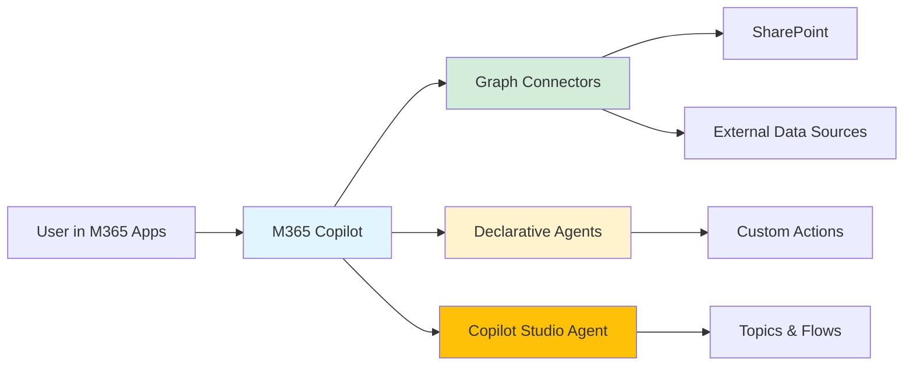
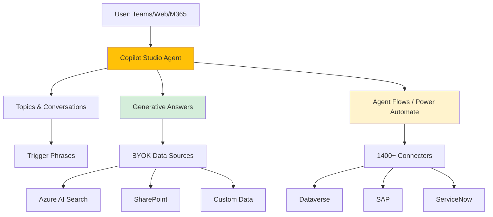
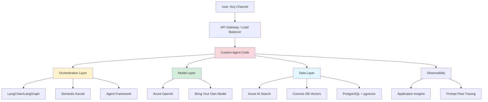
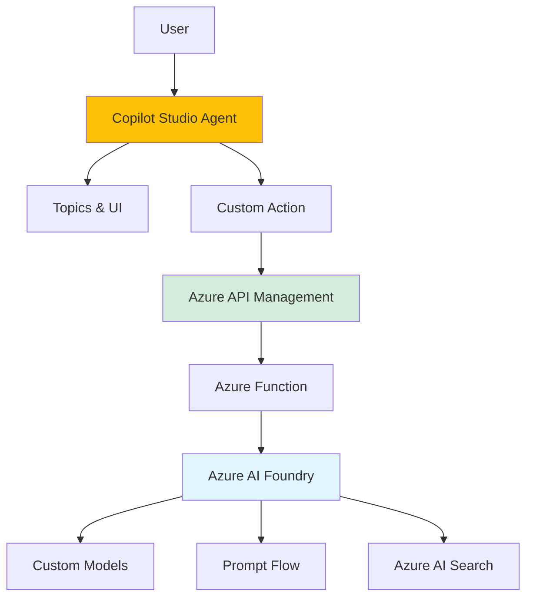
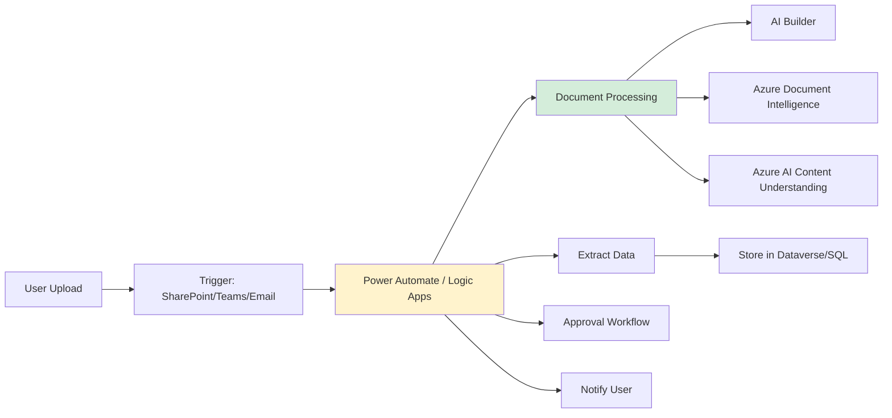

------

layout: defaultlayout: default

title: Implementation Patternstitle: Implementation Patterns

nav_order: 6nav_order: 6

description: "Proven architecture patterns for Microsoft AI solutions"description: "Five proven architecture patterns for Microsoft AI solutions"

------

# Implementation Patterns# Implementation Patterns

{: .no_toc }

> **TODO:** Extract content from README.md Section 5 (lines ~640-800)

Proven architecture patterns for common Microsoft AI implementation scenarios.

{: .fs-6 .fw-300 }**Status:** Stub file created - content needs to be migrated

## Table of contents---

{: .no_toc .text-delta }

## Migration Instructions

1. TOC

{:toc}1. Open the original README.md

2. Locate the content mentioned above

---3. Copy and paste into this file (replace this stub content)

4. Verify all cross-references are updated to link to new file structure

## Pattern Selection Guide5. Test locally with undle exec jekyll serve

Choose your pattern based on your starting point and requirements:---

| Pattern | Best For | Skill Level | Time to Production | Customization |**Navigation:**

|---------|----------|-------------|-------------------|---------------|- [← Back to Home](../README.md)

| **Pattern 1: M365 Copilot Extension** | Enhancing existing M365 with company data | Maker/Admin | Days | Low-Medium |- [View Technologies](technologies.md)

| **Pattern 2: Low-Code Custom Agent** | Departmental agents, citizen developers | Maker | Weeks | Medium |- [View Decision Framework](decision-framework.md)

| **Pattern 3: Pro-Code Custom Agent** | Complex requirements, full control | Professional dev | Weeks-Months | High |
| **Pattern 4: Hybrid Studio + Foundry** | Managed UI + custom models/evaluation | Professional dev | Months | High |
| **Pattern 5: Document-Heavy Workflow** | Processing forms, invoices, documents | Maker/Professional dev | Weeks | Medium |

---

## Pattern 1: M365 Copilot Extension

### Overview

Extend M365 Copilot with company-specific data, actions, or custom agents **without leaving the M365 trust boundary**. Ideal for organizations with M365 licenses who want to enhance Copilot with minimal development.

### Architecture

### Components

**Graph Connectors:**
- Index external data into Microsoft Graph
- Makes data searchable in M365 Copilot
- No custom code required for setup
- [Documentation](https://learn.microsoft.com/en-us/microsoft-365-copilot/microsoft-365-copilot-extensibility)

**Declarative Agents:**
- Lightweight JSON configuration
- Add custom instructions and actions
- Extends Copilot behavior
- [Build guide](https://learn.microsoft.com/en-us/microsoft-365-copilot/extensibility/build-declarative-agents)

**Copilot Studio Agents:**
- Full conversational agent
- Appears in M365 Copilot experience
- Low-code visual designer
- [Studio documentation](https://learn.microsoft.com/en-us/microsoft-copilot-studio/)

### Implementation Steps

1. **Assess data sources:**
   - Identify which company data needs to be accessible (HR docs, policies, product info)
   - Check for existing SharePoint/OneDrive content

2. **Choose extension approach:**
   - **Just data?** → Use Graph Connectors
   - **Add simple skills?** → Use Declarative Agents
   - **Full custom agent?** → Use Copilot Studio

3. **Implement Graph Connectors (if needed):**
   - Use prebuilt connectors (ServiceNow, Salesforce, etc.) or build custom
   - Configure indexing schema and permissions
   - Test search results in M365 Copilot

4. **Build Declarative Agent (if needed):**
   - Create JSON manifest with instructions and actions
   - Define prompts for specialized behavior
   - Deploy via Teams app package

5. **Build Copilot Studio Agent (if needed):**
   - Use Studio templates or start from scratch
   - Add topics, generative answers, flows
   - Publish to M365 Copilot

### Real-World Example

**HR Q&A Agent:**
- **Goal:** Let employees ask HR questions in Copilot
- **Solution:** Graph Connectors (SharePoint HR site) + Declarative Agent (HR assistant instructions)
- **Implementation:**
  - Connect SharePoint HR site via Graph Connector
  - Create Declarative Agent with HR-specific instructions
  - Deploy to M365 tenant
- **Result:** Employees ask HR questions in Word/Teams, get answers grounded in company policies

### When to Use

✅ **Use this pattern when:**
- You have M365 licenses (M365 Copilot or Graph Connectors)
- You want to stay within M365 trust boundary
- Your data is in M365 or accessible via Graph Connectors
- You need quick time to production (days/weeks)
- Makers or admins are primary builders

❌ **Don't use when:**
- You need custom models or evaluation metrics
- You require full control over orchestration logic
- Your data can't be indexed into Microsoft Graph
- You need multi-channel deployment beyond M365

---

## Pattern 2: Low-Code Custom Agent (Copilot Studio)

### Overview

Build custom conversational agents using **Copilot Studio's visual designer**. Deploy to Teams, web, or M365 Copilot. Ideal for departmental agents, citizen developers, and rapid prototyping.

### Architecture

### Components

**Topics:**
- Conversational flows triggered by user phrases
- Visual dialog designer
- Branching logic, variables, conditions

**Generative Answers:**
- RAG-based responses from configured data sources
- **BYOK (Bring Your Own Knowledge):** Azure AI Search, SharePoint, Dataverse, custom
- AI-generated answers with citations

**Agent Flows:**
- Integration with external systems
- Power Automate connector library (1,400+ connectors)
- Call APIs, update databases, trigger workflows

**Code Components (optional):**
- Custom code for complex logic
- Integrate with Azure Functions or custom APIs

### Implementation Steps

1. **Define agent purpose & scope:**
   - What questions will it answer?
   - What actions will it perform?
   - Who are the users (internal/external)?

2. **Set up Copilot Studio environment:**
   - Create environment in Power Platform admin center
   - Assign licenses and security roles
   - Configure data loss prevention (DLP) policies

3. **Configure generative answers:**
   - Add data sources (SharePoint, Azure AI Search, etc.)
   - Configure search parameters and filters
   - Test answer quality and citations

4. **Build topics:**
   - Create topics for specific intents (e.g., "Check order status")
   - Use generative answers for open-ended questions
   - Add flows for actions (e.g., create ticket)

5. **Test & iterate:**
   - Use built-in test pane
   - Review analytics (user satisfaction, topic triggering)
   - Refine topics and prompts

6. **Deploy:**
   - Publish to Teams, web widget, or M365 Copilot
   - Configure authentication (SSO, OAuth)
   - Monitor usage and performance

### Real-World Example

**Customer Support Agent:**
- **Goal:** Handle product questions and create support tickets
- **Solution:** Copilot Studio agent with SharePoint knowledge base + ServiceNow integration
- **Implementation:**
  - Generative Answers configured with SharePoint product docs
  - Topic "Create Ticket" calls Agent Flow → ServiceNow connector
  - Deployed to company website and Teams
- **Result:** 70% of common questions answered without human escalation

### When to Use

✅ **Use this pattern when:**
- You have makers/citizen developers (not professional devs)
- You need visual design tools
- You want managed infrastructure (no hosting)
- You need rapid prototyping and iteration
- You require governance (Power Platform DLP)

❌ **Don't use when:**
- You need full control over orchestration code
- You require custom model selection or evaluation
- You need complex multi-agent workflows
- Budget constraints (Copilot Studio has message-based pricing)

---

## Pattern 3: Pro-Code Custom Agent (M365 Agents SDK / Azure AI Foundry)

### Overview

Build agents with **full code control** using M365 Agents SDK or Azure AI Foundry. Deploy to Teams, web, mobile, or custom channels. Ideal for professional developers with complex requirements.

### Architecture

### Components

**M365 Agents SDK:**
- Teams AI Library for Microsoft Teams deployment
- Bot Framework for multi-channel support
- Native M365 integration (Graph API, SSO)
- [SDK documentation](https://learn.microsoft.com/en-us/microsoft-365/agents-sdk/)

**Azure AI Foundry:**
- Full model catalog (Azure OpenAI, OSS models, BYOM)
- Prompt Flow for evaluation and deployment
- RAG orchestration with Azure AI Search
- [Foundry quickstart](https://learn.microsoft.com/en-us/azure/ai-studio/quickstart)

**Orchestration Frameworks:**
- **LangChain/LangGraph:** Python ecosystem, state management
- **Semantic Kernel:** .NET/Python, enterprise plugins
- **Agent Framework:** Simple multi-agent coordination

**Infrastructure:**
- Azure App Service, Azure Functions, Azure Container Apps for hosting
- Azure API Management for governance (AI Gateway)
- Azure Cosmos DB, PostgreSQL, or SQL Server 2025 for vector storage

### Implementation Steps

1. **Architecture design:**
   - Choose orchestration framework (LangChain, Semantic Kernel, Agent Framework)
   - Select hosting platform (App Service, Functions, AKS)
   - Design RAG pipeline (chunking, embeddings, retrieval)

2. **Set up Azure AI Foundry project:**
   - Create project in Azure AI Foundry portal
   - Deploy Azure OpenAI models
   - Configure Azure AI Search index

3. **Build agent code:**
   - Implement orchestration logic (tool calling, state management)
   - Integrate with data sources (Azure AI Search, databases)
   - Add content safety and guardrails

4. **Implement evaluation:**
   - Create evaluation dataset (test questions + expected answers)
   - Use Prompt Flow for automated evaluation
   - Measure quality metrics (relevance, groundedness, coherence)

5. **Add observability:**
   - Instrument with Application Insights
   - Enable Prompt Flow tracing
   - Set up monitoring and alerting

6. **Deploy & scale:**
   - Deploy to Azure App Service / AKS
   - Configure autoscaling and load balancing
   - Set up CI/CD pipelines

### Real-World Example

**Multi-Channel Research Assistant:**
- **Goal:** Answer research questions across Teams, web, and mobile
- **Solution:** Python agent with LangChain + Azure AI Foundry
- **Implementation:**
  - LangGraph for multi-step reasoning and tool orchestration
  - Azure AI Search with research paper corpus
  - Azure OpenAI gpt-4 for generation
  - Deployed to Azure Container Apps with APIM AI Gateway
- **Result:** Custom evaluation metrics, full control over orchestration, multi-channel deployment

### When to Use

✅ **Use this pattern when:**
- You have professional developers (Python, .NET, TypeScript)
- You need full control over models, prompts, and evaluation
- You require custom orchestration logic
- You need multi-channel deployment
- You want observability and custom metrics

❌ **Don't use when:**
- You don't have dev resources
- You need rapid prototyping without code
- You prefer managed infrastructure
- Time to production is critical (days not weeks)

---

## Pattern 4: Hybrid Studio + Foundry

### Overview

Combine **Copilot Studio's managed UI** with **Azure AI Foundry's custom models and evaluation**. Use Studio for conversation design, Foundry for model experimentation and RAG.

### Architecture

### Components

**Copilot Studio (Frontend):**
- Conversation design and UI
- User authentication and security
- Deployment to Teams/M365/Web

**Azure Function (Bridge):**
- Exposed as custom action in Studio
- Calls Azure AI Foundry endpoints
- Handles authentication and error handling

**Azure AI Foundry (Backend):**
- Custom model selection and tuning
- Prompt Flow for evaluation
- RAG with Azure AI Search

### Implementation Steps

1. **Build Foundry backend:**
   - Deploy models and configure RAG in Foundry
   - Create Prompt Flow for orchestration
   - Deploy as REST endpoint

2. **Create Azure Function:**
   - Implement function to call Foundry endpoint
   - Add authentication (managed identity)
   - Return response in format Studio expects

3. **Register custom action in Studio:**
   - Add Azure Function as custom action
   - Configure input/output parameters
   - Test in Studio test pane

4. **Build Studio topics:**
   - Create topics that call custom action
   - Handle responses and display to user
   - Add fallback logic

5. **Evaluate and iterate:**
   - Use Foundry for model evaluation
   - Use Studio analytics for conversation metrics
   - Refine both layers independently

### Real-World Example

**Document Intelligence Agent:**
- **Goal:** Process complex documents with custom models + Studio UI
- **Solution:** Studio for conversation + Foundry for document processing
- **Implementation:**
  - Foundry: Azure AI Content Understanding (Preview) for multimodal processing
  - Azure Function: Orchestrates document upload → processing → results
  - Studio: Conversation flow, file upload topic, results display
- **Result:** Makers manage conversation, devs manage models/evaluation

### When to Use

✅ **Use this pattern when:**
- You have both makers and developers
- You need custom models but want managed UI
- You want to separate conversation design from AI logic
- You need independent evaluation of AI quality

❌ **Don't use when:**
- You only have makers (use Studio alone)
- You only have devs (use SDK alone)
- Complexity of two platforms isn't justified

---

## Pattern 5: Document-Heavy Workflow

### Overview

Process documents (invoices, forms, contracts, images) using **AI Builder, Azure Document Intelligence, or Azure AI Content Understanding (Preview)**. Automate workflows with Power Automate or Azure Logic Apps.

### Architecture

### Components

**Document Processing Services:**

| Service | Use Case | Skill Level | Documentation |
|---------|----------|-------------|---------------|
| **AI Builder** | Prebuilt models (invoices, receipts, business cards, forms) | Maker | [AI Builder](https://learn.microsoft.com/en-us/ai-builder/) |
| **Azure Document Intelligence** | Custom document models, specialized OCR | Professional dev | [Document Intelligence](https://learn.microsoft.com/en-us/azure/ai-services/document-intelligence/) |
| **Azure AI Content Understanding (Preview)** | Multimodal (image, video, document), advanced understanding | Professional dev | [Content Understanding](https://learn.microsoft.com/en-us/azure/ai-services/content-understanding/document/overview) |

**Workflow Automation:**
- **Power Automate:** Low-code, 1,400+ connectors, visual designer
- **Azure Logic Apps:** Enterprise integration, MCP server, DevOps-ready

### Implementation Steps

1. **Assess document types:**
   - What documents need processing? (invoices, forms, contracts)
   - Are prebuilt models sufficient or need custom models?
   - Volume and frequency of documents

2. **Choose document processing service:**
   - **Prebuilt models exist?** → Use AI Builder
   - **Need custom training?** → Use Azure Document Intelligence
   - **Multimodal or complex understanding?** → Use Azure AI Content Understanding (Preview)

3. **Build document processing flow:**
   - **AI Builder:**
     - Add "Process and save information from forms" action in Power Automate
     - Select prebuilt model (invoice, receipt, etc.)
     - Map extracted fields to variables
   - **Azure Document Intelligence / Content Understanding:**
     - Create custom Azure Function or Logic Apps connector
     - Call service REST API with document
     - Parse JSON response

4. **Add workflow logic:**
   - Store extracted data in Dataverse, SharePoint, or SQL Server
   - Add approval steps (Power Automate approval actions)
   - Send notifications (email, Teams messages)
   - Update source systems (ERP, CRM)

5. **Test and monitor:**
   - Test with real documents
   - Review extraction accuracy
   - Monitor failures and retries
   - Refine models as needed

### Real-World Example

**Invoice Processing Automation:**
- **Goal:** Extract data from supplier invoices and update ERP
- **Solution:** AI Builder invoice model + Power Automate + Dataverse
- **Implementation:**
  - Trigger: Email arrives with invoice attachment
  - Action 1: AI Builder processes invoice → extracts vendor, amount, line items
  - Action 2: Store in Dataverse
  - Action 3: Approval workflow (if amount > $10K)
  - Action 4: Update ERP system via connector
  - Action 5: Notify AP team via Teams
- **Result:** 90% of invoices processed without human intervention

### When to Use

✅ **Use this pattern when:**
- You process high volumes of documents
- Documents are structured or semi-structured
- You need workflow automation (approvals, notifications)
- Integration with business systems (ERP, CRM) is required

❌ **Don't use when:**
- Documents are unstructured text without forms/tables
- You need conversational interaction (use agent patterns instead)
- Document processing is one-off or ad-hoc

---

## Pattern Comparison Matrix

| Factor | Pattern 1: M365 Extension | Pattern 2: Low-Code | Pattern 3: Pro-Code | Pattern 4: Hybrid | Pattern 5: Document Workflow |
|--------|--------------------------|---------------------|---------------------|-------------------|----------------------------|
| **Time to Production** | Days | 1-2 weeks | 1-3 months | 2-4 months | 1-2 weeks |
| **Skill Level** | Maker/Admin | Maker | Professional dev | Maker + Professional dev | Maker/Professional dev |
| **Customization** | Low-Medium | Medium | High | High | Medium |
| **Control** | Low | Medium | High | High | Medium |
| **Hosting** | Microsoft-managed | Microsoft-managed | Self-hosted | Hybrid | Microsoft/Self-hosted |
| **Cost** | M365 license | Message-based | Consumption | Message + Consumption | Credits/Consumption |
| **Best For** | M365 data/skills | Departmental agents | Complex requirements | Custom models + managed UI | Document processing |

---

## Next Steps

**Need scenario examples?**  
→ [View Scenarios](scenarios.md) for detailed use-case walkthroughs

**Need to compare technologies?**  
→ [Feature Comparison](feature-comparison.md) for side-by-side analysis

**Need evaluation guidance?**  
→ [Evaluation Criteria](evaluation-criteria.md) to assess your situation

**Need visual decision tree?**  
→ [Visual Framework](visual-framework.md) for technology selection diagrams

---

**Last Updated:** November 2025  
**Next:** [Scenarios](scenarios.md) - Real-world use cases
