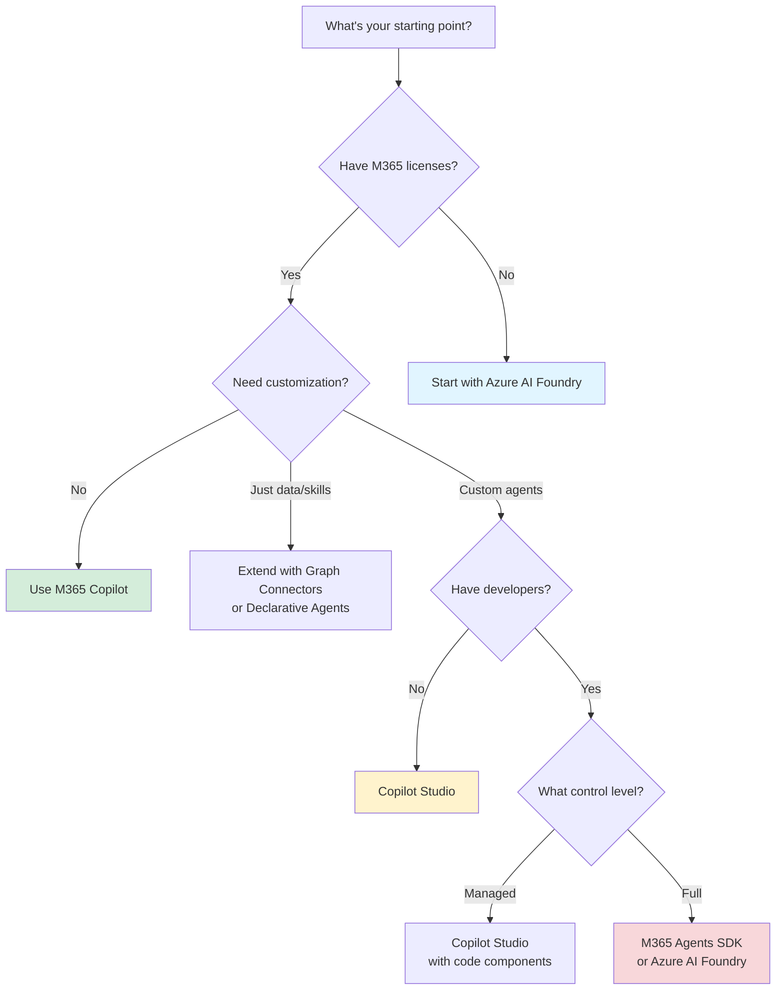

------

layout: defaultlayout: default

title: Quick Referencetitle: Quick Reference

nav_order: 5nav_order: 5

description: "Fast technology selection by need and capability"description: "Technology selection by need and comparison tables"

------

# Quick Reference# Quick Reference

{: .no_toc }

> **TODO:** Extract content from README.md Section 4 (lines ~570-640)

Fast lookups for technology selection based on common needs.

{: .fs-6 .fw-300 }**Status:** Stub file created - content needs to be migrated

## Table of contents---

{: .no_toc .text-delta }

## Migration Instructions

1. TOC

{:toc}1. Open the original README.md

2. Locate the content mentioned above

---3. Copy and paste into this file (replace this stub content)

4. Verify all cross-references are updated to link to new file structure

## Technology by Need5. Test locally with undle exec jekyll serve

### "I need AI in production this week"---

| Need | Technology | Why | Getting Started |**Navigation:**

|------|------------|-----|-----------------|- [← Back to Home](../README.md)

| Productivity boost for all employees | **M365 Copilot** | No setup, works in Word/Excel/Teams/Outlook | [Enable for tenant](https://learn.microsoft.com/en-us/microsoft-365-copilot/microsoft-365-copilot-setup) |- [View Technologies](technologies.md)

| Custom chatbot with templates | **Copilot Studio** | Pre-built templates, visual designer | [Studio quickstart](https://learn.microsoft.com/en-us/microsoft-copilot-studio/quickstart) |- [View Decision Framework](decision-framework.md)

### "I have makers but no developers"

| Need | Technology | Why | Getting Started |
|------|------------|-----|-----------------|
| Build custom agents visually | **Copilot Studio** | Low-code, managed governance | [Studio documentation](https://learn.microsoft.com/en-us/microsoft-copilot-studio/) |
| Document processing (invoices, forms) | **AI Builder** | Prebuilt models, Power Platform integration | [AI Builder](https://learn.microsoft.com/en-us/ai-builder/) |
| Workflow automation | **Copilot Studio Agent Flows** or **Power Automate** | Visual designer, 1,400+ connectors | [Agent Flows](https://learn.microsoft.com/en-us/microsoft-copilot-studio/flows-overview) |

### "I have developers and complex requirements"

| Need | Technology | Why | Getting Started |
|------|------------|-----|-----------------|
| Full control over models & evaluation | **Azure AI Foundry** | Code-first, custom models, Prompt Flow | [Foundry quickstart](https://learn.microsoft.com/en-us/azure/ai-studio/quickstart) |
| Multi-channel agents (Teams, web, custom) | **M365 Agents SDK** | Pro-code, BYO orchestrator | [SDK documentation](https://learn.microsoft.com/en-us/microsoft-365/agents-sdk/) |
| Enterprise integration + AI | **Azure Logic Apps** | 1,400+ connectors, MCP server, DevOps-ready | [Logic Apps for AI](https://learn.microsoft.com/en-us/azure/logic-apps/) |

### "I need to extend M365 Copilot"

| Scenario | Technology | Capability | Documentation |
|----------|------------|------------|---------------|
| Add company data to Copilot | **Graph Connectors** | Index external data into Microsoft Graph | [Connectors](https://learn.microsoft.com/en-us/microsoft-365-copilot/microsoft-365-copilot-extensibility) |
| Add custom skills/actions | **Declarative Agents** | Configure agents with actions | [Declarative agents](https://learn.microsoft.com/en-us/microsoft-365-copilot/extensibility/build-declarative-agents) |
| Build custom agent in Copilot | **Copilot Studio** | Full agent with custom logic | [Studio agents](https://learn.microsoft.com/en-us/microsoft-copilot-studio/) |

### "I need specific AI capabilities"

| Capability | Technology | Use Case | Documentation |
|------------|------------|----------|---------------|
| Vector search / RAG | **Azure AI Search** | Semantic search over documents | [AI Search](https://learn.microsoft.com/en-us/azure/search/) |
| Document understanding | **Azure AI Content Understanding (Preview)** or **Azure Document Intelligence** | Multimodal processing or specialized OCR | [Content Understanding](https://learn.microsoft.com/en-us/azure/ai-services/content-understanding/document/overview) |
| Vector database | **Azure Cosmos DB**, **Azure PostgreSQL**, or **SQL Server 2025** | AI agent memory, embeddings storage | [Cosmos DB vectors](https://learn.microsoft.com/en-us/azure/cosmos-db/nosql/vector-search) |
| Content safety | **Azure AI Content Safety** | Moderation, groundedness detection | [Content Safety](https://learn.microsoft.com/en-us/azure/ai-services/content-safety/) |
| Model governance | **Azure API Management (AI Gateway)** | Rate limiting, routing, chargeback | [AI Gateway](https://learn.microsoft.com/en-us/azure/api-management/genai-gateway-capabilities) |

---

## Quick Comparison Tables

### Development Platforms Comparison

| Factor | M365 Copilot | Copilot Studio | M365 Agents SDK | Azure AI Foundry |
|--------|--------------|----------------|-----------------|------------------|
| **Setup Time** | None | Minutes | Hours | Hours-Days |
| **Skill Level** | End-user | Maker/Citizen dev | Professional dev | Professional dev |
| **Customization** | Extensions only | High (low-code) | Full (code) | Full (code) |
| **Governance** | M365 admin | Studio + Power Platform | Custom | Custom + Foundry |
| **Hosting** | Microsoft-managed | Microsoft-managed | Self-hosted or managed | Self-hosted or managed |
| **Cost Model** | $30/user/month | Message-based | Compute + hosting | Compute + services |
| **Best For** | Broad productivity | Custom agents at scale | Complex multi-channel | Model experimentation |

### Layer 3 Platform Selection

| If You Need... | Choose... | Why |
|----------------|-----------|-----|
| Speed to production | **Copilot Studio** | Templates, visual designer, managed |
| M365 integration | **M365 Agents SDK** or **Copilot Studio** | Native Teams/M365 deployment |
| Custom models | **Azure AI Foundry** | Full model catalog, BYOM |
| Low-code governance | **Copilot Studio** | Built-in compliance, makers |
| Multi-agent orchestration | **Agent Framework** or **LangGraph** | State management, workflows |
| Complex evaluations | **Azure AI Foundry** (Prompt Flow) | Custom eval metrics, datasets |

### Infrastructure Services Quick Matrix

| Service | Primary Use | Layer 4 Role | GA/Preview |
|---------|-------------|--------------|------------|
| Azure OpenAI Service | LLM hosting | Model infrastructure | GA |
| Azure AI Search | Vector/semantic search | RAG foundation | GA |
| Azure API Management | Governance | Centralized control | GA |
| Azure AI Content Safety | Moderation | Safety controls | GA |
| Azure AI Content Understanding | Multimodal processing | Document/image/video AI | Preview |
| Prompt Flow | MLOps | Evaluation & deployment | GA |
| AI Builder | Prebuilt models | Power Platform AI | GA |
| Azure Cosmos DB | Vector DB | Agent memory | GA |
| Azure PostgreSQL | Vector DB + extensions | AI-capable database | GA |
| SQL Server 2025 | Vector DB + AI functions | On-prem AI database | Preview |
| Microsoft Fabric | Analytics + AI | Data/AI platform | GA |

---

## Decision Shortcuts

### Start Here Based on Your Situation

### Common Scenarios → Technologies

| Scenario | Recommended Path |
|----------|------------------|
| HR Q&A bot for employees | **Copilot Studio** + **Graph Connectors** (SharePoint knowledge base) |
| Invoice processing automation | **AI Builder** (prebuilt invoice model) + **Power Automate** |
| Customer support with enterprise data | **Copilot Studio** + **BYOK** (Azure AI Search) |
| Research assistant with custom models | **Azure AI Foundry** + **Azure AI Search** + **Azure OpenAI** |
| Code generation agent | **GitHub Copilot** or **M365 Agents SDK** with code tools |
| Multi-agent coordination | **Agent Framework** or **LangGraph** + **Azure AI Foundry** |
| Document understanding (multimodal) | **Azure AI Content Understanding (Preview)** + **Azure AI Search** |

---

## Technology Groupings

### By Trust Boundary

| Boundary | Technologies | Data Location |
|----------|-------------|---------------|
| **M365 Trust Boundary** | M365 Copilot, Graph Connectors, Declarative Agents, Copilot Studio (partially) | Microsoft 365 tenant |
| **Power Platform** | Copilot Studio, AI Builder, Power Automate, Dataverse | Power Platform environment |
| **Azure** | Azure AI Foundry, Azure AI Services, Azure OpenAI, Azure AI Search, Cosmos DB, etc. | Azure subscription |
| **Hybrid** | M365 Agents SDK (can span M365 + Azure), Azure Logic Apps (enterprise connectors) | Configurable |

### By Skill Level Required

| Skill Level | Technologies |
|-------------|-------------|
| **End User** | M365 Copilot, Built-in Agents |
| **Citizen Developer / Maker** | Copilot Studio, AI Builder, Power Automate, Agent Flows |
| **Professional Developer** | M365 Agents SDK, Azure AI Foundry, Agent Framework, LangChain, Azure AI Services |
| **Data Engineer / Scientist** | Azure AI Foundry, Prompt Flow, Microsoft Fabric, Azure ML |

---

## Pricing Quick Reference

| Technology | Pricing Model | Approx. Cost |
|------------|---------------|--------------|
| **M365 Copilot** | Per-user/month | $30/user |
| **Copilot Studio** | Message-based + capacity | ~$200/month base + messages |
| **Azure AI Foundry** | Consumption (compute, storage, models) | Variable (pay-as-you-go) |
| **Azure OpenAI** | Per 1K tokens | $0.03-$0.12 (varies by model) |
| **Azure AI Search** | Tier-based (Basic, Standard, etc.) | $75+/month |
| **AI Builder** | Credits (capacity) | Included with some Power Platform plans |
| **Graph Connectors** | Included with M365 Copilot or standalone | Varies by license |

*Prices as of November 2025. Always verify current pricing.*

---

## Next Steps by Need

**Just getting started?**  
→ [View Technologies](technologies.md) to understand what's available

**Ready to choose?**  
→ [Decision Framework](decision-framework.md) to evaluate systematically

**Need architecture guidance?**  
→ [Implementation Patterns](implementation-patterns.md) for proven approaches

**Want real examples?**  
→ [Scenarios](scenarios.md) for use-case-based recommendations

**Need to evaluate options?**  
→ [Feature Comparison](feature-comparison.md) for detailed analysis

---

**Last Updated:** November 2025  
**Next:** [Implementation Patterns](implementation-patterns.md) - Proven architecture patterns
