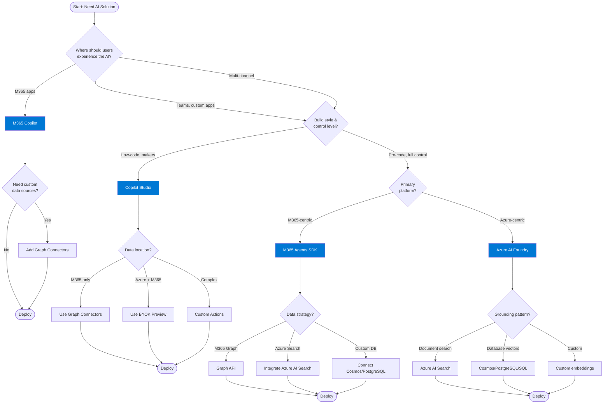
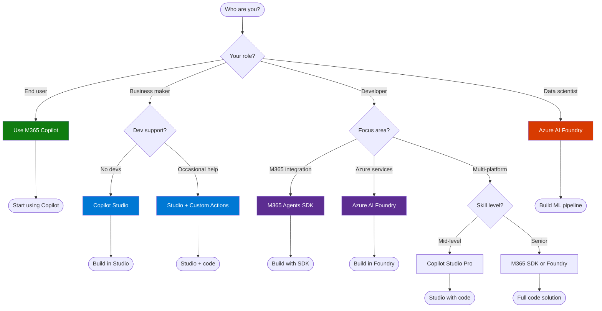
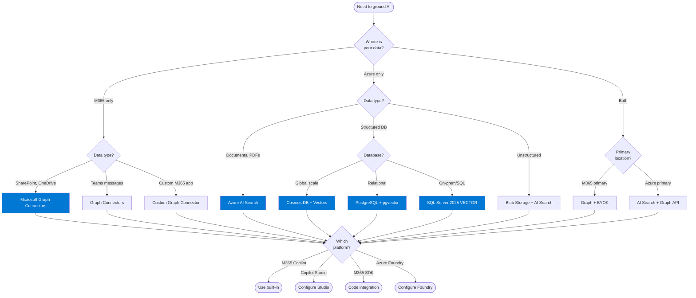
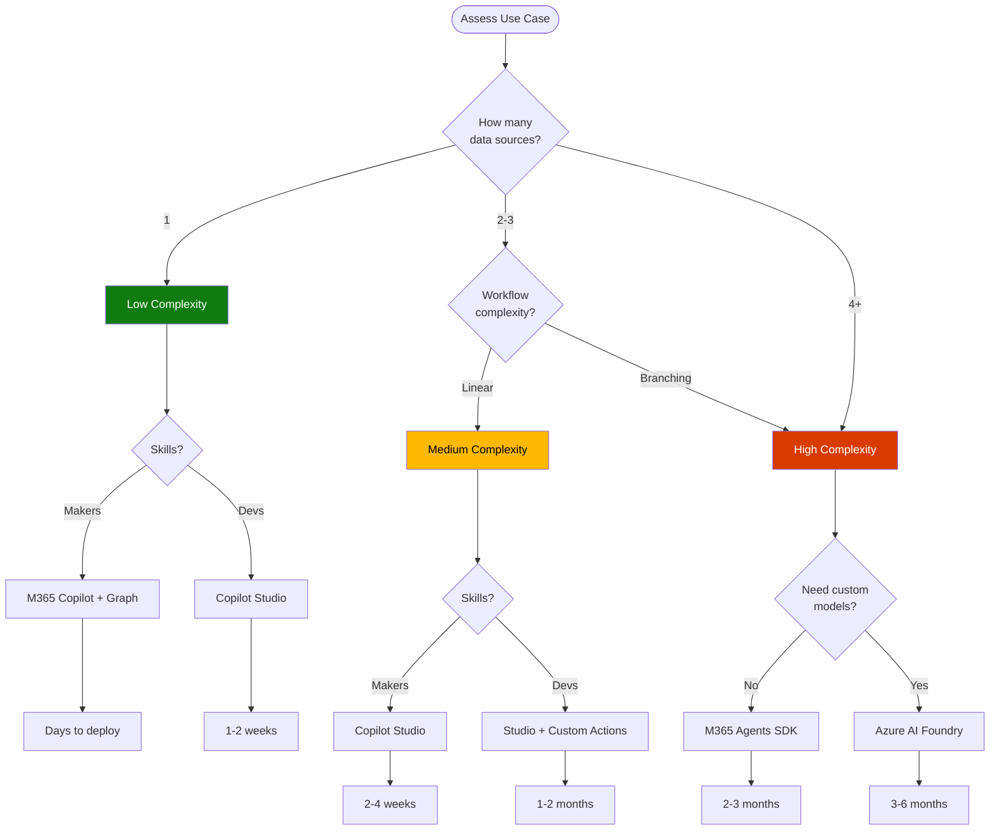
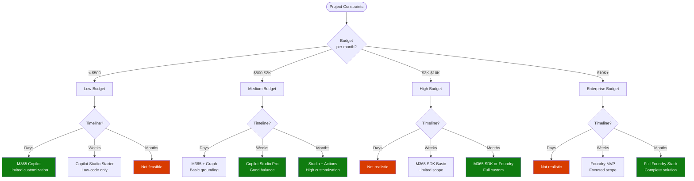
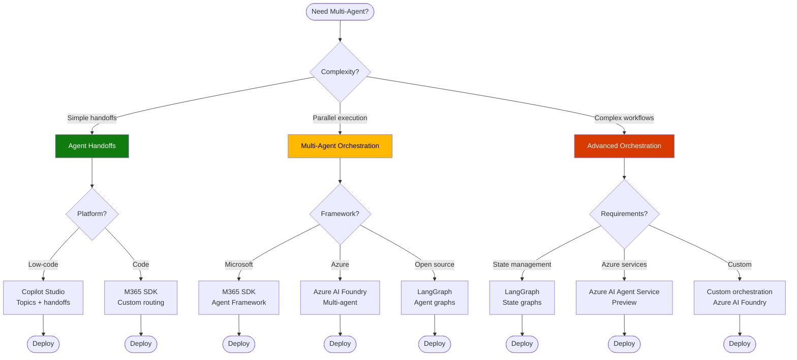
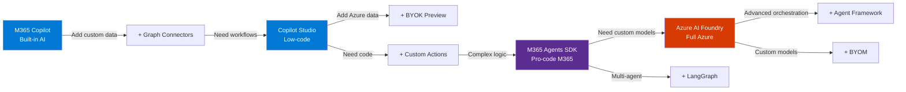

# Visual Framework
{: .no_toc }

Interactive decision trees to guide Microsoft AI technology selection.
{: .fs-6 .fw-300 }

## Table of contents
{: .no_toc .text-delta }

1. TOC
{:toc}

---

## Complete Decision Flow

---

## Persona-Based Flow

---

## Data Grounding Decision

---

## Complexity Assessment Flow

---

## Budget & Timeline Tradeoffs

---

## Governance & Compliance Path

---

## Multi-Agent Orchestration

---

## Upgrade Paths

---

## Legend

### Decision Nodes

- 🔷 **Diamond:** Decision point requiring evaluation
- 🟦 **Rectangle:** Technology recommendation
- 🔵 **Circle:** Start/End point

### Colors

- **Blue (#0078D4):** Microsoft primary technologies
- **Purple (#5C2D91):** Developer-focused solutions
- **Green (#107C10):** Low complexity / fast path
- **Orange (#FFB900):** Medium complexity
- **Red (#D83B01):** High complexity / enterprise

---

## How to Use These Diagrams

1. **Start with Complete Decision Flow** for full end-to-end guidance
2. **Use Persona-Based Flow** if you know your role
3. **Jump to Data Grounding** if data architecture is your concern
4. **Check Complexity Assessment** to estimate effort
5. **Review Budget & Timeline** to set realistic expectations
6. **Verify Governance Path** for compliance requirements
7. **Explore Multi-Agent** if orchestration is needed
8. **Plan Upgrade Paths** for evolution strategy

---

## Next Steps

**Detailed comparisons:**  
→ [Feature Comparison](feature-comparison.md)

**Real-world examples:**  
→ [Scenarios](scenarios.md)

**Evaluate readiness:**  
→ [Evaluation Criteria](evaluation-criteria.md)

---

**Last Updated:** November 2025  
**Next:** [Resources](resources.md)
