# Visual Framework
{: .no_toc }

Interactive decision trees to guide Microsoft AI technology selection.
{: .fs-6 .fw-300 }

## Table of contents
{: .no_toc .text-delta }

1. TOC
{:toc}

---

## About This Visual Framework

These diagrams provide **visual representations** of the [Decision Framework](decision-framework.md) methodology, helping you navigate Microsoft's AI portfolio through interactive flowcharts.

### Optimal Learning Path

Follow this sequence through the documentation for the best learning experience:

```mermaid
%%{init: {'theme':'dark', 'themeVariables': {'fontSize':'16px'}}}%%
flowchart LR
    Start([Start Here]) --> CM[📚 Capability Model<br/>Five-Layer Architecture]
    CM --> DF[🎯 Decision Framework<br/>BXT Methodology]
    DF --> SC[💼 Scenarios<br/>Real-World Examples]
    SC --> VF[📊 Visual Framework<br/>Interactive Diagrams]
    VF --> EC[✅ Evaluation Criteria<br/>Assess Requirements]
    EC --> IP[🏗️ Implementation Patterns<br/>Build Guidance]
    IP --> TECH[🔧 Technologies<br/>Technical Deep Dive]
    TECH --> FC[📋 Feature Comparison<br/>Side-by-Side Matrices]
    
    %% Reference materials (not in main flow)
    FC -.-> QR[⚡ Quick Reference]
    FC -.-> RES[🔗 Resources]
    FC -.-> GLOSS[📖 Glossary]
    
    style Start fill:#4CAF50,stroke:#2E7D32,color:#fff
    style VF fill:#2196F3,stroke:#1565C0,color:#fff
    style QR fill:#9E9E9E,stroke:#616161,color:#fff
    style RES fill:#9E9E9E,stroke:#616161,color:#fff
    style GLOSS fill:#9E9E9E,stroke:#616161,color:#fff
    
    classDef mainPath fill:#1976D2,stroke:#0D47A1,color:#fff
    class CM,DF,SC,EC,IP,TECH,FC mainPath
```



**📌 Main Learning Path** (blue): Foundation → Context → Application → Assessment → Execution → Reference  
**📎 Reference Materials** (gray, dotted): Quick Reference, Resources, Glossary - use as needed, not part of sequential flow

### How This Connects to the Complete Framework

| **You Are Here** | **This Provides** | **Complements** |
|------------------|-------------------|-----------------|
| **Visual Framework** | Decision tree diagrams | [Decision Framework](decision-framework.md) - Written methodology (BXT + 6 Questions) |
| | Technology selection paths | [Scenarios](scenarios.md) - Real-world examples with step-by-step guidance |
| | Complexity/budget/governance views | [Evaluation Criteria](evaluation-criteria.md) - Assessment frameworks and checklists |
| | Multi-agent orchestration patterns | [Quick Reference](quick-reference.md) - Fast-lookup tables for common needs |
| | Upgrade path visualization | [Capability Model](capability-model.md) - Five architectural layers |

### Navigation Guide

**🎯 If you're a visual learner:** Start here with the diagrams  
**📖 If you prefer written guidance:** Start with [Decision Framework](decision-framework.md)  
**🔍 If you need fast answers:** Jump to [Quick Reference](quick-reference.md)  
**💼 If you have a specific use case:** See [Scenarios](scenarios.md)  
**🏗️ If you need architecture context:** Review [Capability Model](capability-model.md)

---

## Diagram Index

| Diagram | Purpose | Maps To Framework |
|---------|---------|-------------------|
| **1. Complete Decision Flow** | End-to-end technology selection | [Phase 2: Q1-Q6](decision-framework.md#phase-2-technology-groupings-six-critical-questions) - All six critical questions |
| **2. Data Grounding Decision** | Data strategy and knowledge sources | [Phase 2: Q4](decision-framework.md#question-4-data-strategy--knowledge) - Data grounding patterns |
| **3. Persona-Based Flow** | Selection by role and skill level | [Phase 2: Q2](decision-framework.md#question-2-build-style--control-level) - Build approach + [Scenarios](scenarios.md) |
| **4. Complexity Assessment** | Technical complexity evaluation | [Evaluation Criteria: Complexity](evaluation-criteria.md#1-technical-complexity-assessment) |
| **5. Budget & Timeline** | Cost and time-to-production paths | [Evaluation Criteria: Budget & Time](evaluation-criteria.md#3-budget-assessment) |
| **6. Governance & Compliance** | Security and compliance requirements | [Evaluation Criteria: Governance](evaluation-criteria.md#5-governance--compliance) |
| **7. Multi-Agent Orchestration** | Multi-agent patterns and frameworks | [Quick Reference: Orchestration Complexity](quick-reference.md#orchestration-complexity-decision-matrix) |
| **8. Upgrade Paths** | Migration and enhancement options | [Capability Model: Layers 1-3](capability-model.md) - Technology progression |

---

## Complete Decision Flow


### Validation Summary

**Last Validated:** November 2025

**Key Changes from Validation:**
- **Removed:** Fabric Data Agents from Autonomous path (validated as conversational Q&A tool, not autonomous agent)
- **Added Preview Status:** Logic Apps AI Agent Workflows, SQL Server 2025 VECTOR

**Validated Technologies:**

*UI-Based Agents (GA unless noted):*
- **M365 Copilot:** Conversational chat in M365 apps [(docs)](https://learn.microsoft.com/en-us/microsoft-365-copilot/extensibility/)
- **Copilot Studio:** Low-code, 13+ channels [(docs)](https://learn.microsoft.com/en-us/microsoft-copilot-studio/fundamentals-what-is-copilot-studio)
- **M365 Agents SDK:** Pro-code, 10+ channels, C#/JS/Python [(docs)](https://learn.microsoft.com/en-us/microsoft-365/agents-sdk/agents-sdk-overview)
- **Azure AI Foundry:** Custom UI deployment [(docs)](https://learn.microsoft.com/en-us/azure/ai-foundry/openai/how-to/use-web-app)

*Autonomous Agents:*
- **Logic Apps AI Agent Workflows (Preview):** Event-driven, 1,400+ connectors [(docs)](https://learn.microsoft.com/en-us/azure/logic-apps/agent-workflows-concepts)
- **Azure AI Foundry Agent Service:** Custom orchestration [(docs)](https://learn.microsoft.com/en-us/azure/ai-foundry/agents/overview)

*API/Headless Services (GA):*
- **Azure AI Agent Service:** REST API, managed PaaS [(docs)](https://learn.microsoft.com/en-us/azure/ai-foundry/agents/quickstart)
- **Azure AI Foundry:** REST API deployment [(docs)](https://learn.microsoft.com/en-us/rest/api/aifoundry/)

*Vector Databases:*
- **Cosmos DB (GA):** IVF, HNSW, DiskANN algorithms [(docs)](https://learn.microsoft.com/en-us/azure/cosmos-db/nosql/vector-search)
- **PostgreSQL pgvector (GA):** Extension 0.7.0 [(docs)](https://learn.microsoft.com/en-us/azure/postgresql/flexible-server/how-to-use-pgvector)
- **SQL Server 2025 VECTOR (Preview):** Native type, float32/float16 [(docs)](https://learn.microsoft.com/en-us/sql/t-sql/data-types/vector-data-type)

---

## Persona-Based Flow


### Validation Summary - Persona-Based Flow
**Last Validated:** November 3, 2025

**Key Changes:**
- Added Preview annotations to Logic Apps AI Agent Workflows and Fabric Data Agents
- Corrected "Copilot Studio Pro" to "Copilot Studio + Custom Actions" (no official "Pro" tier)
- Validated persona assignments against official Microsoft documentation

**Persona-to-Technology Mappings:**

*End User (GA):*
- **M365 Copilot:** Built-in AI in M365 apps, no setup required - [M365 Copilot](https://learn.microsoft.com/en-us/microsoft-365-copilot/extensibility/)

*Business Maker (GA):*
- **Copilot Studio:** Low-code platform, no dev support needed - [Copilot Studio](https://learn.microsoft.com/en-us/microsoft-copilot-studio/fundamentals-what-is-copilot-studio)
- **Copilot Studio + Custom Actions:** Low-code with occasional developer support for custom connectors/flows - [Custom Actions](https://learn.microsoft.com/en-us/microsoft-copilot-studio/copilot-plugins-overview)

*Developer (GA unless noted):*
- **M365 Agents SDK:** Pro-code for M365-centric solutions, C#/JavaScript/Python, 10+ channels - [M365 Agents SDK](https://learn.microsoft.com/en-us/microsoft-365-copilot/extensibility/overview-custom-engine-agent)
- **Azure AI Foundry:** Pro-code for Azure-centric solutions, custom models, full control - [Azure AI Foundry](https://learn.microsoft.com/en-us/azure/ai-foundry/what-is-azure-ai-foundry)
- **Copilot Studio + Custom Actions:** Mid-level developers, low-code with custom code extensibility - [Copilot Studio Extensibility](https://learn.microsoft.com/en-us/microsoft-copilot-studio/copilot-plugins-overview)
- **Logic Apps AI Agent Workflows (Preview):** Event-driven autonomous agents, 1,400+ connectors - [Logic Apps Agent Workflows](https://learn.microsoft.com/en-us/azure/logic-apps/agent-workflows-concepts)

*Data Scientist/Analyst:*
- **Fabric Data Agents (Preview):** Analytics/BI focus, Python SDK, evaluation capabilities, Power BI/semantic models - [Fabric Data Agents](https://learn.microsoft.com/en-us/fabric/data-science/concept-data-agent) | [Python SDK](https://learn.microsoft.com/en-us/fabric/data-science/evaluate-data-agent)
- **Azure AI Foundry (GA):** ML/custom models, full AI/ML pipeline control - [Azure AI Foundry](https://learn.microsoft.com/en-us/azure/ai-foundry/what-is-azure-ai-foundry)

*Integration Specialist:*
- **Logic Apps AI Agent Workflows (Preview):** Enterprise integration focus, 1,400+ connectors, workflow automation - [Logic Apps Overview](https://learn.microsoft.com/en-us/azure/logic-apps/logic-apps-overview) | [AI Agent Workflows](https://learn.microsoft.com/en-us/azure/logic-apps/agent-workflows-concepts)

---

## Data Grounding Decision

```mermaid
flowchart TD
    Start([Need to ground AI]) --> Q1{Where is<br/>your data?}
    
    Q1 -->|M365 only| M365Data{Data type?}
    Q1 -->|Azure only| AzureData{Data type?}
    Q1 -->|Both| Hybrid{Primary<br/>location?}
    Q1 -->|Analytics platform| FabricData[Microsoft Fabric]
    
    M365Data -->|SharePoint, OneDrive| Graph[Microsoft Graph Connectors]
    M365Data -->|Teams messages| GraphTeams[Graph Connectors]
    M365Data -->|Custom M365 app| GraphCustom[Custom Graph Connector]
    
    AzureData -->|Documents, PDFs| Q2{Processing needs?}
    AzureData -->|Structured DB| DB{Database?}
    AzureData -->|Unstructured| Blob[Blob Storage + AI Search]
    
    Q2 -->|Standard indexing| Search[Azure AI Search]
    Q2 -->|Multimodal content| ContentUnderstanding[Azure AI Content Understanding<br/>+ AI Search<br/><i>Preview</i>]
    
    DB -->|Global scale, NoSQL| Cosmos{Vector algorithm?}
    DB -->|Relational| Postgres[PostgreSQL + pgvector]
    DB -->|Enterprise SQL| SQL[SQL Server 2025<br/>VECTOR <i>Preview</i>]
    
    Cosmos -->|Flat index| CosmosIVF[Cosmos DB + IVF]
    Cosmos -->|Graph-based| CosmosHNSW[Cosmos DB + HNSW]
    Cosmos -->|Disk-optimized| CosmosDiskANN[Cosmos DB + DiskANN]
    
    Hybrid -->|M365 primary| HybridM365[Graph + BYOK]
    Hybrid -->|Azure primary| HybridAzure[AI Search + Graph API]
    
    FabricData --> Q3{Access method?}
    Q3 -->|Direct platform access| FabricPlatform[Fabric Lakehouse/Warehouse<br/>OneLake + SQL endpoint]
    Q3 -->|Conversational agent| FabricAgent[Fabric Data Agents<br/><i>Preview</i>]
    
    Graph --> Layer{Which<br/>platform?}
    GraphTeams --> Layer
    GraphCustom --> Layer
    Search --> Layer
    ContentUnderstanding --> Layer
    CosmosIVF --> Layer
    CosmosHNSW --> Layer
    CosmosDiskANN --> Layer
    Postgres --> Layer
    SQL --> Layer
    Blob --> Layer
    HybridM365 --> Layer
    HybridAzure --> Layer
    FabricPlatform --> Layer
    FabricAgent --> Layer
    
    Layer -->|M365 Copilot| LayerM365([Use built-in])
    Layer -->|Copilot Studio| LayerStudio([Configure Studio])
    Layer -->|M365 SDK| LayerSDK([Code integration])
    Layer -->|Azure Foundry| LayerFoundry([Configure Foundry])
    Layer -->|Logic Apps| LayerLogicApps([MCP Server/<br/>Connector])
    
    style Graph fill:#0078D4,color:#fff
    style Search fill:#0078D4,color:#fff
    style ContentUnderstanding fill:#50E6FF,color:#000
    style CosmosIVF fill:#0078D4,color:#fff
    style CosmosHNSW fill:#0078D4,color:#fff
    style CosmosDiskANN fill:#0078D4,color:#fff
    style Postgres fill:#0078D4,color:#fff
    style SQL fill:#0078D4,color:#fff
    style FabricPlatform fill:#FFB900,color:#000
    style FabricAgent fill:#FFB900,color:#000
```### Validation Summary - Data Grounding Decision
**Last Validated:** November 3, 2025

**Key Changes:**
- Added Preview annotation to Azure AI Content Understanding (2025-05-01-preview API)
- Added Preview annotation to Fabric Data Agents (Copilot Studio integration)
- **Distinguished Microsoft Fabric platform vs Fabric Data Agents** - added decision node for direct platform access (Lakehouse/Warehouse/OneLake) vs conversational agent layer
- Confirmed SQL Server 2025 VECTOR Preview status (RC1)

**Validated Technologies:**
- **Microsoft Graph Connectors** (GA): M365 data sources (SharePoint, OneDrive, Teams) - [Graph Connectors Overview](https://learn.microsoft.com/en-us/microsoftsearch/connectors-overview)
- **Azure AI Search** (GA): Document indexing, full-text search, vector search, hybrid queries - [AI Search Overview](https://learn.microsoft.com/en-us/azure/search/search-what-is-azure-search)
- **Azure AI Content Understanding** (Preview): Multimodal processing (documents/images/audio/video), RAG-ready Markdown output, AI Search custom skill integration, built-in chunking, standard/pro modes - [Content Understanding Overview](https://learn.microsoft.com/en-us/azure/ai-services/content-understanding/overview) | [Multimodal Search](https://learn.microsoft.com/en-us/azure/search/multimodal-search-overview)
- **Cosmos DB Vector Search** (GA): IVF/HNSW/DiskANN algorithms, NoSQL & MongoDB vCore APIs - [Cosmos DB Vector Search](https://learn.microsoft.com/en-us/azure/cosmos-db/vector-database)
- **PostgreSQL pgvector** (GA): Extension version 0.7.0, HNSW/IVF indexes - [PostgreSQL Vector Search](https://learn.microsoft.com/en-us/azure/postgresql/flexible-server/how-to-use-pgvector)
- **SQL Server 2025 VECTOR** (Preview RC1): Native VECTOR data type, float32 (1,998 dims)/float16 (3,996 dims) - [SQL Server Vector](https://learn.microsoft.com/en-us/sql/t-sql/data-types/vector-data-type)
- **Microsoft Fabric Platform** (GA): Direct knowledge source access via Lakehouse (Delta tables, Spark), Warehouse (T-SQL), OneLake (ADLS Gen2 APIs), KQL databases. Azure AI Foundry integration for RAG - [Fabric Overview](https://learn.microsoft.com/en-us/fabric/fundamentals/microsoft-fabric-overview) | [AI Foundry Fabric Integration](https://learn.microsoft.com/en-us/azure/ai-foundry/faq)
- **Fabric Data Agents** (Preview): Analytics data grounding (warehouses, lakehouses, Power BI semantic models, KQL databases), Copilot Studio connected agents, Azure AI Agent Service integration - [Fabric Data Agents](https://learn.microsoft.com/en-us/fabric/data-science/concept-data-agent) | [Copilot Studio Integration](https://learn.microsoft.com/en-us/fabric/data-science/data-agent-microsoft-copilot-studio)
- **Logic Apps MCP Server** (Preview): Standard logic apps as remote MCP servers, 1,400+ connectors, OAuth 2.0 auth, Streamable HTTP/SSE transports - [Logic Apps MCP Server](https://learn.microsoft.com/en-us/azure/logic-apps/set-up-model-context-protocol-server-standard) | [API Center Integration](https://learn.microsoft.com/en-us/azure/logic-apps/create-mcp-server-api-center)

---

## Complexity Assessment Flow

```mermaid
flowchart TD
    Start([Assess Use Case]) --> Q1{How many<br/>data sources?}
    
````
```

---

## Complexity Assessment Flow


---

## Budget & Timeline Tradeoffs


---

## Governance & Compliance Path


---

## Multi-Agent Orchestration


### Validation Summary: Multi-Agent Orchestration

**Connected Agents / Sub-Agent Pattern:**

- **Copilot Studio (Preview):** Connected agents feature supports other Copilot Studio agents + Fabric Data Agents in same environment. Child agents are lightweight sub-agents within main agent. Handoffs enable agent-to-agent transfer.
- **Azure AI Foundry Agent Service (GA May 2025):** Connected agents feature allows main agent to delegate to purpose-built sub-agents using natural language routing. No custom orchestrator required.
- **Fabric Data Agents (Preview):** Can participate as connected agent in Copilot Studio or integrate with Azure AI Agent Service. Consumed BY other agents for data grounding—NOT itself an orchestrator.

**Agent Workflow Orchestration:**

- **Microsoft Agent Framework (Preview/Experimental):** Provides Sequential, Concurrent, Handoff, and Magentic orchestration patterns. Available in C#, Python via Semantic Kernel. Under active development.
- **Semantic Kernel:** Supports Sequential, Concurrent, Group Chat, Handoff, and Magentic orchestration patterns.
- **M365 Agents SDK:** Integrates with Microsoft Agent Framework or Semantic Kernel for orchestration. "Bring your own orchestrator" model—does NOT have built-in Agent Framework.
- **LangGraph:** Third-party framework (not Microsoft) providing state graph management for complex workflows.

**Event-Driven Agents:**

- **Logic Apps AI Agent Workflows (Preview):** Event triggers + MCP Server for enterprise system integration. Triggers SINGLE agent via events—NOT multi-agent orchestration.
- **Azure Functions + Agent Service:** Event-driven invocation of single agents. Event routing, not multi-agent coordination.
- **Event Grid + Foundry:** Event routing to agents. Routes events to trigger agents independently—NOT multi-agent orchestration.

**Sources:**

- [Build AI agents with Copilot Studio](https://learn.microsoft.com/microsoft-copilot-studio/copilot-ai-plugins) — Updated 2025-01-29
- [Connect agents in Copilot Studio (Preview)](https://learn.microsoft.com/microsoft-copilot-studio/advanced-connected-agents) — Updated 2025-01-20
- [Microsoft Agent Framework overview](https://learn.microsoft.com/semantic-kernel/frameworks/agent/agent-framework) — Updated 2024-12-18
- [Connected agents in Azure AI Foundry](https://learn.microsoft.com/azure/ai-services/agents/concepts/connected-agents) — Updated 2025-04-30
- [Add Fabric Data agent as connected agent (Preview)](https://learn.microsoft.com/fabric/data-activator/data-agent-copilot-studio-integration) — Updated 2025-01-30
- [Semantic Kernel agents](https://learn.microsoft.com/semantic-kernel/frameworks/agent/) — Updated 2024-12-18
- [Logic Apps AI Agent Workflows (Preview)](https://learn.microsoft.com/azure/logic-apps/create-run-ai-agent-workflow) — Updated 2025-01-15

---

## Upgrade Paths


### Validation Summary: Upgrade Paths

**M365 Copilot Extensions:**

- **Graph Connectors (GA Mar 2025):** Add enterprise data from external sources (Stack Overflow, Salesforce, GitHub, custom APIs). Works across M365 Copilot, Copilot Studio, and Microsoft Search. Can use without migrating to Copilot Studio.

**Copilot Studio Enhancements:**

- **Azure AI Foundry Model Connector:** Connect Azure AI Foundry deployed models (GPT-4o, Phi-3.5-vision, fine-tuned models) to Copilot Studio prompts via connector. Enables using custom or fine-tuned models without full migration.
- **Custom Actions:** Extend agents with custom APIs and workflows. Bridge between low-code and pro-code development.

**M365 Agents SDK Integration:**

- **Azure AI Foundry:** Add Azure AI models, custom model deployments, and advanced AI services to M365 SDK agents. Provides AI infrastructure beyond M365 boundaries.
- **Orchestration Frameworks:** M365 SDK supports bring-your-own-orchestrator model. Options include:
  - **Semantic Kernel:** Microsoft framework with Agent Framework patterns (Preview/Experimental - Sequential, Concurrent, Handoff, Magentic)
  - **LangChain:** Third-party orchestration framework
  - **LangGraph:** Third-party state graph management (not Microsoft product)
  - **Custom orchestration:** Build your own orchestrator

**Azure AI Foundry Advanced Features:**

- **Fine-Tuned Models:** Deploy and use fine-tuned custom models via serverless API deployments.
- **Custom Model Deployments:** Deploy models from catalog (1900+ models from Microsoft, OpenAI, Meta, Hugging Face, partners).

**Key Migration Insights:**

- Graph Connectors can be added to M365 Copilot WITHOUT migrating to Copilot Studio (enhancement, not migration requirement)
- M365 SDK is model- and orchestrator-agnostic - supports ANY AI stack via bring-your-own approach
- Microsoft Agent Framework is orchestration pattern IN Semantic Kernel, not standalone Azure AI Foundry feature
- LangGraph and LangChain are third-party frameworks (not Microsoft products) - supported via M365 SDK's flexible architecture

**Sources:**

- [Graph connectors for M365 Copilot](https://learn.microsoft.com/en-us/power-platform/release-plan/2024wave2/microsoft-copilot-studio/add-enterprise-data-new-graph-connections) — Updated 2024-11-06
- [Bring your own model for prompts](https://learn.microsoft.com/en-us/ai-builder/byom-for-your-prompts) — Updated 2025-01-31
- [M365 Agents SDK overview](https://learn.microsoft.com/en-us/microsoft-365-copilot/extensibility/create-deploy-agents-sdk) — Updated 2025-01-27
- [Semantic Kernel and Agent Framework in Agents SDK](https://learn.microsoft.com/en-us/microsoft-365/agents-sdk/using-semantic-kernel-agent-framework) — Updated 2025-01-15
- [Azure AI Foundry Models overview](https://learn.microsoft.com/en-us/azure/ai-foundry/concepts/foundry-models-overview) — Updated 2025-04-23

---

## Legend

### Decision Nodes

- 🔷 **Diamond:** Decision point requiring evaluation
- 🟦 **Rectangle:** Technology recommendation
- 🔵 **Circle:** Start/End point

### Colors

- **Blue (#0078D4):** Microsoft primary technologies
- **Purple (#5C2D91):** Developer-focused solutions
- **Green (#107C10):** Low complexity / fast path
- **Orange (#FFB900):** Medium complexity
- **Red (#D83B01):** High complexity / enterprise

---

## How to Use These Diagrams

1. **Start with Complete Decision Flow** for full end-to-end guidance
2. **Use Persona-Based Flow** if you know your role
3. **Jump to Data Grounding** if data architecture is your concern
4. **Check Complexity Assessment** to estimate effort
5. **Review Budget & Timeline** to set realistic expectations
6. **Verify Governance Path** for compliance requirements
7. **Explore Multi-Agent** if orchestration is needed
8. **Plan Upgrade Paths** for evolution strategy

---

## Next Steps

**Detailed comparisons:**  
→ [Feature Comparison](feature-comparison.md)

**Real-world examples:**  
→ [Scenarios](scenarios.md)

**Evaluate readiness:**  
→ [Evaluation Criteria](evaluation-criteria.md)

---

**Last Updated:** November 2025  
**Next:** [Evaluation Criteria](evaluation-criteria.md) - Assess complexity, skills, budget, and governance requirements

